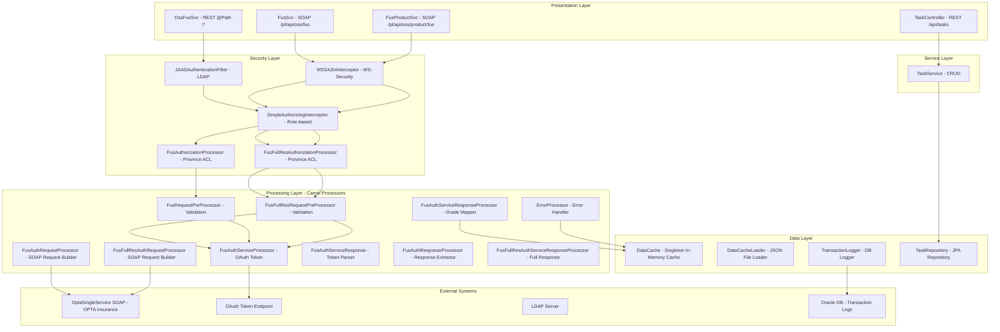

# Component Catalog

---

| **Field**            | **Details**                        |
|----------------------|------------------------------------|
| **Project Name**     | RE_DigitalService                  |
| **Application Name** | cl-esb-fus (OPTA FUS REST/SOAP Service) |
| **Version**          | 3.25.09.01.2-SNAPSHOT              |
| **Date**             | 01-Apr-2026                        |
| **Prepared By**      | Copilot RE/FE Pipeline             |
| **Reviewed By**      | —                                  |
| **Status**           | Draft                              |

---

## 1. Component Inventory Summary

| **Category**          | **Count** | **Notes**                                        |
|-----------------------|-----------|--------------------------------------------------|
| Controllers / REST    | 2         | OssFusSvc (REST stub), TaskController            |
| SOAP Services         | 2         | FusSvc, FusProductSvc                            |
| Processors            | 11        | Apache Camel Processors                          |
| Model / DTO Classes   | 14        | Request/Response/Exception models                |
| JSON Cache Classes    | 2         | DataCache, DataCacheLoader                       |
| JSON Model Classes    | 6         | Auth/Error lookup models                         |
| Logging Classes       | 3         | Transaction logging                              |
| CXF Logger Classes    | 3         | Request/response interceptors                    |
| Spring Boot Classes   | 5         | TaskManager module                               |
| Generated SOAP Types  | 383       | JAXB from WSDL/XSD                               |
| **Total**             | **431**   |                                                  |

---

## 2. Layered Architecture View

---

## 3. Component Details

### 3.1 Service Interfaces

| **ID** | **Component** | **Package** | **Type** | **Annotations** | **Dependencies** |
|--------|--------------|-------------|----------|-----------------|------------------|
| COMP-001 | FusSvc | com.aviva.ca.esb.cl.opta.fus.service | Interface | @WebService, @SOAPBinding(BARE) | FusRequest, FUSResponse |
| COMP-002 | FusProductSvc | com.aviva.ca.esb.cl.opta.fus.service | Interface | @WebService, @SOAPBinding(BARE) | FusProductRequest, FusProductResponse |
| COMP-003 | OssFusSvc | com.aviva.ca.esb.cl.opta.fus.service | Class | @Path("/") | ResultType (returns null) |

### 3.2 Model Classes

| **ID** | **Component** | **Package** | **Type** | **Annotations** | **Fields** |
|--------|--------------|-------------|----------|-----------------|------------|
| COMP-004 | BaseRequest | com.aviva.ca.esb.cl.opta.fus.model | Class | @XmlRootElement, @XmlAccessorType(FIELD) | clientInfo, language |
| COMP-005 | BaseResponse | com.aviva.ca.esb.cl.opta.fus.model | Class | — | clientInfo, isSuccessful |
| COMP-006 | ClientInfo | com.aviva.ca.esb.cl.opta.fus.model | Class | — | clientID, clientName, clientGUID, transactionTime |
| COMP-007 | DwellingFireProtectionRequest | com.aviva.ca.esb.cl.opta.fus.model | Class | @ApiParam | streetName, postalCode, municipality, province, ibcCode, naicsCode, sicCode |
| COMP-008 | DwellingFireProtectionResponse | com.aviva.ca.esb.cl.opta.fus.model | Class | — | baseResponse, dwellingFireProtection (List&lt;String&gt;) |
| COMP-009 | FusRequest | com.aviva.ca.esb.cl.opta.fus.model | Class | @XmlRootElement | baseRequest, dwellingFireProtectionRequest |
| COMP-010 | FUSResponse | com.aviva.ca.esb.cl.opta.fus.model | Class | — | dwellingFireProtectionResponse |
| COMP-011 | FusProductRequest | com.aviva.ca.esb.cl.opta.fus.model | Class | — | streetName, postalCode, municipality, province, ibcCode, naicsCode, sicCode |
| COMP-012 | FusProductResponse | com.aviva.ca.esb.cl.opta.fus.model | Class | — | responseBody (ResponseBodyType) |
| COMP-013 | DetailException | com.aviva.ca.esb.cl.opta.fus.model | Class | — | errorCode, errorMessage |
| COMP-014 | SOAPServiceException | com.aviva.ca.esb.cl.opta.fus.model | Class | @WebFault | DetailException (faultInfo) |
| COMP-015 | FaultElement | com.aviva.ca.esb.cl.opta.fus.model | Class | @XmlRootElement | ErrorDetails |
| COMP-016 | FusAuthRequest | com.aviva.ca.esb.cl.opta.fus.model | Class | — | grant_type, client_secret, client_id, refresh_token |
| COMP-017 | FusAuthResponse | com.aviva.ca.esb.cl.opta.fus.model | Class | @JsonProperty | access_token, expires_in, refresh_expires_in, refresh_token, token_type, not-before-policy, session_state |

### 3.3 Processor Classes (Camel)

| **ID** | **Component** | **Implements** | **Purpose** | **Error Codes** |
|--------|--------------|----------------|-------------|-----------------|
| COMP-018 | FusRequestPreProcessor | Processor | Validates FusRequest fields | FS1001-FS1004 |
| COMP-019 | FusFullResRequestPreProcessor | Processor | Validates FusProductRequest fields | FS1001-FS1004 |
| COMP-020 | FusAuthorizationProcessor | Processor | Province auth check (SOAP) | FS1004, FS1005 |
| COMP-021 | FusFullResAuthorizationProcessor | Processor | Province auth check (REST/Product) | FS1004, FS1005 |
| COMP-022 | FusAuthRequestProcessor | Processor | Builds OSSRequestType from FusRequest | — |
| COMP-023 | FusFullResAuthRequestProcessor | Processor | Builds OSSRequestType from FusProductRequest | — |
| COMP-024 | FusAuthServiceProcessor | Processor | Creates OAuth token refresh request | — |
| COMP-025 | FusAuthResponseProcessor | Processor | Extracts ResponseBodyType | — |
| COMP-026 | FusAuthServiceResponse | Processor | Parses JSON auth token response | — |
| COMP-027 | FusAuthServiceResponseProcessor | Processor | Maps FUS grades to protection types | FS3001, FS7001 |
| COMP-028 | FusFullResAuthServiceResponseProcessor | Processor | Returns full ResponseBodyType | — |
| COMP-029 | ErrorProcessor | Processor | Exception→HTTP status mapping | FS2001, FS1005, FS3001, FS7001 |

### 3.4 JSON / Cache Classes

| **ID** | **Component** | **Package** | **Purpose** |
|--------|--------------|-------------|-------------|
| COMP-030 | DataCache | json.cache | Singleton in-memory cache (errorLookup, userInfo maps) |
| COMP-031 | DataCacheLoader | json.cache | Loads JSON config files into DataCache |
| COMP-032 | UserInfo | json.model | userName + allowedProvinces array |
| COMP-033 | OptaOssACL | json.model | Container for List&lt;UserInfo&gt; |
| COMP-034 | AuthorizationLookup | json.model | Top-level authorization config wrapper |
| COMP-035 | ErrorMessageLookup | json.model | errorCode, errorDesc, errorDesc_fr |
| COMP-036 | ErrorDetails | json.model | Simple error: code + message |
| COMP-037 | ResponseError | json.model | Custom exception with code + message |

### 3.5 Logging Classes

| **ID** | **Component** | **Package** | **Purpose** |
|--------|--------------|-------------|-------------|
| COMP-038 | FusTransactionLog | logging | 17-field transaction log data model |
| COMP-039 | LoggerConstants | logging | Static constants: APPLICATION_SOAP, APPLICATION_REST, APPLICATION_PRODUCT |
| COMP-040 | TransactionLogger | logging | @Async DB logging via JdbcTemplate |

### 3.6 CXF Logger Classes

| **ID** | **Component** | **Package** | **Purpose** |
|--------|--------------|-------------|-------------|
| COMP-041 | CXFLoggerFeature | common.cxf.logger | Registers In/Out logging interceptors |
| COMP-042 | LoggingInInterceptor | common.cxf.logger | Logs inbound requests, masks passwords |
| COMP-043 | LoggingOutInterceptor | common.cxf.logger | Logs outbound responses via CachedOutputStream |

### 3.7 TaskManager Module (Spring Boot)

| **ID** | **Component** | **Package** | **Type** | **Annotations** |
|--------|--------------|-------------|----------|-----------------|
| COMP-044 | TaskManagerApplication | com.example.taskmanager | Class | @SpringBootApplication |
| COMP-045 | TaskController | controller | Class | @RestController, @RequestMapping("/api/tasks") |
| COMP-046 | Task | model | Entity | @Entity, @Table("tasks") |
| COMP-047 | TaskRepository | repository | Interface | JpaRepository&lt;Task, Long&gt; |
| COMP-048 | TaskService | service | Class | @Service |

### 3.8 Generated SOAP Types

| **ID** | **Component** | **Package** | **Count** | **Notes** |
|--------|--------------|-------------|-----------|-----------|
| COMP-049 | OptaSingleService | ca.optaintel.ws.optasingleservice._2_0 | 1 | JAX-WS Service client |
| COMP-050 | OptaSingleServicePort | ca.optaintel.ws.optasingleservice._2_0 | 1 | Service interface: call(OSSRequestType)→OSSResponseType |
| COMP-051 | JAXB Generated Types | ca.optaintel.ws.optasingleservice._2 | 381 | Request/Response/Product/Address/Enum types |

---

## 4. Third-Party Library Dependencies

| **Library** | **Version** | **Purpose** | **Risk** |
|-------------|-------------|-------------|----------|
| Apache Camel | 2.17.0.redhat-630187 | ESB routing framework | 🔴 EOL |
| Apache CXF | 3.0.2 | SOAP/REST web services | 🔴 EOL |
| Jackson | via Fuse BOM | JSON serialization | 🟡 Med |
| Swagger | via Fuse BOM | API documentation | 🟡 Med |
| Oracle JDBC (ojdbc6) | 6 | Database driver | 🔴 EOL |
| SQL Server JDBC (sqljdbc41) | 4.1 | Database driver | 🔴 EOL |
| Jasypt | via Fuse BOM | Encryption | 🟡 Med |
| EHCache | via Fuse BOM | Caching | 🟡 Med |
| json-simple | 1.1 | JSON parsing | 🔴 Unmaintained |
| vault-adapter | 1.0.7-SNAPSHOT | Secret management | 🟡 Internal |
| Spring Boot | 3.2 | TaskManager framework | 🟢 Low |
| H2 Database | via Spring Boot | In-memory dev DB | 🟢 Low |

---

## 5. Deprecated / Dead Code

| **ID** | **Component** | **Evidence** | **Recommendation** |
|--------|--------------|-------------|---------------------|
| COMP-003 | OssFusSvc | Returns null; never produces real data | Remove or implement |
| — | FusAuthServiceResponseProcessor L37-44 | Commented-out conditional logic | Remove dead code |
| — | FusRequestPreProcessor L53 | Commented-out FUS006 error code | Remove or document |

---

## 6. Configuration Components

| **File** | **Type** | **Purpose** |
|----------|----------|-------------|
| blueprint.xml | OSGi Blueprint | Camel routes, CXF endpoints, bean definitions, security |
| fus-log.xml | OSGi Blueprint | Oracle datasource, JdbcTemplate, TransactionLogger route |
| features.xml | Karaf Feature | OSGi bundle dependencies and feature descriptor |
| app_config.properties | Properties | Runtime configuration (endpoints, credentials, timeouts) |
| application.properties | Properties | Spring Boot config (H2, port 8080) |
| ldap_config.xml | JAAS Config | LDAP server connection and search settings |
| authorization_config.json | JSON | Province-based ACL per user |
| error_messages.json | JSON | Error code→message mapping |
| fus_logging_queries.properties | Properties | SQL INSERT for transaction logging |
| log4j.properties | Properties | Logging configuration |

---

## 7. Camel Route Components

| **Route ID** | **Entry Point** | **Purpose** | **Key Processors** |
|-------------|----------------|-------------|---------------------|
| jsonToErrorMessageLookup | file://{{ERROR_MSG_LOOKUP}} | Load error messages into cache | DataCacheLoader |
| jsonToAuthenticationLookup | file://{{AUTHORIZATION_LOOKUP}} | Load auth config into cache | DataCacheLoader |
| in_rest_fusRouter | cxfrs:bean:service | REST full-response flow | COMP-021→COMP-019→COMP-024→COMP-023→COMP-028→COMP-029 |
| route_oss_security_token | direct:securityToken | OAuth token refresh | COMP-024→COMP-026 |
| in_soap_fusRouter | cxf:bean:soapService | SOAP condensed response flow | COMP-020→COMP-018→COMP-024→COMP-022→COMP-027→COMP-029 |
| in_soap_fus_fullResponse_Router | cxf:bean:soapFullResponseService | SOAP full-response flow | COMP-021→COMP-019→COMP-024→COMP-023→COMP-028→COMP-029 |
