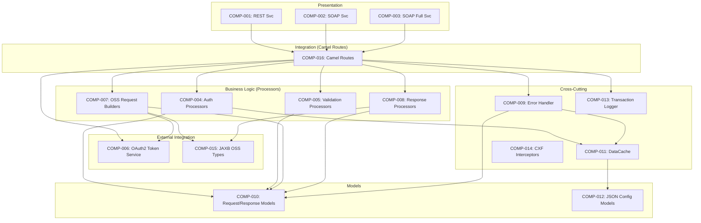

# Component Catalog

---

| **Field**            | **Details**                                    |
|----------------------|------------------------------------------------|
| **Project Name**     | sb-esb-fus                                     |
| **Application Name** | OPTA FUS REST / SOAP Service (cl-esb-fus)      |
| **Version**          | 3.25.09.01.2-SNAPSHOT                          |
| **Date**             | 27-Jun-2025                                    |
| **Prepared By**      | Copilot RE Pipeline                            |
| **Reviewed By**      | Pending                                        |
| **Status**           | Draft                                          |

---

## 1. Overview

This component catalog enumerates all software components, modules, services, and libraries identified during reverse engineering of the cl-esb-fus service. The service is an OSGi bundle deployed on JBoss Fuse 6.3 that exposes OPTA Single Service (Dwelling Fire Protection scoring) as SOAP and REST endpoints via Apache Camel routes and Apache CXF.

Components are categorized by architectural layer (Presentation, Business Logic, Data Access, Integration, Cross-Cutting) and include migration risk assessment, dead code flags, and hardcoded value indicators.

---

## 2. Component Summary

| **Total Components** | **Modules** | **Services** | **Libraries** | **Shared Utilities** |
|----------------------|-------------|--------------|---------------|----------------------|
| 22                   | 7           | 3            | 17            | 2                    |

### 2.1 Component Health Summary

| **Status**                       | **Count** | **Percentage** |
|----------------------------------|-----------|----------------|
| ✅ Active                         | 16        | 73%            |
| ⚠️ Partially Used                | 2         | 9%             |
| 🔴 Dead Code                     | 2         | 9%             |
| ⚪ Contains Hardcoded Values      | 2         | 9%             |

---

## 3. Component Inventory

### 3.1 Component: REST Endpoint Service

| **Attribute**            | **Details**                                                     |
|--------------------------|-----------------------------------------------------------------|
| **Component ID**         | COMP-001                                                        |
| **Component Name**       | OssFusSvc (REST Service)                                        |
| **Type**                 | Service                                                         |
| **Layer**                | Presentation                                                    |
| **Package/Namespace**    | com.aviva.ca.esb.cl.opta.fus.service                            |
| **Source Path**          | src/main/java/com/aviva/ca/esb/cl/opta/fus/service/OssFusSvc.java |
| **Language**             | Java 8                                                          |
| **Framework**            | Apache CXF JAX-RS                                               |
| **Framework Version**    | 3.0.2                                                           |
| **Description**          | REST service class annotated with @Path("/") exposing getFusScore GET endpoint. Uses @BeanParam to bind query parameters to FusProductRequest. **Note: method body is a stub** — actual processing is handled by the Camel route `in_rest_fusRouter`. |
| **Business Capability**  | Dwelling Fire Protection REST API entry point                   |
| **Owner/Team**           | Catalyst ESB Team                                               |
| **Status**               | Partially Used                                                  |
| **Migration Risk**       | 🟡 Medium                                                       |
| **Hardcoded Values**     | No                                                              |
| **Dead Code Present**    | Yes — method body is a stub (see Section 7)                     |

#### Dependencies

| **Depends On**          | **Dependency Type** | **Version** | **Support Status** | **Migration Risk** | **Notes**                    |
|-------------------------|---------------------|-------------|--------------------|---------------------|------------------------------|
| Apache CXF JAX-RS       | Compile             | 3.0.2       | 🔴 EOL             | 🔴 High             | Replace with Spring MVC      |
| FusProductRequest        | Compile             | Internal    | ✅ Active           | 🟢 Low              | Model class                  |
| FusProductResponse       | Compile             | Internal    | ✅ Active           | 🟢 Low              | Model class                  |
| Swagger JAXRS            | Compile             | 1.5.16      | 🔴 EOL             | 🟡 Medium           | Replace with SpringDoc       |

#### Exposed Interfaces

| **Interface**           | **Type** | **Auth Mechanism**    | **Rate Limit** | **Description**                              |
|-------------------------|----------|-----------------------|----------------|----------------------------------------------|
| GET /pl/api/oss/rest/product | REST | JAAS/LDAP + Role ACL  | No             | Fire protection scoring with full response   |

#### Key Classes / Files

| **Class/File Name**     | **Responsibility**                                    | **LOC** |
|-------------------------|-------------------------------------------------------|---------|
| OssFusSvc.java          | JAX-RS resource class with @Path, @GET, @ApiOperation | ~25     |

---

### 3.2 Component: SOAP FUS Service

| **Attribute**            | **Details**                                                     |
|--------------------------|-----------------------------------------------------------------|
| **Component ID**         | COMP-002                                                        |
| **Component Name**       | FusSvc (SOAP Service Interface)                                 |
| **Type**                 | Service                                                         |
| **Layer**                | Presentation                                                    |
| **Package/Namespace**    | com.aviva.ca.esb.cl.opta.fus.service                            |
| **Source Path**          | src/main/java/com/aviva/ca/esb/cl/opta/fus/service/FusSvc.java  |
| **Language**             | Java 8                                                          |
| **Framework**            | Apache CXF JAX-WS                                               |
| **Framework Version**    | 3.0.2                                                           |
| **Description**          | @WebService interface defining `getFusScore(FusRequest)` operation. Returns FUSResponse with mapped fire protection types. Used by CXF endpoint bean `soapService`. |
| **Business Capability**  | Dwelling Fire Protection SOAP API entry point                   |
| **Owner/Team**           | Catalyst ESB Team                                               |
| **Status**               | Active                                                          |
| **Migration Risk**       | 🟡 Medium                                                       |
| **Hardcoded Values**     | No                                                              |
| **Dead Code Present**    | No                                                              |

#### Dependencies

| **Depends On**          | **Dependency Type** | **Version** | **Support Status** | **Migration Risk** | **Notes**              |
|-------------------------|---------------------|-------------|--------------------|---------------------|------------------------|
| FusRequest               | Compile             | Internal    | ✅ Active           | 🟢 Low              | Request model          |
| FUSResponse              | Compile             | Internal    | ✅ Active           | 🟢 Low              | Response model         |
| SOAPServiceException     | Compile             | Internal    | ✅ Active           | 🟢 Low              | Fault model            |

#### Exposed Interfaces

| **Interface**               | **Type** | **Auth Mechanism**          | **Rate Limit** | **Description**                          |
|-----------------------------|----------|-----------------------------|----------------|------------------------------------------|
| POST /pl/api/oss/fus         | SOAP     | WS-Security UsernameToken + Role ACL | No      | Fire protection scoring (mapped response)|

#### Key Classes / Files

| **Class/File Name**     | **Responsibility**                         | **LOC** |
|-------------------------|--------------------------------------------|---------|
| FusSvc.java             | @WebService interface with getFusScore     | ~25     |

---

### 3.3 Component: SOAP Full Response Service

| **Attribute**            | **Details**                                                     |
|--------------------------|-----------------------------------------------------------------|
| **Component ID**         | COMP-003                                                        |
| **Component Name**       | FusProductSvc (SOAP Full Response Service)                      |
| **Type**                 | Service                                                         |
| **Layer**                | Presentation                                                    |
| **Package/Namespace**    | com.aviva.ca.esb.cl.opta.fus.service                            |
| **Source Path**          | src/main/java/com/aviva/ca/esb/cl/opta/fus/service/FusProductSvc.java |
| **Language**             | Java 8                                                          |
| **Framework**            | Apache CXF JAX-WS                                               |
| **Framework Version**    | 3.0.2                                                           |
| **Description**          | @WebService interface defining `getFusScore(FusProductRequest)` operation. Returns FusProductResponse with full OSS ResponseBodyType (unprocessed). |
| **Business Capability**  | Full OPTA response passthrough (SOAP)                           |
| **Owner/Team**           | Catalyst ESB Team                                               |
| **Status**               | Active                                                          |
| **Migration Risk**       | 🟡 Medium                                                       |
| **Hardcoded Values**     | No                                                              |
| **Dead Code Present**    | No                                                              |

#### Dependencies

| **Depends On**           | **Dependency Type** | **Version** | **Support Status** | **Migration Risk** | **Notes**              |
|--------------------------|---------------------|-------------|--------------------|---------------------|------------------------|
| FusProductRequest         | Compile             | Internal    | ✅ Active           | 🟢 Low              | Request model          |
| FusProductResponse        | Compile             | Internal    | ✅ Active           | 🟢 Low              | Response model         |
| SOAPServiceException      | Compile             | Internal    | ✅ Active           | 🟢 Low              | Fault model            |

#### Exposed Interfaces

| **Interface**                    | **Type** | **Auth Mechanism**          | **Rate Limit** | **Description**                     |
|----------------------------------|----------|-----------------------------|----------------|-------------------------------------|
| POST /pl/api/oss/product/fus     | SOAP     | WS-Security UsernameToken + Role ACL | No      | Full OSS response passthrough       |

#### Key Classes / Files

| **Class/File Name**       | **Responsibility**                            | **LOC** |
|---------------------------|-----------------------------------------------|---------|
| FusProductSvc.java        | @WebService interface with getFusScore        | ~25     |

---

### 3.4 Component: Authorization Processors

| **Attribute**            | **Details**                                                     |
|--------------------------|-----------------------------------------------------------------|
| **Component ID**         | COMP-004                                                        |
| **Component Name**       | Authorization Processors                                        |
| **Type**                 | Module                                                          |
| **Layer**                | Business Logic                                                  |
| **Package/Namespace**    | com.aviva.ca.esb.cl.opta.fus.processor                          |
| **Source Path**          | src/main/java/com/aviva/ca/esb/cl/opta/fus/processor/           |
| **Language**             | Java 8                                                          |
| **Framework**            | Apache Camel (Processor interface)                               |
| **Framework Version**    | 2.17.0                                                          |
| **Description**          | Two Camel processors that validate province-level authorization. FusAuthorizationProcessor handles SOAP requests; FusFullResAuthorizationProcessor handles REST and full-response requests. Both check province against SUPPORTED_PROVINCE_LIST config, generate UUID transaction IDs, and set Camel exchange properties for logging. |
| **Business Capability**  | Province-based access control (BR-001, BR-002)                  |
| **Owner/Team**           | Catalyst ESB Team                                               |
| **Status**               | Active                                                          |
| **Migration Risk**       | 🟡 Medium                                                       |
| **Hardcoded Values**     | No — province list externalized to config                       |
| **Dead Code Present**    | No                                                              |

#### Dependencies

| **Depends On**              | **Dependency Type** | **Version** | **Support Status** | **Migration Risk** | **Notes**                    |
|-----------------------------|---------------------|-------------|--------------------|---------------------|------------------------------|
| Apache Camel Processor       | Compile             | 2.17.0      | 🔴 EOL             | 🔴 High             | Replace with Spring service  |
| DataCache                    | Runtime             | Internal    | ✅ Active           | 🟢 Low              | Authorization lookup         |
| SOAPServiceException         | Compile             | Internal    | ✅ Active           | 🟢 Low              | Error signaling              |

#### Key Classes / Files

| **Class/File Name**                    | **Responsibility**                                      | **LOC** |
|----------------------------------------|---------------------------------------------------------|---------|
| FusAuthorizationProcessor.java         | SOAP province authorization + UUID generation           | 109     |
| FusFullResAuthorizationProcessor.java  | REST/full-response province authorization               | 92      |

---

### 3.5 Component: Request Validation Processors

| **Attribute**            | **Details**                                                     |
|--------------------------|-----------------------------------------------------------------|
| **Component ID**         | COMP-005                                                        |
| **Component Name**       | Request Validation Processors                                   |
| **Type**                 | Module                                                          |
| **Layer**                | Business Logic                                                  |
| **Package/Namespace**    | com.aviva.ca.esb.cl.opta.fus.processor                          |
| **Source Path**          | src/main/java/com/aviva/ca/esb/cl/opta/fus/processor/           |
| **Language**             | Java 8                                                          |
| **Framework**            | Apache Camel (Processor interface)                               |
| **Framework Version**    | 2.17.0                                                          |
| **Description**          | Two Camel processors that validate required request fields. FusRequestPreProcessor validates SOAP FusRequest fields; FusFullResRequestPreProcessor validates REST/full-response FusProductRequest fields. Both check for null/empty: streetName, postalCode, municipality, province. |
| **Business Capability**  | Input validation (BR-003)                                       |
| **Owner/Team**           | Catalyst ESB Team                                               |
| **Status**               | Active                                                          |
| **Migration Risk**       | 🟢 Low                                                          |
| **Hardcoded Values**     | No                                                              |
| **Dead Code Present**    | No                                                              |

#### Dependencies

| **Depends On**              | **Dependency Type** | **Version** | **Support Status** | **Migration Risk** | **Notes**                    |
|-----------------------------|---------------------|-------------|--------------------|---------------------|------------------------------|
| Apache Camel Processor       | Compile             | 2.17.0      | 🔴 EOL             | 🔴 High             | Replace with @Valid + Bean Validation |
| FusRequest / FusProductRequest | Compile           | Internal    | ✅ Active           | 🟢 Low              | Request models               |
| SOAPServiceException         | Compile             | Internal    | ✅ Active           | 🟢 Low              | Error signaling              |

#### Key Classes / Files

| **Class/File Name**                   | **Responsibility**                                | **LOC** |
|---------------------------------------|---------------------------------------------------|---------|
| FusRequestPreProcessor.java           | SOAP request field validation                     | 65      |
| FusFullResRequestPreProcessor.java    | REST/full-response request field validation       | 63      |

---

### 3.6 Component: OAuth2 Token Service

| **Attribute**            | **Details**                                                     |
|--------------------------|-----------------------------------------------------------------|
| **Component ID**         | COMP-006                                                        |
| **Component Name**       | OAuth2 Token Acquisition Service                                |
| **Type**                 | Module                                                          |
| **Layer**                | Integration                                                     |
| **Package/Namespace**    | com.aviva.ca.esb.cl.opta.fus.processor                          |
| **Source Path**          | src/main/java/com/aviva/ca/esb/cl/opta/fus/processor/           |
| **Language**             | Java 8                                                          |
| **Framework**            | Apache Camel (Processor interface)                               |
| **Framework Version**    | 2.17.0                                                          |
| **Description**          | Two processors that handle OAuth2 client credentials flow. FusAuthServiceProcessor builds the token request (form-urlencoded with client_id, client_secret, grant_type, refresh_token). FusAuthServiceResponse parses the JSON token response and extracts access_token. Credentials sourced from Jasypt-encrypted external properties. |
| **Business Capability**  | External service authentication (BR-004)                        |
| **Owner/Team**           | Catalyst ESB Team                                               |
| **Status**               | Active                                                          |
| **Migration Risk**       | 🟡 Medium                                                       |
| **Hardcoded Values**     | No — credentials externalized via Jasypt                        |
| **Dead Code Present**    | No                                                              |

#### Dependencies

| **Depends On**              | **Dependency Type** | **Version** | **Support Status** | **Migration Risk** | **Notes**                          |
|-----------------------------|---------------------|-------------|--------------------|---------------------|------------------------------------|
| Apache Camel Processor       | Compile             | 2.17.0      | 🔴 EOL             | 🔴 High             | Replace with Spring RestTemplate   |
| FusAuthRequest               | Compile             | Internal    | ✅ Active           | 🟢 Low              | Token request model                |
| FusAuthResponse              | Compile             | Internal    | ✅ Active           | 🟢 Low              | Token response model               |
| Jackson JSON                 | Runtime             | 2.4.3       | 🔴 EOL             | 🟡 Medium           | Upgrade to managed version         |

#### Key Classes / Files

| **Class/File Name**               | **Responsibility**                              | **LOC** |
|-----------------------------------|-------------------------------------------------|---------|
| FusAuthServiceProcessor.java      | Builds OAuth2 token request                     | 67      |
| FusAuthServiceResponse.java       | Parses OAuth2 token JSON response               | 29      |

---

### 3.7 Component: OSS Request Builders

| **Attribute**            | **Details**                                                     |
|--------------------------|-----------------------------------------------------------------|
| **Component ID**         | COMP-007                                                        |
| **Component Name**       | OSS Request Builder Processors                                  |
| **Type**                 | Module                                                          |
| **Layer**                | Integration                                                     |
| **Package/Namespace**    | com.aviva.ca.esb.cl.opta.fus.processor                          |
| **Source Path**          | src/main/java/com/aviva/ca/esb/cl/opta/fus/processor/           |
| **Language**             | Java 8                                                          |
| **Framework**            | Apache Camel (Processor interface)                               |
| **Framework Version**    | 2.17.0                                                          |
| **Description**          | Two processors that build OSSRequestType SOAP requests for the external OPTA Single Service. FusAuthRequestProcessor handles SOAP flow; FusFullResAuthRequestProcessor handles REST/full-response flow. Both inject OAuth2 bearer token as SOAP header, set default brokerage/carrier/username, and map address fields to OSS request format. |
| **Business Capability**  | External service request construction (BR-005)                  |
| **Owner/Team**           | Catalyst ESB Team                                               |
| **Status**               | Active                                                          |
| **Migration Risk**       | 🟡 Medium                                                       |
| **Hardcoded Values**     | Yes — default brokerage ("ABC Brokerage"), carrier ("Aviva"), username injected from config with static defaults |
| **Dead Code Present**    | No                                                              |

#### Dependencies

| **Depends On**                | **Dependency Type** | **Version** | **Support Status** | **Migration Risk** | **Notes**                        |
|-------------------------------|---------------------|-------------|--------------------|---------------------|----------------------------------|
| Apache Camel Processor         | Compile             | 2.17.0      | 🔴 EOL             | 🔴 High             | Replace with Spring service      |
| JAXB Generated Types (ca.optaintel) | Compile       | Generated   | ✅ Active           | 🟡 Medium           | OSSRequestType, RequestKeyType   |
| FusAuthResponse                | Compile             | Internal    | ✅ Active           | 🟢 Low              | OAuth2 token                     |

#### Key Classes / Files

| **Class/File Name**                     | **Responsibility**                                      | **LOC** |
|-----------------------------------------|---------------------------------------------------------|---------|
| FusAuthRequestProcessor.java            | SOAP OSS request builder with auth token                | 148     |
| FusFullResAuthRequestProcessor.java     | REST/full-response OSS request builder with auth token  | 148     |

---

### 3.8 Component: Response Processors

| **Attribute**            | **Details**                                                     |
|--------------------------|-----------------------------------------------------------------|
| **Component ID**         | COMP-008                                                        |
| **Component Name**       | OSS Response Processors                                         |
| **Type**                 | Module                                                          |
| **Layer**                | Business Logic                                                  |
| **Package/Namespace**    | com.aviva.ca.esb.cl.opta.fus.processor                          |
| **Source Path**          | src/main/java/com/aviva/ca/esb/cl/opta/fus/processor/           |
| **Language**             | Java 8                                                          |
| **Framework**            | Apache Camel (Processor interface)                               |
| **Framework Version**    | 2.17.0                                                          |
| **Description**          | Three processors handling OSS responses. FusAuthServiceResponseProcessor maps OSSResponseType to DwellingFireProtectionResponse by extracting fire protection grades (firehall, hydrant, unprotected). FusFullResAuthServiceResponseProcessor passes through full ResponseBodyType. FusAuthResponseProcessor extracts response body from MessageContentsList. |
| **Business Capability**  | Fire protection grade mapping and response transformation (BR-006, BR-007) |
| **Owner/Team**           | Catalyst ESB Team                                               |
| **Status**               | Active                                                          |
| **Migration Risk**       | 🟡 Medium                                                       |
| **Hardcoded Values**     | No                                                              |
| **Dead Code Present**    | No                                                              |

#### Dependencies

| **Depends On**                      | **Dependency Type** | **Version** | **Support Status** | **Migration Risk** | **Notes**                    |
|-------------------------------------|---------------------|-------------|--------------------|---------------------|------------------------------|
| Apache Camel Processor               | Compile             | 2.17.0      | 🔴 EOL             | 🔴 High             | Replace with Spring service  |
| JAXB Generated Types (ca.optaintel)  | Compile             | Generated   | ✅ Active           | 🟡 Medium           | OSSResponseType, ResponseBodyType |
| FUSResponse / FusProductResponse     | Compile             | Internal    | ✅ Active           | 🟢 Low              | Response models              |

#### Key Classes / Files

| **Class/File Name**                            | **Responsibility**                                  | **LOC** |
|------------------------------------------------|-----------------------------------------------------|---------|
| FusAuthServiceResponseProcessor.java           | Maps OSS response to DwellingFireProtectionResponse  | 150     |
| FusFullResAuthServiceResponseProcessor.java    | Passes through full OSS ResponseBodyType             | 19      |
| FusAuthResponseProcessor.java                  | Extracts response body from CXF MessageContentsList  | 16      |

---

### 3.9 Component: Error Handler

| **Attribute**            | **Details**                                                     |
|--------------------------|-----------------------------------------------------------------|
| **Component ID**         | COMP-009                                                        |
| **Component Name**       | ErrorProcessor                                                  |
| **Type**                 | Module                                                          |
| **Layer**                | Cross-Cutting                                                   |
| **Package/Namespace**    | com.aviva.ca.esb.cl.opta.fus.processor                          |
| **Source Path**          | src/main/java/com/aviva/ca/esb/cl/opta/fus/processor/ErrorProcessor.java |
| **Language**             | Java 8                                                          |
| **Framework**            | Apache Camel (Processor interface)                               |
| **Framework Version**    | 2.17.0                                                          |
| **Description**          | Centralized error handler that converts exceptions to SOAP faults (FaultElement with ErrorDetails) or REST error JSON responses (ErrorDetails). Looks up error codes in DataCache for bilingual messages (English/French). Also has a `returnSoapResponse` method for SOAP fault conversion in Camel `<bean>` invocations. Sets exchange properties for error logging. |
| **Business Capability**  | Centralized error handling and bilingual error messaging (BR-008) |
| **Owner/Team**           | Catalyst ESB Team                                               |
| **Status**               | Active                                                          |
| **Migration Risk**       | 🟡 Medium                                                       |
| **Hardcoded Values**     | No                                                              |
| **Dead Code Present**    | No                                                              |

#### Dependencies

| **Depends On**              | **Dependency Type** | **Version** | **Support Status** | **Migration Risk** | **Notes**                      |
|-----------------------------|---------------------|-------------|--------------------|---------------------|--------------------------------|
| Apache Camel Processor       | Compile             | 2.17.0      | 🔴 EOL             | 🔴 High             | Replace with @ControllerAdvice |
| DataCache                    | Runtime             | Internal    | ✅ Active           | 🟢 Low              | Error message lookup           |
| ErrorDetails                 | Compile             | Internal    | ✅ Active           | 🟢 Low              | Error model                    |
| FaultElement                 | Compile             | Internal    | ✅ Active           | 🟢 Low              | SOAP fault model               |

#### Key Classes / Files

| **Class/File Name**     | **Responsibility**                                              | **LOC** |
|-------------------------|-----------------------------------------------------------------|---------|
| ErrorProcessor.java     | Exception-to-SOAP-fault/REST-error conversion + error lookup    | 112     |

---

### 3.10 Component: Request/Response Models

| **Attribute**            | **Details**                                                     |
|--------------------------|-----------------------------------------------------------------|
| **Component ID**         | COMP-010                                                        |
| **Component Name**       | FUS Request/Response Models                                     |
| **Type**                 | Library                                                         |
| **Layer**                | Business Logic                                                  |
| **Package/Namespace**    | com.aviva.ca.esb.cl.opta.fus.model                              |
| **Source Path**          | src/main/java/com/aviva/ca/esb/cl/opta/fus/model/               |
| **Language**             | Java 8                                                          |
| **Framework**            | JAXB, Jackson, JAX-WS                                           |
| **Framework Version**    | Java EE 7                                                       |
| **Description**          | Data transfer objects for all three endpoints. Includes request wrappers (FusRequest, FusProductRequest, BaseRequest, DwellingFireProtectionRequest), response wrappers (FUSResponse, FusProductResponse, BaseResponse, DwellingFireProtectionResponse), OAuth2 models (FusAuthRequest, FusAuthResponse), and exception models (SOAPServiceException, DetailException, FaultElement, ErrorDetails). |
| **Business Capability**  | API contract definition                                         |
| **Owner/Team**           | Catalyst ESB Team                                               |
| **Status**               | Active                                                          |
| **Migration Risk**       | 🟢 Low                                                          |
| **Hardcoded Values**     | No                                                              |
| **Dead Code Present**    | No                                                              |

#### Key Classes / Files

| **Class/File Name**                    | **Responsibility**                                     | **LOC** |
|----------------------------------------|--------------------------------------------------------|---------|
| FusRequest.java                        | SOAP request wrapper (baseRequest + address fields)    | 58      |
| FusProductRequest.java                 | REST/full-response request with @QueryParam/@ApiParam  | 164     |
| BaseRequest.java                       | Base request with clientInfo + language                 | 54      |
| ClientInfo.java                        | Client metadata (ID, name, GUID, timestamp)            | 77      |
| DwellingFireProtectionRequest.java     | Address fields (street, postal, municipality, province)| 155     |
| FUSResponse.java                       | SOAP response wrapper                                  | 57      |
| FusProductResponse.java               | Full response wrapper with ResponseBodyType            | 39      |
| BaseResponse.java                      | Base response with clientInfo + isSuccessful flag       | 46      |
| DwellingFireProtectionResponse.java   | Mapped fire protection types response                  | 48      |
| FusAuthRequest.java                    | OAuth2 token request (client_id, client_secret, etc.)  | 42      |
| FusAuthResponse.java                   | OAuth2 token response (access_token, expires_in, etc.) | 71      |
| SOAPServiceException.java             | @WebFault exception with DetailException               | 53      |
| DetailException.java                   | Error details (errorCode + errorMessage)               | 31      |
| FaultElement.java                      | SOAP fault container with ErrorDetails                 | 69      |

---

### 3.11 Component: Data Cache

| **Attribute**            | **Details**                                                     |
|--------------------------|-----------------------------------------------------------------|
| **Component ID**         | COMP-011                                                        |
| **Component Name**       | DataCache & DataCacheLoader                                     |
| **Type**                 | Utility                                                         |
| **Layer**                | Cross-Cutting                                                   |
| **Package/Namespace**    | com.aviva.ca.esb.cl.opta.fus.json.cache                         |
| **Source Path**          | src/main/java/com/aviva/ca/esb/cl/opta/fus/json/cache/          |
| **Language**             | Java 8                                                          |
| **Framework**            | None (plain Java singleton)                                      |
| **Framework Version**    | N/A                                                             |
| **Description**          | Thread-safe singleton cache (DataCache) with HashMap-based storage for error message lookups and authorization ACLs. DataCacheLoader converts JSON-deserialized lists into HashMap keyed by error code or username. Loaded at startup via Camel file routes reading from external JSON files. |
| **Business Capability**  | Configuration data caching                                      |
| **Owner/Team**           | Catalyst ESB Team                                               |
| **Status**               | Active                                                          |
| **Migration Risk**       | 🟢 Low                                                          |
| **Hardcoded Values**     | No                                                              |
| **Dead Code Present**    | No                                                              |

#### Key Classes / Files

| **Class/File Name**     | **Responsibility**                                | **LOC** |
|-------------------------|---------------------------------------------------|---------|
| DataCache.java          | Singleton cache with getInstance() pattern         | 46      |
| DataCacheLoader.java    | JSON-to-HashMap conversion and cache population   | 52      |

---

### 3.12 Component: JSON Configuration Models

| **Attribute**            | **Details**                                                     |
|--------------------------|-----------------------------------------------------------------|
| **Component ID**         | COMP-012                                                        |
| **Component Name**       | JSON/Cache Models                                               |
| **Type**                 | Library                                                         |
| **Layer**                | Cross-Cutting                                                   |
| **Package/Namespace**    | com.aviva.ca.esb.cl.opta.fus.json.model                         |
| **Source Path**          | src/main/java/com/aviva/ca/esb/cl/opta/fus/json/model/          |
| **Language**             | Java 8                                                          |
| **Framework**            | Jackson, JAXB                                                   |
| **Framework Version**    | 2.4.3                                                           |
| **Description**          | POJOs for JSON configuration files: ErrorMessageLookup (error code → EN/FR messages), AuthorizationLookup / OptaOssACL / UserInfo (username → allowed provinces), ResponseError (exception wrapper), ErrorDetails (error code + message). |
| **Business Capability**  | Configuration data models                                       |
| **Owner/Team**           | Catalyst ESB Team                                               |
| **Status**               | Active                                                          |
| **Migration Risk**       | 🟢 Low                                                          |
| **Hardcoded Values**     | No                                                              |
| **Dead Code Present**    | No                                                              |

#### Key Classes / Files

| **Class/File Name**        | **Responsibility**                                  | **LOC** |
|----------------------------|-----------------------------------------------------|---------|
| ErrorMessageLookup.java    | Error code → message mapping model                  | 33      |
| AuthorizationLookup.java   | Authorization config wrapper                        | 15      |
| OptaOssACL.java            | ACL model with list of UserInfo                     | 31      |
| UserInfo.java              | User profile with allowed provinces                 | 22      |
| ResponseError.java         | Exception class with code/message                   | 32      |
| ErrorDetails.java          | JAXB error details model (@XmlRootElement)          | 33      |

---

### 3.13 Component: Transaction Logger

| **Attribute**            | **Details**                                                     |
|--------------------------|-----------------------------------------------------------------|
| **Component ID**         | COMP-013                                                        |
| **Component Name**       | Transaction Logging Service                                     |
| **Type**                 | Module                                                          |
| **Layer**                | Cross-Cutting                                                   |
| **Package/Namespace**    | com.aviva.ca.esb.cl.opta.fus.logging                            |
| **Source Path**          | src/main/java/com/aviva/ca/esb/cl/opta/fus/logging/             |
| **Language**             | Java 8                                                          |
| **Framework**            | Spring JdbcTemplate                                              |
| **Framework Version**    | (managed by Fuse)                                               |
| **Description**          | Asynchronous transaction logger that persists audit records to Oracle DB (`cl_fus_trans_log` table) with 17 fields: transaction_id, application, url, transaction_time, client_id, client_name, client_guid, dwelling_fire_protection, street_name, postal_code, municipality, province, req_payload, res_payload, status, error_code, error_message. Uses JdbcTemplate with parameterized SQL insert. JAXB Marshaller serializes request/response payloads to XML strings. |
| **Business Capability**  | Audit logging and transaction tracking (BR-009)                 |
| **Owner/Team**           | Catalyst ESB Team                                               |
| **Status**               | Active                                                          |
| **Migration Risk**       | 🟡 Medium                                                       |
| **Hardcoded Values**     | No                                                              |
| **Dead Code Present**    | No                                                              |

#### Dependencies

| **Depends On**              | **Dependency Type** | **Version** | **Support Status** | **Migration Risk** | **Notes**                      |
|-----------------------------|---------------------|-------------|--------------------|---------------------|--------------------------------|
| Spring JdbcTemplate          | Runtime             | (managed)   | ✅ Supported        | 🟢 Low              | Continue using                 |
| Oracle OJDBC6                | Runtime             | 1.0 (wrap)  | 🔴 EOL             | 🟡 Medium           | Upgrade to ojdbc11             |
| JAXB Marshaller              | Runtime             | 2.x         | 🔴 EOL             | 🟡 Medium           | Migrate to Jakarta XML Binding |

#### Key Classes / Files

| **Class/File Name**         | **Responsibility**                                      | **LOC** |
|-----------------------------|---------------------------------------------------------|---------|
| TransactionLogger.java      | Async DB insert of transaction audit records            | 169     |
| FusTransactionLog.java      | POJO for 17-field transaction log record                | 184     |
| LoggerConstants.java         | Constants: APP_SOAP, APP_REST, APP_PRODUCT, column names | 31     |

---

### 3.14 Component: CXF Logging Interceptors

| **Attribute**            | **Details**                                                     |
|--------------------------|-----------------------------------------------------------------|
| **Component ID**         | COMP-014                                                        |
| **Component Name**       | CXF Logger Interceptors                                         |
| **Type**                 | Module                                                          |
| **Layer**                | Cross-Cutting                                                   |
| **Package/Namespace**    | com.aviva.ca.esb.common.cxf.logger                              |
| **Source Path**          | src/main/java/com/aviva/ca/esb/common/cxf/logger/               |
| **Language**             | Java 8                                                          |
| **Framework**            | Apache CXF (Interceptor interface)                               |
| **Framework Version**    | 3.0.2                                                           |
| **Description**          | CXF interceptors for logging SOAP request/response payloads. CXFLoggerFeature registers both interceptors. LoggingInInterceptor logs method, URI, headers, and request body with WSSE password masking. LoggingOutInterceptor logs response body via CachedOutputStreamCallback. |
| **Business Capability**  | Request/response auditing and debugging                         |
| **Owner/Team**           | Catalyst ESB Team (shared common package)                       |
| **Status**               | Active                                                          |
| **Migration Risk**       | 🟡 Medium                                                       |
| **Hardcoded Values**     | No                                                              |
| **Dead Code Present**    | No                                                              |

#### Key Classes / Files

| **Class/File Name**          | **Responsibility**                                    | **LOC** |
|------------------------------|-------------------------------------------------------|---------|
| CXFLoggerFeature.java        | CXF Feature registering in/out interceptors           | 22      |
| LoggingInInterceptor.java    | Inbound SOAP message logging with password masking    | 191     |
| LoggingOutInterceptor.java   | Outbound SOAP response logging                        | 81      |

---

### 3.15 Component: JAXB Generated OSS Types

| **Attribute**            | **Details**                                                     |
|--------------------------|-----------------------------------------------------------------|
| **Component ID**         | COMP-015                                                        |
| **Component Name**       | JAXB Generated OSS Schema Types                                 |
| **Type**                 | Library                                                         |
| **Layer**                | Integration                                                     |
| **Package/Namespace**    | ca.optaintel.ws.optasingleservice._2_0                          |
| **Source Path**          | src/main/java/ca/optaintel/                                     |
| **Language**             | Java 8 (auto-generated)                                         |
| **Framework**            | JAXB                                                            |
| **Framework Version**    | 2.x                                                             |
| **Description**          | 383 auto-generated JAXB classes from 18 XSD schemas defining the OPTA Single Service data model. Covers request types, response types for multiple products (FUS, Flood, Peril, Address Search, Building Imagery, etc.). Only a small subset (OSSRequestType, OSSResponseType, ResponseBodyType, DwellingFireProtection types) is actively used by the FUS service. |
| **Business Capability**  | OPTA Single Service SOAP contract types                         |
| **Owner/Team**           | OptaIntel (external) / Catalyst ESB Team                        |
| **Status**               | Partially Used                                                  |
| **Migration Risk**       | 🟡 Medium                                                       |
| **Hardcoded Values**     | No                                                              |
| **Dead Code Present**    | Yes — ~95% of classes are unused by FUS service (see Section 7) |

#### Key Classes / Files

| **Class/File Name**                        | **Responsibility**                        | **LOC** |
|--------------------------------------------|-------------------------------------------|---------|
| OptaSingleServicePort.java                 | SOAP service port interface               | ~30     |
| OSSRequestType.java                        | Main request envelope type                | ~200    |
| OSSResponseType.java                       | Main response envelope type               | ~150    |
| ResponseBodyType.java                      | Response body containing product results  | ~100    |
| DwellingFireProtectionType.java            | Fire protection result type               | ~80     |

---

### 3.16 Component: Camel Route Configuration

| **Attribute**            | **Details**                                                     |
|--------------------------|-----------------------------------------------------------------|
| **Component ID**         | COMP-016                                                        |
| **Component Name**       | Camel Routes (Blueprint XML)                                    |
| **Type**                 | Module                                                          |
| **Layer**                | Integration                                                     |
| **Package/Namespace**    | N/A (XML configuration)                                         |
| **Source Path**          | src/main/resources/OSGI-INF/blueprint/blueprint.xml              |
| **Language**             | XML (Camel DSL)                                                 |
| **Framework**            | Apache Camel Blueprint                                           |
| **Framework Version**    | 2.17.0                                                          |
| **Description**          | Six Camel routes defining all processing flows: `in_rest_fusRouter` (REST), `in_soap_fusRouter` (SOAP), `in_soap_fus_fullResponse_Router` (SOAP full response), `route_oss_security_token` (OAuth2 token), `jsonToErrorMessageLookup` (error cache), `jsonToAuthenticationLookup` (auth cache). Each main route follows: authenticate → validate → get token → build request → call OSS → process response → log. |
| **Business Capability**  | Integration orchestration                                       |
| **Owner/Team**           | Catalyst ESB Team                                               |
| **Status**               | Active                                                          |
| **Migration Risk**       | 🔴 High                                                         |
| **Hardcoded Values**     | Yes — `disableCNCheck="true"`, `ws-security.validate.token=false` |
| **Dead Code Present**    | No                                                              |

---

### 3.17 Component: Transaction Logging Configuration

| **Attribute**            | **Details**                                                     |
|--------------------------|-----------------------------------------------------------------|
| **Component ID**         | COMP-017                                                        |
| **Component Name**       | Transaction Logging Blueprint (fus-log.xml)                     |
| **Type**                 | Module                                                          |
| **Layer**                | Cross-Cutting                                                   |
| **Package/Namespace**    | N/A (XML configuration)                                         |
| **Source Path**          | src/main/resources/OSGI-INF/blueprint/fus-log.xml                |
| **Language**             | XML (OSGi Blueprint)                                            |
| **Framework**            | OSGi Blueprint + Camel                                           |
| **Framework Version**    | N/A                                                             |
| **Description**          | Configures Oracle DataSource (JDBC connection pool: min=3, initial=3, max=30), JdbcTemplate bean, TransactionLogger bean, and a simple Camel route (`direct-vm:fusLogger` → `bean:fusTransLogger`) for async transaction logging. |
| **Business Capability**  | Database connectivity for audit logging                         |
| **Owner/Team**           | Catalyst ESB Team                                               |
| **Status**               | Active                                                          |
| **Migration Risk**       | 🟡 Medium                                                       |
| **Hardcoded Values**     | No — DB credentials externalized                                |
| **Dead Code Present**    | No                                                              |

---

## 4. Component Dependency Map

### 4.1 Dependency Matrix

| **Component ↓ / Depends On →** | COMP-004 | COMP-005 | COMP-006 | COMP-007 | COMP-008 | COMP-009 | COMP-010 | COMP-011 | COMP-013 | COMP-015 |
|---------------------------------|----------|----------|----------|----------|----------|----------|----------|----------|----------|----------|
| **COMP-001 (REST Svc)**         |          |          |          |          |          |          | ✓        |          |          |          |
| **COMP-002 (SOAP Svc)**         |          |          |          |          |          |          | ✓        |          |          |          |
| **COMP-003 (SOAP Full Svc)**    |          |          |          |          |          |          | ✓        |          |          |          |
| **COMP-004 (Auth Proc)**        |          |          |          |          |          |          | ✓        | ✓        |          |          |
| **COMP-005 (Validate Proc)**    |          |          |          |          |          |          | ✓        |          |          |          |
| **COMP-006 (OAuth2 Token)**     |          |          |          |          |          |          | ✓        |          |          |          |
| **COMP-007 (OSS Req Builder)**  |          |          | ✓        |          |          |          | ✓        |          |          | ✓        |
| **COMP-008 (Response Proc)**    |          |          |          |          |          |          | ✓        |          |          | ✓        |
| **COMP-009 (Error Handler)**    |          |          |          |          |          |          | ✓        | ✓        |          |          |
| **COMP-013 (Trans Logger)**     |          |          |          |          |          |          | ✓        |          |          |          |
| **COMP-016 (Camel Routes)**     | ✓        | ✓        | ✓        | ✓        | ✓        | ✓        |          |          | ✓        |          |

### 4.2 Dependency Diagram

---

## 5. Layered Component View

### 5.1 Presentation Layer

| **Component ID** | **Component Name**               | **Technology**     | **Description**                                |
|------------------|----------------------------------|--------------------|------------------------------------------------|
| COMP-001         | OssFusSvc (REST Service)         | CXF JAX-RS         | REST GET endpoint for fire protection scoring  |
| COMP-002         | FusSvc (SOAP Service)            | CXF JAX-WS         | SOAP endpoint for mapped fire protection response |
| COMP-003         | FusProductSvc (SOAP Full)        | CXF JAX-WS         | SOAP endpoint for full OSS response passthrough |

### 5.2 Business Logic Layer

| **Component ID** | **Component Name**               | **Technology**     | **Description**                                |
|------------------|----------------------------------|--------------------|------------------------------------------------|
| COMP-004         | Authorization Processors         | Camel Processor    | Province-based access control                  |
| COMP-005         | Request Validation Processors    | Camel Processor    | Input field validation                         |
| COMP-008         | Response Processors              | Camel Processor    | OSS response mapping to FUS response           |
| COMP-010         | Request/Response Models          | JAXB + Jackson     | DTO definitions for API contracts              |

### 5.3 Data Access Layer

| **Component ID** | **Component Name**               | **Technology**     | **Description**                                |
|------------------|----------------------------------|--------------------|------------------------------------------------|
| COMP-013         | Transaction Logger               | JdbcTemplate       | Async audit log insert to Oracle DB            |

### 5.4 Integration Layer

| **Component ID** | **Component Name**               | **Technology**     | **Description**                                |
|------------------|----------------------------------|--------------------|------------------------------------------------|
| COMP-006         | OAuth2 Token Service             | Camel Processor    | Acquires OAuth2 tokens for OPTA API            |
| COMP-007         | OSS Request Builders             | Camel Processor    | Constructs OPTA SOAP requests                  |
| COMP-015         | JAXB OSS Types                   | JAXB               | Generated types for OPTA service contract      |
| COMP-016         | Camel Routes                     | Camel Blueprint    | Orchestration of all processing flows          |
| COMP-017         | Logging Config                   | Blueprint XML      | Oracle DB connection and logging route config  |

### 5.5 Cross-Cutting Concerns

| **Component ID** | **Component Name**               | **Concern Type**   | **Description**                                |
|------------------|----------------------------------|--------------------|------------------------------------------------|
| COMP-009         | ErrorProcessor                   | Error Handling     | Centralized SOAP fault / REST error conversion |
| COMP-011         | DataCache                        | Caching            | In-memory singleton for config data            |
| COMP-012         | JSON Config Models               | Configuration      | Models for cached configuration data           |
| COMP-014         | CXF Logger Interceptors          | Logging            | SOAP message logging with password masking     |

---

## 6. Third-Party Libraries & Frameworks

| **Library/Framework**         | **Version**                | **License**    | **Used By**       | **Support Status** | **Migration Risk** | **Purpose**                                |
|-------------------------------|----------------------------|----------------|-------------------|--------------------|---------------------|--------------------------------------------|
| JBoss Fuse BOM                | 6.3.0.redhat-187           | Apache 2.0     | All               | 🔴 EOL             | 🔴 High             | OSGi container and dependency management   |
| Apache Camel Core             | 2.17.0.redhat-630187       | Apache 2.0     | COMP-016          | 🔴 EOL             | 🔴 High             | Message routing engine                     |
| Apache Camel Blueprint        | 2.17.0.redhat-630187       | Apache 2.0     | COMP-016          | 🔴 EOL             | 🔴 High             | OSGi Blueprint DI integration              |
| Apache Camel CXF              | 2.17.0.redhat-630187       | Apache 2.0     | COMP-016          | 🔴 EOL             | 🔴 High             | Camel-CXF bridge for SOAP/REST            |
| Apache Camel Cache            | 2.17.0.redhat-630187       | Apache 2.0     | COMP-011          | 🔴 EOL             | 🟡 Medium           | Ehcache-based caching                      |
| Apache Camel Jasypt           | 2.17.0.redhat-630187       | Apache 2.0     | COMP-016          | 🔴 EOL             | 🟡 Medium           | Property encryption                        |
| Apache Camel SQL              | 2.17.0.redhat-630187       | Apache 2.0     | COMP-013          | 🔴 EOL             | 🟡 Medium           | SQL component                              |
| Apache CXF JAXRS              | (Fuse managed)             | Apache 2.0     | COMP-001          | 🔴 EOL             | 🔴 High             | JAX-RS REST framework                      |
| Apache CXF API                | 2.7.18.redhat-1            | Apache 2.0     | COMP-014          | 🔴 EOL             | 🔴 High             | CXF core API (interceptors)               |
| Jackson JSON Schema           | 2.4.3                      | Apache 2.0     | COMP-010          | 🔴 EOL             | 🟡 Medium           | JSON schema support                        |
| Jackson Scala Module          | 2.4.3                      | Apache 2.0     | None (dead)       | 🔴 EOL             | 🟢 Low              | Unused dependency — remove                 |
| Swagger JAXRS                 | 1.5.16                     | Apache 2.0     | COMP-001          | 🔴 EOL             | 🟡 Medium           | API documentation                          |
| Javassist                     | 3.18.1-GA                  | Apache 2.0     | COMP-001          | ⚠️ Nearing EOL     | 🟢 Low              | Bytecode manipulation (Swagger dependency) |
| Ehcache JMS Replication       | 0.5                        | Apache 2.0     | COMP-011          | 🔴 EOL             | 🟡 Medium           | Cache replication (JMS)                    |
| Vault Adapter                 | 1.0.7-SNAPSHOT             | Proprietary    | COMP-016          | ⚠️ Internal        | 🟡 Medium           | Secret management                          |
| JSON Simple                   | 1.1                        | Apache 2.0     | COMP-012          | 🔴 EOL             | 🟢 Low              | Basic JSON parsing                         |
| SLF4J                         | (Fuse managed)             | MIT            | All               | ✅ Supported        | 🟢 Low              | Logging facade                             |
| Log4j 1.x                    | (Fuse managed)             | Apache 2.0     | All               | 🔴 EOL             | 🟡 Medium           | Logging implementation — known CVEs        |
| Oracle OJDBC6                 | 1.0 (wrapped)              | Oracle         | COMP-013          | 🔴 EOL             | 🟡 Medium           | Oracle JDBC driver                         |
| SQL Server JDBC               | 1.0 (wrapped)              | Microsoft      | None (unused?)    | 🔴 EOL             | 🟢 Low              | SQL Server driver — possibly unused        |

---

## 7. Deprecated / Dead Code Components

| **Component ID** | **Component Name**                | **Reason**                                                   | **Evidence Type**                                      | **Lines Affected** | **Last Modified** | **Recommendation**           |
|------------------|-----------------------------------|--------------------------------------------------------------|--------------------------------------------------------|--------------------|-------------------|------------------------------|
| COMP-001         | OssFusSvc.getFusScore()           | REST method body is a stub; Camel route handles all processing | Method body never executed — CXF SimpleConsumer binding bypasses method | Full method body | Unknown | Remove stub or implement     |
| COMP-015         | JAXB Generated Classes (95%)      | 383 classes generated from 18 XSD schemas; only ~20 used by FUS service | Unreferenced classes for non-FUS products (Flood, Peril, Imagery, etc.) | ~24,000 LOC | N/A | Regenerate only needed types |
| N/A              | jackson-module-scala_2.10         | Scala Jackson module declared as optional; no Scala code exists | Dependency declared but no Scala imports in codebase   | N/A                | Unknown           | Remove from pom.xml          |
| N/A              | sqljdbc41                         | SQL Server driver bundled but no SQL Server connections configured | No SQL Server datasource in blueprint XML              | N/A                | Unknown           | Verify usage; remove if unused |

---

## 8. Notes & Observations

| **#** | **Observation**                                                              | **Severity** | **Recommendation**                                |
|-------|------------------------------------------------------------------------------|--------------|---------------------------------------------------|
| 1     | All core frameworks (Fuse, Camel, CXF) are EOL — no security patches        | Critical     | Migrate to Spring Boot 3.x immediately             |
| 2     | Tests are explicitly skipped (`skipTests=true`) — zero coverage              | Critical     | Enable tests; generate comprehensive test suite    |
| 3     | TLS CN check disabled (`disableCNCheck="true"`) in CXF conduit              | Critical     | Enable CN check; verify certificates               |
| 4     | WS-Security token validation disabled                                        | Critical     | Enable token validation                            |
| 5     | Duplicate processor logic between SOAP and REST variants                     | Warning      | Consolidate into single parameterized processor    |
| 6     | DataCache uses hand-rolled singleton pattern                                 | Info         | Replace with Spring-managed bean (singleton scope) |
| 7     | CXF LoggingInInterceptor masks WSSE passwords — good security practice       | Info         | Preserve this behavior in migration                |
| 8     | External properties loaded from fixed filesystem path                        | Warning      | Use Spring Boot config with profiles               |
| 9     | Oracle connection pool min/max (3/30) may need tuning for new architecture   | Info         | Evaluate with load testing                         |
| 10    | Camel WireTap for async logging is fire-and-forget — no error tracking       | Warning      | Add error handling for logging failures            |

---

## 9. Appendices

### Appendix A: Component ID Reference

Naming convention: COMP-[NNN] where NNN is a sequential number.

| **Range**     | **Category**                |
|---------------|-----------------------------|
| COMP-001–003  | Presentation (Services)     |
| COMP-004–005  | Business Logic (Validation) |
| COMP-006–007  | Integration (Builders)      |
| COMP-008      | Business Logic (Response)   |
| COMP-009      | Cross-Cutting (Error)       |
| COMP-010      | Models (Request/Response)   |
| COMP-011–012  | Cross-Cutting (Cache/Config)|
| COMP-013      | Data Access (Logging)       |
| COMP-014      | Cross-Cutting (CXF Logging) |
| COMP-015      | Integration (JAXB Types)    |
| COMP-016–017  | Integration (Config)        |

### Appendix B: Glossary

| **Term**         | **Definition**                                                            |
|------------------|---------------------------------------------------------------------------|
| Processor        | Apache Camel interface for processing exchange messages in a route         |
| Blueprint        | OSGi XML-based dependency injection and configuration format              |
| CXF Endpoint     | Apache CXF managed SOAP or REST service entry point                       |
| WireTap          | Camel EIP pattern for sending a copy of the message to another route      |
| DataFormat       | Camel abstraction for marshalling/unmarshalling (JSON, XML, etc.)         |
| Conduit          | CXF HTTP transport configuration (timeouts, TLS, etc.)                    |
| SimpleConsumer   | CXF-RS binding style that allows Camel to receive REST requests directly  |

---

## 10. Hardcoded Values per Component

| **Component ID** | **File/Class**                      | **Field/Variable**      | **Hardcoded Value**                    | **Line(s)**  | **Expected Behavior**                      | **Impact if Not Addressed**                     | **Recommendation**                          |
|------------------|-------------------------------------|-------------------------|----------------------------------------|--------------|--------------------------------------------|-------------------------------------------------|---------------------------------------------|
| COMP-007         | FusAuthRequestProcessor.java        | broker                  | "ABC Brokerage" (from config default)  | Property     | Should be per-request or config-driven     | All requests use same default brokerage         | Externalize; make per-request if applicable |
| COMP-007         | FusAuthRequestProcessor.java        | carrier                 | "Aviva" (from config default)          | Property     | Should be per-carrier if multi-carrier     | All requests use same default carrier           | Externalize; verify business requirement    |
| COMP-016         | blueprint.xml (conduit)             | disableCNCheck          | `true`                                 | L164         | Should be `false` in production            | Man-in-the-middle attack vector                 | Set to `false`; fix certificates            |
| COMP-016         | blueprint.xml (WSS4J)               | ws-security.validate.token | `false`                             | L56          | Should be `true` for production security   | Tokens accepted without validation              | Set to `true`                               |
| COMP-016         | blueprint.xml (WSS4J)               | ws-security.ut.no-callbacks | `true`                              | L55          | Custom callback handler recommended        | No custom validation of username tokens         | Implement callback handler                  |

---

## 11. Component-to-Endpoint Mapping

| **Endpoint**                    | **HTTP Method** | **Route Component** | **Processor(s)**                                                                  | **Transformer(s)** | **Data Access** | **External Calls**                |
|---------------------------------|-----------------|---------------------|-----------------------------------------------------------------------------------|---------------------|-----------------|-----------------------------------|
| /pl/api/oss/rest/product        | GET             | COMP-016 (in_rest_fusRouter) | COMP-004, COMP-005, COMP-006, COMP-007, COMP-008, COMP-009                | COMP-008            | COMP-013        | COMP-006 (OAuth2), COMP-015 (OSS) |
| /pl/api/oss/fus                 | POST (SOAP)     | COMP-016 (in_soap_fusRouter) | COMP-004, COMP-005, COMP-006, COMP-007, COMP-008, COMP-009                | COMP-008            | COMP-013        | COMP-006 (OAuth2), COMP-015 (OSS) |
| /pl/api/oss/product/fus         | POST (SOAP)     | COMP-016 (in_soap_fus_fullResponse_Router) | COMP-004, COMP-005, COMP-006, COMP-007, COMP-008, COMP-009 | COMP-008            | COMP-013        | COMP-006 (OAuth2), COMP-015 (OSS) |

---

> **Document Control:**
> | Version | Date | Author | Changes |
> |---------|------|--------|---------|
> | 0.1 | 27-Jun-2025 | Copilot RE Pipeline | Initial draft |
> | 0.2 | 27-Jun-2025 | Copilot RE Pipeline | Added: Component health summary (2.1), Migration risk & hardcoded/dead code flags (3.1), Dependency version & risk (3.1), Interface auth details (3.1), Library support status (6), Dead code evidence (7), Hardcoded values section (10), Component-to-endpoint mapping (11) |
