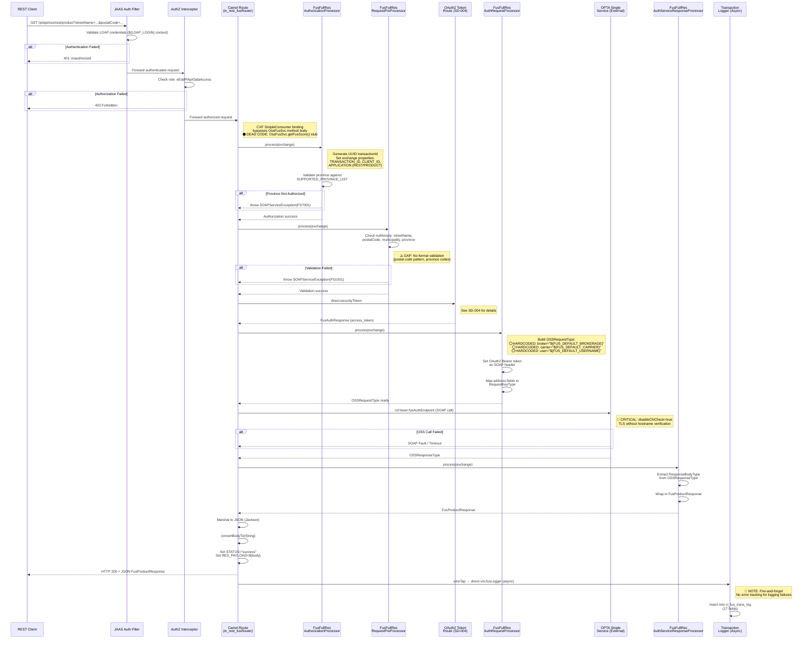
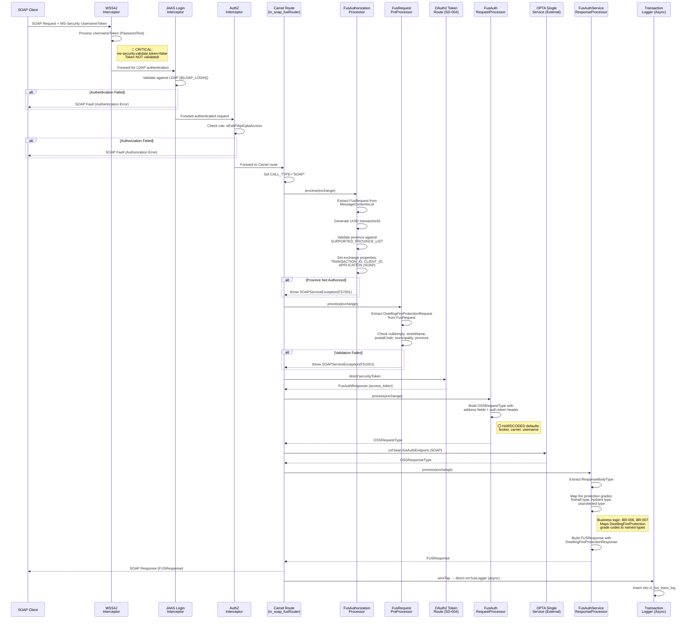
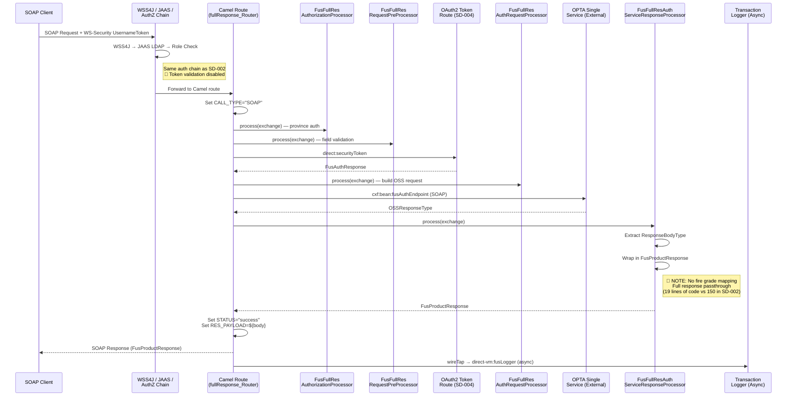
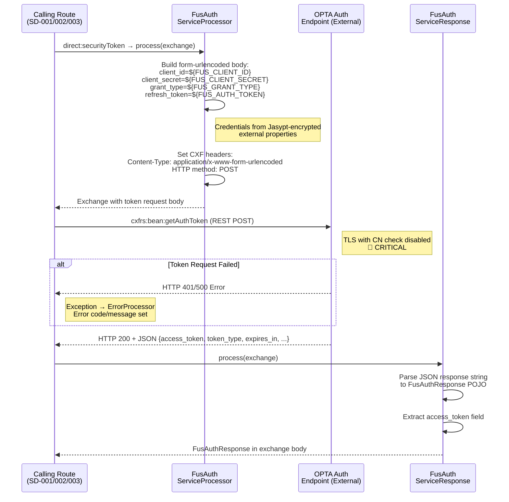
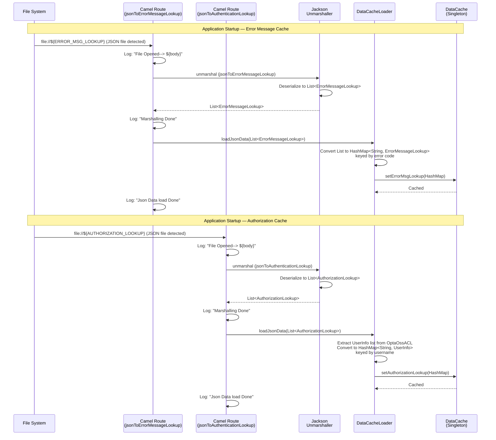
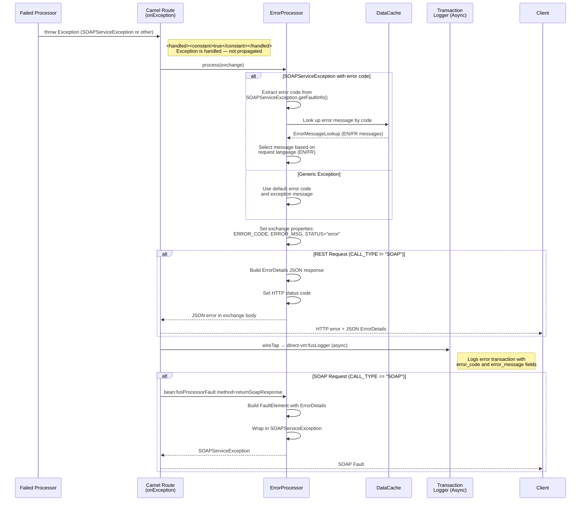
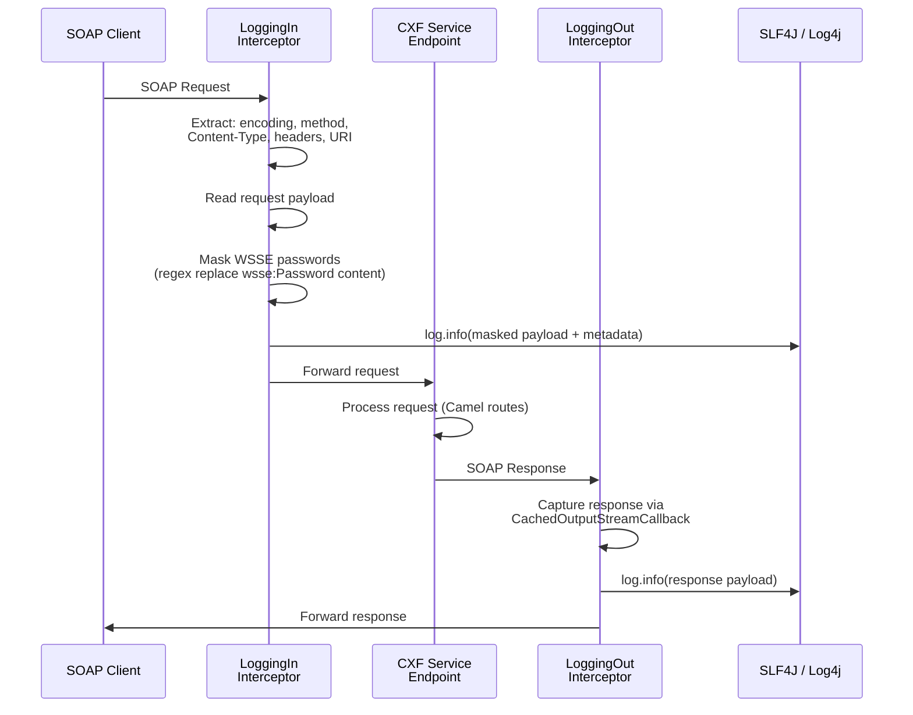
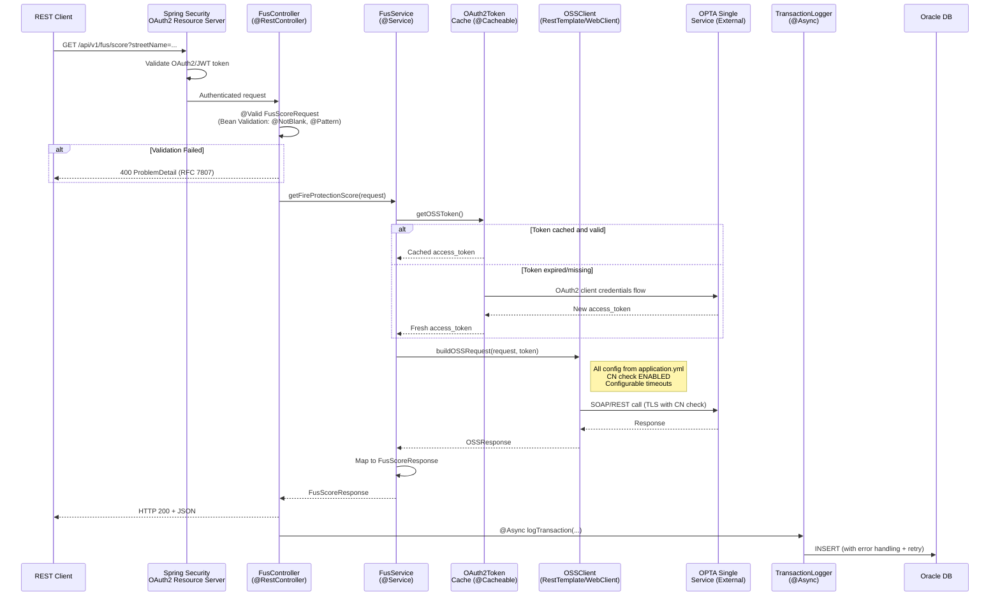

# Sequence Diagrams

---

| **Field**            | **Details**                                    |
|----------------------|------------------------------------------------|
| **Project Name**     | sb-esb-fus                                     |
| **Application Name** | OPTA FUS REST / SOAP Service (cl-esb-fus)      |
| **Version**          | 3.25.09.01.2-SNAPSHOT                          |
| **Date**             | 27-Jun-2025                                    |
| **Prepared By**      | Copilot RE Pipeline                            |
| **Reviewed By**      | Pending                                        |
| **Status**           | Draft                                          |

---

## 1. Overview

This document contains sequence diagrams capturing the runtime interaction patterns between components, services, and actors in the cl-esb-fus service. Each diagram represents a specific Camel route or workflow identified during reverse engineering of the OSGi Blueprint configuration and Java processor classes.

### Diagram Notation

| **Symbol**   | **Meaning**                                           |
|--------------|-------------------------------------------------------|
| `──▶`        | Synchronous request                                   |
| `──▷`        | Asynchronous request                                  |
| `◀──`        | Synchronous response                                  |
| `◁──`        | Asynchronous response / callback                      |
| `──X`        | Message lost / failure                                |
| `[alt]`      | Alternative (conditional) flow                        |
| `[loop]`     | Repeated execution                                    |
| `[opt]`      | Optional execution                                    |

### Annotation Notation

| **Annotation**             | **Meaning**                                                       |
|----------------------------|-------------------------------------------------------------------|
| `⚠️ GAP`                   | Missing validation or functionality at this step                  |
| `⚪ HARDCODED`             | Step returns a hardcoded/static value instead of dynamic logic    |
| `⚫ DEAD CODE`             | Flow path exists in code but is never executed                    |
| `🔴 CRITICAL`              | Critical finding that must be addressed before migration          |
| `📝 NOTE`                  | General observation or clarification                              |

---

## 2. Sequence Diagram Index

| **Diagram ID** | **Title**                                    | **Use Case / Workflow**                  | **Actors/Components**                                                                      | **Priority** |
|-----------------|----------------------------------------------|------------------------------------------|---------------------------------------------------------------------------------------------|--------------|
| SD-001          | REST Fire Protection Scoring                 | in_rest_fusRouter                        | REST Client, JAAS Filter, AuthZ Processor, Validator, OAuth2 Token, OSS Request Builder, OPTA OSS, Response Processor, Transaction Logger | High |
| SD-002          | SOAP Fire Protection Scoring                 | in_soap_fusRouter                        | SOAP Client, WSS4J, JAAS, AuthZ Processor, Validator, OAuth2 Token, OSS Request Builder, OPTA OSS, Response Processor, Transaction Logger | High |
| SD-003          | SOAP Full Response Flow                      | in_soap_fus_fullResponse_Router          | SOAP Client, WSS4J, JAAS, AuthZ Processor, Validator, OAuth2 Token, OSS Request Builder, OPTA OSS, Full Response Processor, Transaction Logger | High |
| SD-004          | OAuth2 Security Token Acquisition            | route_oss_security_token                 | Calling Route, Auth Service Processor, OPTA Auth Endpoint, Auth Response Processor          | High |
| SD-005          | JSON Cache Loading (Startup)                 | jsonToErrorMessageLookup / jsonToAuthenticationLookup | File System, Camel Route, DataCacheLoader, DataCache                           | Medium |
| SD-006          | Error Handling Flow                          | onException blocks                       | Any Processor, ErrorProcessor, DataCache, Transaction Logger                                 | High |
| SD-007          | CXF Request/Response Logging                 | CXF Interceptor chain                    | Client, CXF Interceptors, Service Endpoint                                                  | Low |

---

## 3. Sequence Diagrams

### 3.1 SD-001: REST Fire Protection Scoring

**Use Case:** REST client requests Dwelling Fire Protection score via GET /pl/api/oss/rest/product
**Description:** Complete request flow for the REST endpoint, from authentication through to async transaction logging.
**Trigger:** HTTP GET request to /pl/api/oss/rest/product with query parameters (streetName, postalCode, municipality, province)
**Pre-conditions:** Client has valid LDAP credentials; service is deployed and running on Karaf
**Post-conditions:** Client receives JSON FusProductResponse with full OSS fire protection data; transaction is logged to Oracle DB

#### Participants

| **Participant**                     | **Type**    | **Component ID** | **Description**                                    |
|-------------------------------------|-------------|-------------------|----------------------------------------------------|
| REST Client                         | Actor       | N/A               | External system making HTTP GET request             |
| JAAS Auth Filter                    | Service     | COMP-016          | JAASAuthenticationFilter validating LDAP credentials|
| Authorization Interceptor           | Service     | COMP-016          | SimpleAuthorizingInterceptor checking eEsbPlApiOptaAccess role |
| Camel Route (in_rest_fusRouter)     | Service     | COMP-016          | Main REST processing route                          |
| FusFullResAuthorizationProcessor    | Service     | COMP-004          | Province authorization + UUID generation            |
| FusFullResRequestPreProcessor       | Service     | COMP-005          | Request field validation                            |
| OAuth2 Token Route                  | Service     | COMP-006          | Sub-route for token acquisition (see SD-004)        |
| FusFullResAuthRequestProcessor      | Service     | COMP-007          | Builds OSSRequestType with auth token               |
| OPTA Single Service                 | External    | N/A               | External OPTA SOAP service (OptaSingleServicePort)  |
| FusFullResAuthServiceResponseProcessor | Service  | COMP-008          | Passes through full ResponseBodyType                |
| Jackson Marshaller                  | Service     | COMP-016          | Converts FusProductResponse to JSON                 |
| Transaction Logger                  | Service     | COMP-013          | Async audit log to Oracle DB                        |

#### Sequence Diagram (Mermaid)



#### Step-by-Step Description

| **Step** | **From**           | **To**             | **Message/Action**                                                | **Type** | **Annotations**     | **Notes**                                             |
|----------|--------------------|--------------------|-------------------------------------------------------------------|----------|---------------------|-------------------------------------------------------|
| 1        | REST Client        | JAAS Auth Filter   | GET /pl/api/oss/rest/product?streetName=...                       | Sync     | None                | HTTP Basic auth credentials in Authorization header   |
| 2        | JAAS Auth Filter   | JAAS Auth Filter   | Validate credentials against LDAP (${LDAP_LOGIN})                 | Sync     | None                | JAAS context configured in blueprint.xml              |
| 3        | AuthZ Interceptor  | AuthZ Interceptor  | Check role: eEsbPlApiOptaAccess                                   | Sync     | None                | Role mapped to getFusScore method                     |
| 4        | Camel Route        | AuthProc           | process(exchange) — province authorization                         | Sync     | None                | Generates UUID transaction ID                         |
| 5        | Camel Route        | Validator          | process(exchange) — field validation                               | Sync     | ⚠️ GAP              | No postal code format or province code validation     |
| 6        | Camel Route        | TokenRoute         | direct:securityToken — acquire OAuth2 token                        | Sync     | None                | Sub-route call (see SD-004)                           |
| 7        | Camel Route        | ReqBuilder         | process(exchange) — build OSSRequestType                           | Sync     | ⚪ HARDCODED         | Default brokerage, carrier, username from config      |
| 8        | Camel Route        | OSS                | cxf:bean:fusAuthEndpoint — SOAP call                               | Sync     | 🔴 CRITICAL          | TLS CN check disabled                                 |
| 9        | Camel Route        | RespProc           | process(exchange) — extract ResponseBodyType                       | Sync     | None                | Full response passthrough for REST                    |
| 10       | Camel Route        | Jackson Marshaller | Marshal FusProductResponse to JSON                                 | Sync     | None                | Jackson library with FAIL_ON_UNKNOWN_PROPERTIES off   |
| 11       | Camel Route        | REST Client        | HTTP 200 + JSON body                                               | Response | None                | —                                                     |
| 12       | Camel Route        | Transaction Logger | wireTap → async DB insert                                          | Async    | 📝 NOTE              | Fire-and-forget; logging failures not tracked         |

#### Error / Alternative Flows

| **Condition**                      | **Alternative Flow**                                                     |
|------------------------------------|--------------------------------------------------------------------------|
| LDAP authentication fails          | JAAS filter returns HTTP 401 Unauthorized; no further processing         |
| Role authorization fails           | SimpleAuthorizingInterceptor returns HTTP 403 Forbidden                  |
| Province not in authorized list    | SOAPServiceException(FS7001) → ErrorProcessor → JSON error response      |
| Required field missing/empty       | SOAPServiceException(FS1001) → ErrorProcessor → JSON error response      |
| OAuth2 token acquisition fails     | Exception propagated → ErrorProcessor → JSON error response              |
| OPTA SOAP call fails/times out     | Exception propagated → ErrorProcessor → JSON error response              |
| Transaction logging fails          | Silently fails — WireTap is fire-and-forget                              |

#### Annotations Summary

| **Step** | **Annotation Type** | **Description**                                                     | **Linked Gap/Finding**        |
|----------|---------------------|---------------------------------------------------------------------|-------------------------------|
| 4        | ⚫ DEAD CODE         | OssFusSvc.getFusScore() method body is never executed               | GAP-001 (Doc-09)              |
| 5        | ⚠️ GAP              | No format validation for postal code or province code               | GAP-002 (Doc-09)              |
| 7        | ⚪ HARDCODED         | Default brokerage ("ABC Brokerage"), carrier ("Aviva") from config  | GAP-003 (Doc-09)              |
| 8        | 🔴 CRITICAL          | TLS CN check disabled (`disableCNCheck="true"`)                     | GAP-004 (Doc-09)              |
| 12       | 📝 NOTE              | Async logging with no error tracking                                | GAP-005 (Doc-09)              |

---

### 3.2 SD-002: SOAP Fire Protection Scoring

**Use Case:** SOAP client requests Dwelling Fire Protection score via POST /pl/api/oss/fus
**Description:** Complete request flow for the SOAP endpoint, returning a mapped DwellingFireProtectionResponse with fire protection grades extracted from the full OSS response.
**Trigger:** SOAP request with getFusScore operation containing FusRequest body + WS-Security UsernameToken
**Pre-conditions:** Client has valid LDAP credentials and WS-Security UsernameToken; service is deployed on Karaf
**Post-conditions:** Client receives SOAP FUSResponse with mapped fire protection types; transaction is logged to Oracle DB

#### Participants

| **Participant**                        | **Type**    | **Component ID** | **Description**                                 |
|----------------------------------------|-------------|-------------------|-------------------------------------------------|
| SOAP Client                            | Actor       | N/A               | External system sending SOAP request             |
| WSS4J Interceptor                      | Service     | COMP-016          | WS-Security UsernameToken processing             |
| JAAS Login Interceptor                 | Service     | COMP-016          | LDAP authentication for SOAP                     |
| Authorization Interceptor              | Service     | COMP-016          | Role-based authorization                         |
| Camel Route (in_soap_fusRouter)        | Service     | COMP-016          | Main SOAP processing route                       |
| FusAuthorizationProcessor              | Service     | COMP-004          | Province authorization + UUID generation         |
| FusRequestPreProcessor                 | Service     | COMP-005          | Request field validation                         |
| OAuth2 Token Route                     | Service     | COMP-006          | Sub-route for token acquisition                  |
| FusAuthRequestProcessor                | Service     | COMP-007          | Builds OSSRequestType with auth token            |
| OPTA Single Service                    | External    | N/A               | External OPTA SOAP service                       |
| FusAuthServiceResponseProcessor        | Service     | COMP-008          | Maps OSS response to DwellingFireProtectionResponse |
| Transaction Logger                     | Service     | COMP-013          | Async audit log to Oracle DB                     |

#### Sequence Diagram (Mermaid)



#### Step-by-Step Description

| **Step** | **From**        | **To**          | **Message/Action**                                               | **Type** | **Annotations**     | **Notes**                                                |
|----------|-----------------|-----------------|------------------------------------------------------------------|----------|---------------------|----------------------------------------------------------|
| 1        | SOAP Client     | WSS4J           | SOAP envelope + WS-Security UsernameToken (PasswordText)         | Sync     | 🔴 CRITICAL          | Token validation disabled                                |
| 2        | WSS4J           | JAAS            | Forward for LDAP authentication                                   | Sync     | None                | JAASLoginInterceptor with RolePrincipal classname         |
| 3        | JAAS            | AuthZ           | Forward with authenticated principal                              | Sync     | None                | SimpleAuthorizingInterceptor                              |
| 4        | Route           | AuthProc        | Province authorization                                            | Sync     | None                | FusAuthorizationProcessor (SOAP variant)                  |
| 5        | Route           | Validator       | Field validation (streetName, postalCode, municipality, province) | Sync     | ⚠️ GAP              | No format validation                                      |
| 6        | Route           | TokenRoute      | direct:securityToken                                              | Sync     | None                | See SD-004                                                |
| 7        | Route           | ReqBuilder      | Build OSSRequestType                                              | Sync     | ⚪ HARDCODED         | Default broker/carrier/username                           |
| 8        | Route           | OSS             | SOAP call to OPTA Single Service                                  | Sync     | 🔴 CRITICAL          | TLS CN check disabled                                    |
| 9        | Route           | RespProc        | Map OSSResponseType → DwellingFireProtectionResponse              | Sync     | None                | Core business logic: fire grade extraction                |
| 10       | Route           | SOAP Client     | SOAP Response (FUSResponse)                                       | Response | None                | —                                                         |
| 11       | Route           | Logger          | wireTap → async DB insert                                         | Async    | 📝 NOTE              | Fire-and-forget                                           |

#### Error / Alternative Flows

| **Condition**                            | **Alternative Flow**                                                          |
|------------------------------------------|-------------------------------------------------------------------------------|
| WS-Security token invalid                | Token validation disabled — **tokens pass without validation** (🔴 CRITICAL)  |
| LDAP authentication fails                | SOAP Fault returned to client                                                 |
| Role authorization fails                 | SOAP Fault returned to client                                                 |
| Province not authorized                  | SOAPServiceException(FS7001) → ErrorProcessor → SOAP Fault via returnSoapResponse |
| Required field missing                   | SOAPServiceException(FS1001) → ErrorProcessor → SOAP Fault via returnSoapResponse |
| OAuth2 token fails                       | Exception → ErrorProcessor → SOAP Fault (with CALL_TYPE check for SOAP format)|
| OPTA SOAP call fails                     | Exception → ErrorProcessor → SOAP Fault via returnSoapResponse               |
| No fire protection data in OSS response  | Empty/null DwellingFireProtectionResponse fields                              |

#### Annotations Summary

| **Step** | **Annotation Type** | **Description**                                                          | **Linked Gap/Finding**        |
|----------|---------------------|--------------------------------------------------------------------------|-------------------------------|
| 1        | 🔴 CRITICAL          | WS-Security token validation disabled (`ws-security.validate.token=false`)| GAP-006 (Doc-09)              |
| 5        | ⚠️ GAP              | No format validation for postal code or province code                    | GAP-002 (Doc-09)              |
| 7        | ⚪ HARDCODED         | Default brokerage, carrier, username from config                         | GAP-003 (Doc-09)              |
| 8        | 🔴 CRITICAL          | TLS CN check disabled                                                    | GAP-004 (Doc-09)              |

---

### 3.3 SD-003: SOAP Full Response Flow

**Use Case:** SOAP client requests full OPTA response via POST /pl/api/oss/product/fus
**Description:** Similar to SD-002 but returns the complete OSS ResponseBodyType without mapping to specific fire protection types. Uses FusFullRes* processor variants.
**Trigger:** SOAP request with getFusScore operation containing FusProductRequest body + WS-Security UsernameToken
**Pre-conditions:** Client has valid LDAP credentials and WS-Security UsernameToken
**Post-conditions:** Client receives SOAP FusProductResponse with full ResponseBodyType; transaction is logged

#### Participants

| **Participant**                              | **Type**    | **Component ID** | **Description**                             |
|----------------------------------------------|-------------|-------------------|---------------------------------------------|
| SOAP Client                                  | Actor       | N/A               | External system sending SOAP request         |
| WSS4J / JAAS / AuthZ                         | Service     | COMP-016          | Authentication and authorization chain       |
| Camel Route (in_soap_fus_fullResponse_Router) | Service    | COMP-016          | Full response SOAP processing route          |
| FusFullResAuthorizationProcessor              | Service    | COMP-004          | Province authorization (full response variant)|
| FusFullResRequestPreProcessor                 | Service    | COMP-005          | Request field validation                     |
| OAuth2 Token Route                            | Service    | COMP-006          | Sub-route for token acquisition              |
| FusFullResAuthRequestProcessor                | Service    | COMP-007          | Builds OSSRequestType (full response variant)|
| OPTA Single Service                           | External   | N/A               | External OPTA SOAP service                   |
| FusFullResAuthServiceResponseProcessor        | Service    | COMP-008          | Passes through full ResponseBodyType         |
| Transaction Logger                            | Service    | COMP-013          | Async audit log                              |

#### Sequence Diagram (Mermaid)



#### Step-by-Step Description

| **Step** | **From**        | **To**          | **Message/Action**                                    | **Type** | **Annotations** | **Notes**                                          |
|----------|-----------------|-----------------|-------------------------------------------------------|----------|-----------------|-----------------------------------------------------|
| 1        | SOAP Client     | Auth Chain      | SOAP + WS-Security UsernameToken                      | Sync     | 🔴 CRITICAL      | Token validation disabled                           |
| 2        | Route           | AuthProc        | Province authorization                                 | Sync     | None            | FusFullResAuthorizationProcessor                    |
| 3        | Route           | Validator       | Field validation                                       | Sync     | ⚠️ GAP          | No format validation                                |
| 4        | Route           | TokenRoute      | direct:securityToken                                   | Sync     | None            | See SD-004                                          |
| 5        | Route           | ReqBuilder      | Build OSSRequestType                                   | Sync     | ⚪ HARDCODED     | Default broker/carrier/username                     |
| 6        | Route           | OSS             | SOAP call                                              | Sync     | 🔴 CRITICAL      | TLS CN check disabled                              |
| 7        | Route           | RespProc        | Extract ResponseBodyType → FusProductResponse          | Sync     | 📝 NOTE          | Simple passthrough — 19 LOC                        |
| 8        | Route           | Client          | SOAP Response                                          | Response | None            | —                                                   |
| 9        | Route           | Logger          | wireTap async logging                                  | Async    | 📝 NOTE          | Fire-and-forget                                     |

#### Error / Alternative Flows

| **Condition**               | **Alternative Flow**                                                                   |
|-----------------------------|----------------------------------------------------------------------------------------|
| Any exception               | onException → ErrorProcessor → returnSoapResponse (SOAP Fault) + wireTap async logging |

#### Annotations Summary

| **Step** | **Annotation Type** | **Description**                                                | **Linked Gap/Finding** |
|----------|---------------------|----------------------------------------------------------------|------------------------|
| 1        | 🔴 CRITICAL          | WS-Security token validation disabled                          | GAP-006 (Doc-09)       |
| 3        | ⚠️ GAP              | No format validation for postal code or province code          | GAP-002 (Doc-09)       |
| 5        | ⚪ HARDCODED         | Default brokerage, carrier, username                           | GAP-003 (Doc-09)       |
| 6        | 🔴 CRITICAL          | TLS CN check disabled                                          | GAP-004 (Doc-09)       |

---

### 3.4 SD-004: OAuth2 Security Token Acquisition

**Use Case:** Acquire OAuth2 access token from OPTA authentication endpoint
**Description:** Sub-route (`route_oss_security_token`) invoked by SD-001, SD-002, and SD-003 via `direct:securityToken`. Performs OAuth2 client credentials flow using externalized and Jasypt-encrypted credentials.
**Trigger:** `direct:securityToken` call from any main processing route
**Pre-conditions:** OAuth2 credentials (client_id, client_secret, grant_type, refresh_token) configured in external properties
**Post-conditions:** FusAuthResponse with valid access_token stored in exchange body

#### Participants

| **Participant**               | **Type**    | **Component ID** | **Description**                           |
|-------------------------------|-------------|-------------------|-------------------------------------------|
| Calling Route                  | Service     | COMP-016          | Main Camel route calling this sub-route   |
| FusAuthServiceProcessor        | Service     | COMP-006          | Builds OAuth2 token request               |
| OPTA Auth Endpoint             | External    | N/A               | OAuth2 token endpoint (${FUS_AUTH_ENDPOINT_URL}) |
| FusAuthServiceResponse         | Service     | COMP-006          | Parses OAuth2 JSON response               |

#### Sequence Diagram (Mermaid)



#### Step-by-Step Description

| **Step** | **From**        | **To**           | **Message/Action**                                         | **Type** | **Annotations** | **Notes**                                    |
|----------|-----------------|------------------|------------------------------------------------------------|----------|-----------------|----------------------------------------------|
| 1        | Calling Route   | TokenProc        | process(exchange) — build form-urlencoded OAuth2 request   | Sync     | None            | Jasypt-encrypted credentials                 |
| 2        | Calling Route   | Auth Endpoint    | cxfrs:bean:getAuthToken — REST POST                        | Sync     | 🔴 CRITICAL      | TLS CN check disabled (shared conduit config)|
| 3        | Auth Endpoint   | Calling Route    | HTTP 200 + JSON {access_token, ...}                        | Response | None            | —                                            |
| 4        | Calling Route   | RespProc         | process(exchange) — parse JSON to FusAuthResponse          | Sync     | None            | Manual JSON parsing (not Jackson ObjectMapper)|

#### Error / Alternative Flows

| **Condition**                     | **Alternative Flow**                                                              |
|-----------------------------------|-----------------------------------------------------------------------------------|
| OAuth2 endpoint unreachable       | Exception → ErrorProcessor → SOAP fault or REST error based on CALL_TYPE          |
| Invalid credentials               | HTTP 401 → Exception → ErrorProcessor                                             |
| Token endpoint returns error JSON | May parse incorrectly — no explicit error response handling in FusAuthServiceResponse |
| CALL_TYPE == 'SOAP'              | Error formatted as SOAP fault via returnSoapResponse                               |
| CALL_TYPE != 'SOAP'              | Error formatted as REST JSON error                                                 |

#### Annotations Summary

| **Step** | **Annotation Type** | **Description**                                                  | **Linked Gap/Finding** |
|----------|---------------------|------------------------------------------------------------------|------------------------|
| 2        | 🔴 CRITICAL          | TLS CN check disabled for auth endpoint connection               | GAP-004 (Doc-09)       |
| 4        | ⚠️ GAP              | No explicit error handling for malformed OAuth2 responses        | GAP-007 (Doc-09)       |

---

### 3.5 SD-005: JSON Cache Loading (Startup)

**Use Case:** Load configuration data (error messages and authorization ACLs) from JSON files into in-memory cache at application startup
**Description:** Two Camel file-consumer routes trigger at startup when JSON files are detected in configured directories. Files are unmarshalled from JSON to POJOs, then loaded into the DataCache singleton.
**Trigger:** Camel file component detects JSON files in `${ERROR_MSG_LOOKUP}` and `${AUTHORIZATION_LOOKUP}` directories
**Pre-conditions:** JSON files exist at configured paths; valid JSON format
**Post-conditions:** DataCache singleton populated with error message HashMap and authorization ACL HashMap

#### Participants

| **Participant**          | **Type**    | **Component ID** | **Description**                          |
|--------------------------|-------------|-------------------|------------------------------------------|
| File System              | External    | N/A               | JSON config files on server              |
| Camel File Route         | Service     | COMP-016          | File consumer routes                     |
| Jackson Unmarshaller     | Service     | COMP-016          | JSON to POJO conversion                  |
| DataCacheLoader          | Service     | COMP-011          | Converts POJOs to HashMaps in cache      |
| DataCache                | Service     | COMP-011          | Singleton in-memory cache                |

#### Sequence Diagram (Mermaid)



#### Step-by-Step Description

| **Step** | **From**      | **To**       | **Message/Action**                                           | **Type** | **Annotations** | **Notes**                                 |
|----------|---------------|--------------|--------------------------------------------------------------|----------|-----------------|-------------------------------------------|
| 1        | File System   | Camel Route  | File detected in configured directory                         | Sync     | None            | Camel file consumer (one-time at startup) |
| 2        | Camel Route   | Jackson      | Unmarshal JSON to List<ErrorMessageLookup/AuthorizationLookup> | Sync    | None            | FAIL_ON_UNKNOWN_PROPERTIES disabled       |
| 3        | Camel Route   | Loader       | loadJsonData(list) — convert to HashMap and cache             | Sync     | None            | Overloaded method handles both types      |
| 4        | Loader        | Cache        | Set HashMap in DataCache singleton                            | Sync     | None            | Thread-safe singleton                     |

#### Error / Alternative Flows

| **Condition**                      | **Alternative Flow**                                                                  |
|------------------------------------|--------------------------------------------------------------------------------------|
| JSON file not found                | Camel file consumer waits indefinitely — cache remains empty → runtime errors         |
| Malformed JSON                     | Jackson throws exception — cache not populated → runtime errors                       |
| File consumed but cache empty      | No explicit startup health check — errors surface at first request                    |

#### Annotations Summary

| **Step** | **Annotation Type** | **Description**                                                          | **Linked Gap/Finding** |
|----------|---------------------|--------------------------------------------------------------------------|------------------------|
| N/A      | ⚠️ GAP              | No startup health check to verify cache is populated                     | GAP-008 (Doc-09)       |
| N/A      | ⚠️ GAP              | File consumer processes file once and moves it; no refresh mechanism     | GAP-009 (Doc-09)       |

---

### 3.6 SD-006: Error Handling Flow

**Use Case:** Centralized exception handling across all routes
**Description:** All three main routes have `<onException>` blocks that catch `java.lang.Exception`, invoke the ErrorProcessor, and optionally format the response as SOAP fault or REST JSON error. Error details are looked up from the DataCache by error code. Transaction logging occurs on error via WireTap.
**Trigger:** Any unhandled exception thrown during request processing
**Pre-conditions:** DataCache populated with error message lookups
**Post-conditions:** Client receives formatted error response (SOAP Fault or REST JSON); error transaction logged to DB

#### Participants

| **Participant**        | **Type**    | **Component ID** | **Description**                           |
|------------------------|-------------|-------------------|-------------------------------------------|
| Failed Processor       | Service     | Various           | Processor that threw the exception        |
| Camel onException      | Service     | COMP-016          | Exception handler in route                |
| ErrorProcessor         | Service     | COMP-009          | Exception-to-response conversion          |
| DataCache              | Service     | COMP-011          | Error message lookup                      |
| Transaction Logger     | Service     | COMP-013          | Async error logging                       |
| Client                 | Actor       | N/A               | Receives error response                   |

#### Sequence Diagram (Mermaid)



#### Step-by-Step Description

| **Step** | **From**       | **To**       | **Message/Action**                                          | **Type** | **Annotations** | **Notes**                                |
|----------|----------------|--------------|-------------------------------------------------------------|----------|-----------------|------------------------------------------|
| 1        | Processor      | onException  | Exception thrown                                             | Sync     | None            | All exceptions caught by onException      |
| 2        | onException    | ErrorProc    | process(exchange) — error conversion                         | Sync     | None            | Centralized error handling                |
| 3        | ErrorProc      | DataCache    | Lookup error message by code                                 | Sync     | None            | Bilingual messages (EN/FR)               |
| 4        | ErrorProc      | ErrorProc    | Set exchange properties (ERROR_CODE, ERROR_MSG, STATUS)      | Sync     | None            | Used by Transaction Logger               |
| 5        | onException    | Logger       | wireTap async logging                                        | Async    | 📝 NOTE          | Fire-and-forget                          |
| 6        | onException    | Client       | Error response (SOAP Fault or REST JSON)                     | Response | None            | Format based on CALL_TYPE property       |

#### Error / Alternative Flows

| **Condition**                        | **Alternative Flow**                                           |
|--------------------------------------|----------------------------------------------------------------|
| Error code not in DataCache          | Generic error message used; may not be bilingual               |
| Transaction logging fails            | Silently fails — error response still delivered to client      |

---

### 3.7 SD-007: CXF Request/Response Logging

**Use Case:** Log all SOAP request/response payloads for debugging and audit
**Description:** CXF interceptors log inbound requests (method, URI, headers, body) and outbound responses. The LoggingInInterceptor specifically masks WSSE passwords to prevent credential leakage in logs.
**Trigger:** Any SOAP request to CXF endpoints
**Pre-conditions:** CXFLoggerFeature registered on CXF endpoints
**Post-conditions:** Request and response payloads logged to SLF4J/Log4j

#### Participants

| **Participant**          | **Type**    | **Component ID** | **Description**                      |
|--------------------------|-------------|-------------------|--------------------------------------|
| SOAP Client              | Actor       | N/A               | External client                      |
| LoggingInInterceptor     | Service     | COMP-014          | Inbound message logger               |
| CXF Service Endpoint     | Service     | COMP-002/003      | SOAP service                         |
| LoggingOutInterceptor    | Service     | COMP-014          | Outbound response logger             |
| SLF4J/Log4j              | Service     | N/A               | Logging framework                    |

#### Sequence Diagram (Mermaid)



#### Annotations Summary

| **Step** | **Annotation Type** | **Description**                                           | **Linked Gap/Finding** |
|----------|---------------------|-----------------------------------------------------------|------------------------|
| N/A      | 📝 NOTE              | Good security practice: WSSE password masking in logs     | N/A                    |
| N/A      | ⚠️ GAP              | REST endpoint does not use CXF interceptors for logging   | GAP-010 (Doc-09)       |

---

## 4. Cross-Cutting Sequence Patterns

### 4.1 Authentication Flow Pattern

```
┌──────────┐        ┌──────────────────┐        ┌──────────────┐        ┌──────────────┐
│  Client  │        │  Auth Filter     │        │  LDAP Server │        │  Role Store  │
│          │        │  (JAAS/WSS4J)    │        │              │        │              │
└────┬─────┘        └────────┬─────────┘        └──────┬───────┘        └──────┬───────┘
     │                       │                          │                       │
     │ Request + credentials │                          │                       │
     │──────────────────────▶│                          │                       │
     │                       │                          │                       │
     │                       │ validate(username, pwd)  │                       │
     │                       │─────────────────────────▶│                       │
     │                       │                          │                       │
     │                       │     Auth result          │                       │
     │                       │◀─────────────────────────│                       │
     │                       │                          │                       │
     │                       │ Check role: eEsbPlApiOptaAccess                  │
     │                       │─────────────────────────────────────────────────▶│
     │                       │                          │                       │
     │                       │                          │    Role confirmed     │
     │                       │◀─────────────────────────────────────────────────│
     │                       │                          │                       │
     │ Authenticated request │                          │                       │
     │◀──────────────────────│                          │                       │
     │                       │                          │                       │
┌────┴─────┐        ┌────────┴─────────┐        ┌──────┴───────┐        ┌──────┴───────┐
│  Client  │        │  Auth Filter     │        │  LDAP Server │        │  Role Store  │
└──────────┘        └──────────────────┘        └──────────────┘        └──────────────┘
```

**Pattern Notes:**
- REST: Uses `JAASAuthenticationFilter` (HTTP Basic Auth → LDAP)
- SOAP: Uses `WSS4JInInterceptor` (UsernameToken) → `JAASLoginInterceptor` (LDAP) → `SimpleAuthorizingInterceptor` (roles)
- Province-level authorization is a secondary check in the Camel processor, not in the CXF interceptor chain

### 4.2 Error Handling Pattern

```
┌──────────┐        ┌────────────────┐        ┌──────────────────┐        ┌────────────┐
│  Caller  │        │ Camel Route    │        │ ErrorProcessor   │        │  DataCache │
│          │        │ (onException)  │        │                  │        │            │
└────┬─────┘        └───────┬────────┘        └────────┬─────────┘        └──────┬─────┘
     │                      │                          │                         │
     │ Exception thrown      │                          │                         │
     │─────────────────────▶│                          │                         │
     │                      │                          │                         │
     │                      │ process(exchange)        │                         │
     │                      │─────────────────────────▶│                         │
     │                      │                          │                         │
     │                      │                          │ lookup(errorCode)       │
     │                      │                          │────────────────────────▶│
     │                      │                          │                         │
     │                      │                          │    ErrorMessageLookup   │
     │                      │                          │◀────────────────────────│
     │                      │                          │                         │
     │                      │  Error response          │                         │
     │                      │◀─────────────────────────│                         │
     │                      │                          │                         │
     │  SOAP Fault or       │                          │                         │
     │  REST JSON Error     │                          │                         │
     │◀─────────────────────│                          │                         │
     │                      │                          │                         │
┌────┴─────┐        ┌───────┴────────┐        ┌────────┴─────────┐        ┌──────┴─────┐
│  Caller  │        │ Camel Route    │        │ ErrorProcessor   │        │  DataCache │
└──────────┘        └────────────────┘        └──────────────────┘        └────────────┘
```

**Pattern Notes:**
- All three main routes use identical `<onException>` structure
- `<handled><constant>true</constant></handled>` — exceptions are consumed, not re-thrown
- SOAP routes additionally call `bean:fusProcessorFault method=returnSoapResponse` to format SOAP faults
- Error codes follow pattern: FS1001 (validation), FS7001 (authorization), etc.

### 4.3 Transaction Logging Pattern

```
┌─────────────┐        ┌────────────────────┐        ┌──────────────────┐
│ Camel Route │        │ Transaction Logger │        │ Oracle Database  │
│             │        │ (fusTransLogger)   │        │ (cl_fus_trans_log│
└──────┬──────┘        └─────────┬──────────┘        └────────┬─────────┘
       │                         │                             │
       │ wireTap (async)         │                             │
       │────────────────────────▶│                             │
       │                         │                             │
       │                         │ Extract from exchange:      │
       │                         │ TRANSACTION_ID, CLIENT_ID,  │
       │                         │ CLIENT_NAME, CLIENT_GUID,   │
       │                         │ STREET_NAME, POSTAL_CODE,   │
       │                         │ MUNICIPALITY, PROVINCE,     │
       │                         │ APPLICATION, URL,           │
       │                         │ TRANSACTION_TIME,           │
       │                         │ REQ_PAYLOAD, RES_PAYLOAD,   │
       │                         │ STATUS, ERROR_CODE,         │
       │                         │ ERROR_MSG,                  │
       │                         │ DWELLING_FIRE_PROTECTION    │
       │                         │                             │
       │    ┌────────────────────┴──────────────────────────┐  │
       │    │ [alt] DB Available                            │  │
       │    └────────────────────┬──────────────────────────┘  │
       │                         │                             │
       │                         │ INSERT INTO cl_fus_trans_log│
       │                         │ (17 fields) VALUES (?,?,...) │
       │                         │────────────────────────────▶│
       │                         │                             │
       │                         │       acknowledgment        │
       │                         │◀────────────────────────────│
       │                         │                             │
       │    ┌────────────────────┴──────────────────────────┐  │
       │    │ [else] DB Unavailable                         │  │
       │    │ ⚠️ GAP: Logging failure silently swallowed    │  │
       │    │ No retry, no fallback, no alerting            │  │
       │    └────────────────────┬──────────────────────────┘  │
       │                         │                             │
┌──────┴──────┐        ┌─────────┴──────────┐        ┌────────┴─────────┐
│ Camel Route │        │ Transaction Logger │        │ Oracle Database  │
└─────────────┘        └────────────────────┘        └──────────────────┘
```

**Pattern Notes:**
- Logging is always async (Camel WireTap) — never blocks the main request flow
- On success, STATUS="success" and RES_PAYLOAD contains the response body
- On error, STATUS="error", ERROR_CODE and ERROR_MSG are set by ErrorProcessor
- Request payloads are marshalled to XML strings via JAXB Marshaller
- Connection pool: min=3, initial=3, max=30 (configured in fus-log.xml)
- ⚠️ GAP: No error handling for logging failures — fire-and-forget pattern

---

## 5. Interaction Summary Matrix

| **Component ↓ / Calls →**           | CXF Endpoints (COMP-001/002/003) | Auth Processors (COMP-004) | Validators (COMP-005) | OAuth2 (COMP-006) | OSS Builders (COMP-007) | Response Proc (COMP-008) | Error Proc (COMP-009) | Models (COMP-010) | DataCache (COMP-011) | Trans Logger (COMP-013) | CXF Logger (COMP-014) | JAXB Types (COMP-015) | OPTA OSS (External) | OPTA Auth (External) | Oracle DB |
|--------------------------------------|:-:|:-:|:-:|:-:|:-:|:-:|:-:|:-:|:-:|:-:|:-:|:-:|:-:|:-:|:-:|
| **REST Client**                      | ✓ |   |   |   |   |   |   |   |   |   |   |   |   |   |   |
| **SOAP Client**                      | ✓ |   |   |   |   |   |   |   |   |   |   |   |   |   |   |
| **Camel Routes (COMP-016)**          |   | ✓ | ✓ | ✓ | ✓ | ✓ | ✓ |   |   | ✓ |   |   | ✓ | ✓ |   |
| **Auth Processors (COMP-004)**       |   |   |   |   |   |   |   | ✓ | ✓ |   |   |   |   |   |   |
| **Validators (COMP-005)**            |   |   |   |   |   |   |   | ✓ |   |   |   |   |   |   |   |
| **OAuth2 Token (COMP-006)**          |   |   |   |   |   |   |   | ✓ |   |   |   |   |   | ✓ |   |
| **OSS Builders (COMP-007)**          |   |   |   | ✓ |   |   |   | ✓ |   |   |   | ✓ |   |   |   |
| **Response Proc (COMP-008)**         |   |   |   |   |   |   |   | ✓ |   |   |   | ✓ |   |   |   |
| **Error Proc (COMP-009)**            |   |   |   |   |   |   |   | ✓ | ✓ |   |   |   |   |   |   |
| **Trans Logger (COMP-013)**          |   |   |   |   |   |   |   |   |   |   |   |   |   |   | ✓ |
| **CXF Logger (COMP-014)**            |   |   |   |   |   |   |   |   |   |   |   |   |   |   |   |

---

## 6. Notes & Observations

| **#** | **Observation**                                                                                        | **Diagram(s)** | **Impact**  |
|-------|--------------------------------------------------------------------------------------------------------|----------------|-------------|
| 1     | All three main routes (SD-001, SD-002, SD-003) follow identical pipeline: auth → validate → token → build → call → process → log | SD-001, SD-002, SD-003 | Medium — strong candidate for consolidation |
| 2     | SOAP and REST variants use duplicate processor classes (Fus* vs FusFullRes*) with nearly identical logic | SD-001, SD-002 | Medium — refactor to parameterized processors |
| 3     | OAuth2 token is acquired per request — no caching of tokens before expiry                               | SD-004         | High — performance impact; should cache tokens |
| 4     | WS-Security token validation disabled — all SOAP tokens accepted without verification                    | SD-002, SD-003 | Critical — security vulnerability              |
| 5     | TLS CN check disabled globally — affects all outbound connections (OSS + Auth)                           | All            | Critical — man-in-the-middle risk              |
| 6     | Transaction logging is fire-and-forget — no error handling, no retry, no alerting                        | All            | Medium — audit data may be silently lost       |
| 7     | REST endpoint OssFusSvc method body is dead code — CXF SimpleConsumer binding bypasses it                | SD-001         | Low — but confusing for maintainers            |
| 8     | Error message lookup from DataCache supports bilingual (EN/FR) responses                                 | SD-006         | Low — good practice to preserve                |
| 9     | CXF LoggingInInterceptor masks WSSE passwords — good security practice                                  | SD-007         | Low — preserve in migration                    |
| 10    | No startup health check verifies cache population or external service availability                        | SD-005         | Medium — failures surface at first request     |

---

## 7. Dead Code Flow Paths

| **Diagram ID** | **Step(s)**  | **Flow Path Description**                                            | **Evidence**                                                     | **Recommendation**                     |
|-----------------|--------------|----------------------------------------------------------------------|------------------------------------------------------------------|----------------------------------------|
| SD-001          | Step 4 (note)| OssFusSvc.getFusScore() method body — REST service class method stubs | CXF SimpleConsumer binding routes directly to Camel; method body never invoked | Remove method body stubs or implement  |
| N/A             | N/A          | ~363 JAXB generated classes for non-FUS products (Flood, Peril, Imagery, etc.) | Generated from 18 XSD schemas; only FUS-related types referenced in processor code | Regenerate JAXB with only needed schemas |

---

## 8. Target State Sequence Diagrams (Proposed)

### 8.1 SD-001-TARGET: REST Fire Protection Scoring (Target State)

**Corresponding Current State:** SD-001
**Key Changes from Current State:**

| **Change #** | **Description of Change**                                             | **Reason**                          |
|--------------|-----------------------------------------------------------------------|-------------------------------------|
| 1            | Replace JAAS/LDAP with Spring Security OAuth2 Resource Server         | Modernize authentication            |
| 2            | Replace Camel route with Spring MVC @RestController                    | Simplify architecture               |
| 3            | Add Bean Validation (@Valid, @NotBlank, @Pattern) for request fields   | Addresses GAP-002                   |
| 4            | Cache OAuth2 tokens until expiry                                       | Performance improvement             |
| 5            | Enable TLS CN check                                                   | Addresses GAP-004                   |
| 6            | Remove dead code (OssFusSvc stubs)                                     | Dead code cleanup                   |
| 7            | Replace WireTap with Spring @Async for transaction logging             | Modernize; add error handling       |
| 8            | Externalize all hardcoded values to application.yml                    | Addresses GAP-003                   |
| 9            | Replace ErrorProcessor with @ControllerAdvice + ProblemDetail (RFC 7807)| Standard error handling             |
| 10           | Add OpenAPI 3.x specification via SpringDoc                            | Modern API documentation            |

#### Target State Diagram (Mermaid)



---

## 9. Appendices

### Appendix A: ASCII Diagram Guidelines

ASCII sequence diagrams are provided alongside Mermaid diagrams for cross-cutting patterns (Section 4). Mermaid diagrams are used for main flows (Section 3) for better readability and rendering in GitHub/Markdown viewers.

| **Element**              | **Mermaid Syntax**                                 |
|--------------------------|-----------------------------------------------------|
| Participant              | `participant Alias as Display Name`                  |
| Sync request             | `->>` (solid arrow)                                  |
| Async request            | `-->>` (dashed arrow)                                |
| Note                     | `Note right of Alias: text`                          |
| Alt/Opt block            | `alt Condition` / `else` / `end`                     |
| Activation               | `activate Alias` / `deactivate Alias`                |

### Appendix B: Glossary

| **Term**                 | **Definition**                                                                         |
|--------------------------|----------------------------------------------------------------------------------------|
| Camel Route              | Apache Camel integration pipeline defining message flow between processors              |
| CXF Endpoint             | Apache CXF managed SOAP or REST service entry point                                     |
| Exchange                 | Apache Camel message container passed between processors in a route                      |
| WireTap                  | Camel EIP pattern for sending an async copy of the message to another route              |
| SimpleConsumer           | CXF-RS binding style that passes raw HTTP parameters to Camel without calling JAX-RS method body |
| onException              | Camel DSL element for route-level exception handling                                     |
| CALL_TYPE                | Exchange property used to differentiate SOAP vs REST error formatting                    |
| MessageContentsList      | CXF internal list type containing SOAP operation parameters                              |
| OSSRequestType           | JAXB-generated type representing the OPTA Single Service SOAP request envelope           |
| OSSResponseType          | JAXB-generated type representing the OPTA Single Service SOAP response envelope          |
| ResponseBodyType         | JAXB-generated type containing the actual product response data within OSSResponseType   |
| DwellingFireProtection   | OPTA product providing fire protection scoring for residential properties                |

---

> **Document Control:**
> | Version | Date | Author | Changes |
> |---------|------|--------|---------|
> | 0.1 | 27-Jun-2025 | Copilot RE Pipeline | Initial draft |
> | 0.2 | 27-Jun-2025 | Copilot RE Pipeline | Added: Annotation notation (1), Step annotations column (3.x), Annotations summary per diagram (3.x), Transaction logging pattern (4.3), Dead code flow paths (7), Target state diagrams (8) |
> | 0.3 | 27-Jun-2025 | Copilot RE Pipeline | Used Mermaid syntax for all main sequence diagrams; ASCII for cross-cutting patterns |
