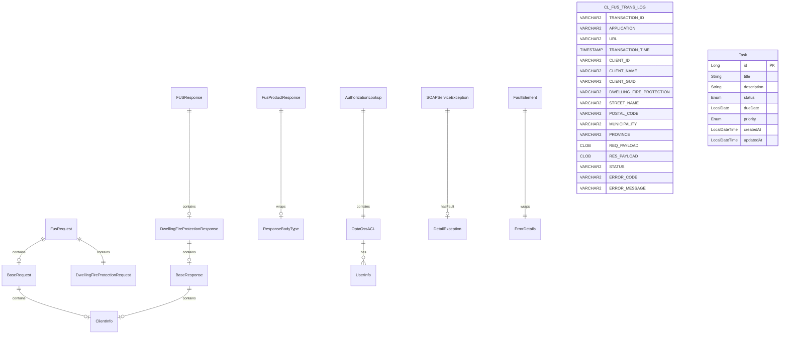

# Data Dictionary

---

| **Field**            | **Details**                                   |
|----------------------|-----------------------------------------------|
| **Project Name**     | Catalyst ESB — OPTA FUS Service               |
| **Application Name** | sb-esb-fus                                    |
| **Version**          | 1.0.0                                         |
| **Date**             | 26-Jun-2025                                   |
| **Prepared By**      | Copilot RE Pipeline                           |
| **Reviewed By**      | Pending                                       |
| **Status**           | Draft                                         |

---

## 1. Overview

This data dictionary provides a comprehensive catalog of all data entities, attributes, data types, relationships, and constraints identified in the **sb-esb-fus** application's data layer during reverse engineering. It covers the Oracle transaction logging table, JAXB/SOAP API payloads, JSON data structures, in-memory caches, and the co-located Spring Boot Task Manager entities. The sb-esb-fus service is a JBoss Fuse 6.3 OSGi bundle that proxies Dwelling Fire Protection scoring from the OPTA Single Service.

---

## 2. Data Sources

| **Data Source**          | **Type**  | **Technology**        | **Schema/Database**   | **Notes**                                              |
|--------------------------|-----------|----------------------|-----------------------|--------------------------------------------------------|
| Oracle Transaction Log   | RDBMS     | Oracle 12c+          | BDQWDAPI              | Transaction audit logging via `CL_FUS_TRANS_LOG` table |
| DataCache — Errors       | Cache     | Java HashMap (in-memory) | —                  | Singleton cache loaded from JSON file on startup       |
| DataCache — Authorization| Cache     | Java HashMap (in-memory) | —                  | Singleton cache loaded from JSON file on startup       |
| JSON Error Config        | File      | JSON / Jackson       | —                     | External file at `ERROR_MSG_LOOKUP` path               |
| JSON Auth Config         | File      | JSON / Jackson       | —                     | External file at `AUTHORIZATION_LOOKUP` path           |
| H2 Database (Task Mgr)   | RDBMS     | H2 (in-memory)      | tasks                 | Spring Boot Task Manager — `tasks` table               |
| Blueprint Config         | File      | Java Properties      | —                     | External properties at `/app/opdata/properties/catalyst/fus/config/app_config.properties` |

---

## 3. Entity Summary

| **Entity ID** | **Entity Name**                  | **Data Source**          | **Type**     | **Record Count** | **Description**                                                  |
|----------------|----------------------------------|--------------------------|--------------|------------------|------------------------------------------------------------------|
| ENT-001        | CL_FUS_TRANS_LOG                 | Oracle Transaction Log   | Table        | Growing          | Transaction audit log for all FUS scoring requests/responses     |
| ENT-002        | FusRequest                       | API Payload              | JAXB DTO     | —                | SOAP request wrapper for FUS scoring                             |
| ENT-003        | DwellingFireProtectionRequest    | API Payload              | JAXB DTO     | —                | Address and industry code data for FUS scoring                   |
| ENT-004        | BaseRequest                      | API Payload              | JAXB DTO     | —                | Client info and language wrapper                                 |
| ENT-005        | ClientInfo                       | API Payload              | JAXB DTO     | —                | Client identification data                                       |
| ENT-006        | FUSResponse                      | API Payload              | JAXB DTO     | —                | SOAP response wrapper for FUS scoring (simplified)               |
| ENT-007        | DwellingFireProtectionResponse   | API Payload              | JAXB DTO     | —                | Simplified fire protection grade response                        |
| ENT-008        | BaseResponse                     | API Payload              | JAXB DTO     | —                | Response metadata with success flag                              |
| ENT-009        | FusProductRequest                | API Payload              | JAXB DTO     | —                | REST/Product SOAP request — flat address structure                |
| ENT-010        | FusProductResponse               | API Payload              | JAXB DTO     | —                | Full OPTA response wrapper for Product endpoint                  |
| ENT-011        | FusAuthRequest                   | Internal Model           | POJO         | —                | OAuth token request credentials                                  |
| ENT-012        | FusAuthResponse                  | Internal Model           | POJO         | —                | OAuth token response (access token + metadata)                   |
| ENT-013        | FusTransactionLog                | Internal Model           | POJO         | —                | Java model for transaction log records                           |
| ENT-014        | SOAPServiceException             | Exception Model          | Exception    | —                | SOAP fault exception with detail                                 |
| ENT-015        | DetailException                  | Exception Model          | JAXB DTO     | —                | SOAP fault detail element                                        |
| ENT-016        | FaultElement                     | Exception Model          | JAXB DTO     | —                | SOAP fault wrapper with error details                            |
| ENT-017        | ErrorMessageLookup               | Cache Data               | POJO         | ~10              | Error code to message mapping loaded from JSON                   |
| ENT-018        | ErrorDetails                     | API Payload              | JAXB DTO     | —                | REST error response body                                         |
| ENT-019        | ResponseError                    | Exception Model          | Exception    | —                | Internal exception carrying error code + message                 |
| ENT-020        | AuthorizationLookup              | Cache Data               | POJO         | ~5               | Authorization config loaded from JSON                            |
| ENT-021        | OptaOssACL                       | Cache Data               | POJO         | —                | ACL configuration wrapper                                        |
| ENT-022        | UserInfo                         | Cache Data               | POJO         | ~5               | Per-user province authorization data                             |
| ENT-023        | DataCache                        | Cache                    | Singleton    | 1                | Thread-safe singleton holding error and auth caches              |
| ENT-024        | Task (Spring Boot)               | H2 Database              | JPA Entity   | Growing          | Task management entity (co-located Spring Boot app)              |

---

## 4. Entity Details

### 4.1 ENT-001: CL_FUS_TRANS_LOG

| **Attribute**         | **Details**                                               |
|-----------------------|-----------------------------------------------------------|
| **Entity ID**         | ENT-001                                                   |
| **Entity Name**       | CL_FUS_TRANS_LOG                                          |
| **Schema**            | BDQWDAPI                                                  |
| **Type**              | Table                                                     |
| **Description**       | Oracle table that stores audit records for every FUS scoring request/response. Captures request metadata, address fields, payloads, status, and errors. |
| **Primary Key**       | None defined (no PK constraint in DDL)                    |
| **Estimated Rows**    | Growing — one row per request                             |
| **Source File/Class** | DDL: `table-schema/fusLogs.sql`; Java: `FusTransactionLog.java`; Logger: `TransactionLogger.java` |

#### Attributes / Columns

| **#** | **Column Name**             | **Data Type**     | **Length/Precision** | **Nullable** | **Default** | **Constraints** | **Usage Status** | **Default/Hardcoded Value**                          | **Mapping Reference** | **Description**                             |
|-------|-----------------------------|-------------------|----------------------|--------------|-------------|-----------------|------------------|------------------------------------------------------|-----------------------|---------------------------------------------|
| 1     | TRANSACTION_ID              | VARCHAR2          | 48 BYTE              | Yes          | —           | —               | Active           | UUID.randomUUID().toString() — `FusAuthorizationProcessor:L81` | F2F 7.1               | Unique UUID for request correlation         |
| 2     | APPLICATION                 | VARCHAR2          | 20 BYTE              | Yes          | —           | —               | Active           | ⚪ Hardcoded: `"OssFUSServiceSoap"` / `"OssFUSServiceRest"` / `"OssFUSProductSoap"` — `LoggerConstants` | F2F 7.1 | Source application identifier               |
| 3     | URL                         | VARCHAR2          | 200 BYTE             | Yes          | —           | —               | Active           | None — extracted from CXF request                    | F2F 7.1               | Request URL from CXF message                |
| 4     | TRANSACTION_TIME            | TIMESTAMP(6)      | —                    | Yes          | —           | —               | Active           | `new Date()` — `TransactionLogger:L109`              | F2F 7.1               | Timestamp of transaction processing         |
| 5     | CLIENT_ID                   | VARCHAR2          | 50 BYTE              | Yes          | —           | —               | Active           | None — from `ClientInfo.clientID`                    | F2F 7.1               | Client ID from request                      |
| 6     | CLIENT_NAME                 | VARCHAR2          | 50 BYTE              | Yes          | —           | —               | Active           | None — from `ClientInfo.clientName`                  | F2F 7.1               | Client name from request                    |
| 7     | CLIENT_GUID                 | VARCHAR2          | 50 BYTE              | Yes          | —           | —               | Active           | None — from `ClientInfo.clientGUID`                  | F2F 7.1               | Client GUID from request                    |
| 8     | DWELLING_FIRE_PROTECTION    | VARCHAR2          | 200 BYTE             | Yes          | —           | —               | Active           | None — mapped grade categories as string             | F2F 7.1               | Fire protection classification result       |
| 9     | STREET_NAME                 | VARCHAR2          | 200 BYTE             | Yes          | —           | —               | Active           | None — from request                                  | F2F 7.1               | Street name from address lookup             |
| 10    | POSTAL_CODE                 | VARCHAR2          | 8 BYTE               | Yes          | —           | —               | Active           | None — from request                                  | F2F 7.1               | Postal code from address lookup             |
| 11    | MUNICIPALITY                | VARCHAR2          | 50 BYTE              | Yes          | —           | —               | Active           | None — from request                                  | F2F 7.1               | Municipality from address lookup            |
| 12    | PROVINCE                    | VARCHAR2          | 10 BYTE              | Yes          | —           | —               | Active           | None — from request                                  | F2F 7.1               | Province code from address lookup           |
| 13    | REQ_PAYLOAD                 | CLOB              | —                    | Yes          | —           | —               | Active           | None — JAXB-marshalled XML of request                | F2F 7.1               | Full request payload (XML serialized)       |
| 14    | RES_PAYLOAD                 | CLOB              | —                    | Yes          | —           | —               | Active           | None — JAXB-marshalled XML of response               | F2F 7.1               | Full response payload (XML/JSON serialized) |
| 15    | STATUS                      | VARCHAR2          | 10 BYTE              | Yes          | —           | —               | Active           | ⚪ Hardcoded: `"success"` or `"error"` — `LoggerConstants` | F2F 7.1          | Processing outcome                          |
| 16    | ERROR_CODE                  | VARCHAR2          | 10 BYTE              | Yes          | —           | —               | Active           | None — FS-prefixed codes from processors             | F2F 7.1               | Error code if processing failed             |
| 17    | ERROR_MESSAGE               | VARCHAR2          | 200 BYTE             | Yes          | —           | —               | Active           | None — error description                             | F2F 7.1               | Error message if processing failed          |

#### Indexes

| **Index Name** | **Columns** | **Type** | **Unique** | **Notes**                            |
|----------------|-------------|----------|------------|--------------------------------------|
| —              | —           | —        | —          | ⚠️ No indexes defined in DDL         |

#### Foreign Key Relationships

| **FK Name** | **Column(s)** | **References** | **On Delete** | **On Update** |
|-------------|---------------|----------------|---------------|---------------|
| —           | —             | —              | —             | —             |

> No foreign keys — standalone audit table.

#### Check Constraints

| **Constraint Name** | **Column(s)** | **Expression**                             |
|---------------------|---------------|--------------------------------------------|
| —                   | —             | ⚠️ No check constraints defined            |

#### Triggers

| **Trigger Name** | **Event** | **Timing** | **Description**                            |
|-------------------|-----------|------------|---------------------------------------------|
| —                 | —         | —          | No triggers defined                         |

---

### 4.2 ENT-002: FusRequest

| **Attribute**         | **Details**                                               |
|-----------------------|-----------------------------------------------------------|
| **Entity ID**         | ENT-002                                                   |
| **Entity Name**       | FusRequest                                                |
| **Schema**            | SOAP XML (namespace: `http://api.esb.ca.aviva.com/v1.0/`) |
| **Type**              | JAXB DTO                                                  |
| **Description**       | Root SOAP request element for the FUS scoring endpoint (`/pl/api/oss/fus`). Contains base request metadata and dwelling fire protection address data. |
| **Primary Key**       | —                                                         |
| **Source File/Class** | `com.aviva.ca.esb.cl.opta.fus.model.FusRequest`          |

#### Attributes / Columns

| **#** | **Column Name**                  | **Data Type** | **Length/Precision** | **Nullable** | **Default** | **Constraints**   | **Usage Status** | **Default/Hardcoded Value** | **Mapping Reference** | **Description**                          |
|-------|----------------------------------|---------------|----------------------|--------------|-------------|-------------------|------------------|-----------------------------|----------------------|------------------------------------------|
| 1     | baseRequest                      | BaseRequest   | —                    | Yes          | —           | `required=true`   | Active           | None                        | F2F 3.1              | Client metadata and language wrapper     |
| 2     | DwellingFireProtectionRequest    | DwellingFireProtectionRequest | — | Yes        | —           | `required=true`   | Active           | None                        | F2F 3.1              | Address and industry code data           |

---

### 4.3 ENT-003: DwellingFireProtectionRequest

| **Attribute**         | **Details**                                               |
|-----------------------|-----------------------------------------------------------|
| **Entity ID**         | ENT-003                                                   |
| **Entity Name**       | DwellingFireProtectionRequest                             |
| **Schema**            | SOAP XML (namespace: `http://api.esb.ca.aviva.com/v1.0/`) |
| **Type**              | JAXB DTO                                                  |
| **Description**       | Contains address fields and industry codes for a dwelling fire protection score request. Used as nested element in `FusRequest`. |
| **Source File/Class** | `com.aviva.ca.esb.cl.opta.fus.model.DwellingFireProtectionRequest` |

#### Attributes / Columns

| **#** | **Column Name** | **Data Type** | **Length/Precision** | **Nullable** | **Default** | **Constraints**   | **Usage Status** | **Default/Hardcoded Value** | **Mapping Reference** | **Description**                   |
|-------|-----------------|---------------|----------------------|--------------|-------------|-------------------|------------------|-----------------------------|----------------------|-----------------------------------|
| 1     | streetName      | String        | —                    | No           | —           | `required=true`   | Active           | None                        | F2F 5.1              | Street address                    |
| 2     | postalCode      | String        | —                    | No           | —           | `required=true`   | Active           | None                        | F2F 5.1              | Canadian postal code              |
| 3     | municipality    | String        | —                    | No           | —           | `required=true`   | Active           | None                        | F2F 5.1              | Municipality/city name            |
| 4     | province        | String        | —                    | No           | —           | `required=true`   | Active           | None                        | F2F 5.1              | Province code (e.g., ON, BC)      |
| 5     | ibcCode         | String        | —                    | Yes          | —           | `required=false`  | Active           | None                        | F2F 5.1              | IBC industry classification code  |
| 6     | naicsCode       | String        | —                    | Yes          | —           | `required=false`  | Active           | None                        | F2F 5.1              | NAICS industry code               |
| 7     | sicCode         | String        | —                    | Yes          | —           | `required=false`  | Active           | None                        | F2F 5.1              | SIC industry code                 |

> **Dead Code Note:** The field `fullResReq` (String, Y/N toggle for full response) is commented out in source (L45–L48, L141–L151). Was originally used to control full vs. simplified response but has been removed.

---

### 4.4 ENT-005: ClientInfo

| **Attribute**         | **Details**                                               |
|-----------------------|-----------------------------------------------------------|
| **Entity ID**         | ENT-005                                                   |
| **Entity Name**       | ClientInfo                                                |
| **Schema**            | SOAP XML (namespace: `http://api.esb.ca.aviva.com/v1.0/`) |
| **Type**              | JAXB DTO                                                  |
| **Description**       | Client identification data included in both requests and responses. Identifies the calling application/client. |
| **Source File/Class** | `com.aviva.ca.esb.cl.opta.fus.model.ClientInfo`          |

#### Attributes / Columns

| **#** | **Column Name**   | **Data Type** | **Length/Precision** | **Nullable** | **Default** | **Constraints**   | **Usage Status** | **Default/Hardcoded Value** | **Mapping Reference** | **Description**                   |
|-------|-------------------|---------------|----------------------|--------------|-------------|-------------------|------------------|-----------------------------|----------------------|-----------------------------------|
| 1     | clientID          | String        | —                    | Yes          | —           | `required=false`  | Active           | None                        | F2F 3.1              | Client identifier                 |
| 2     | clientName        | String        | —                    | Yes          | —           | `required=false`  | Active           | None                        | F2F 3.1              | Client display name               |
| 3     | clientGUID        | String        | —                    | Yes          | —           | `required=false`  | Active           | None                        | F2F 3.1              | Client globally unique identifier |
| 4     | transactionTime   | String        | —                    | Yes          | —           | `required=false`  | Active           | Set by processor: `yyyy-MM-dd'T'HH:mm:ss:SSSXXX` format | F2F 3.1 | Timestamp of transaction |

---

### 4.5 ENT-006: FUSResponse

| **Attribute**         | **Details**                                               |
|-----------------------|-----------------------------------------------------------|
| **Entity ID**         | ENT-006                                                   |
| **Entity Name**       | FUSResponse                                               |
| **Schema**            | SOAP XML                                                  |
| **Type**              | JAXB DTO                                                  |
| **Description**       | Root SOAP response element for the simplified FUS scoring endpoint. Contains the mapped dwelling fire protection response. Originally had a `ResponseBodyType` for full responses (now commented out). |
| **Source File/Class** | `com.aviva.ca.esb.cl.opta.fus.model.FUSResponse`         |

#### Attributes / Columns

| **#** | **Column Name**                  | **Data Type**                   | **Length** | **Nullable** | **Default** | **Constraints**   | **Usage Status** | **Default/Hardcoded Value** | **Mapping Reference** | **Description**                          |
|-------|----------------------------------|---------------------------------|------------|--------------|-------------|-------------------|------------------|-----------------------------|----------------------|------------------------------------------|
| 1     | DwellingFireProtectionResponse   | DwellingFireProtectionResponse  | —          | Yes          | —           | `required=false`  | Active           | None                        | F2F 6.1              | Simplified fire protection grade result  |

> **Dead Code Note:** Field `ResponseBodyType` (wrapping OPTA full response) is commented out in source (L22–L40).

---

### 4.6 ENT-007: DwellingFireProtectionResponse

| **Attribute**         | **Details**                                               |
|-----------------------|-----------------------------------------------------------|
| **Entity ID**         | ENT-007                                                   |
| **Entity Name**       | DwellingFireProtectionResponse                            |
| **Schema**            | SOAP XML (namespace: `http://api.esb.ca.aviva.com/v1.0/`) |
| **Type**              | JAXB DTO                                                  |
| **Description**       | Contains the simplified fire protection grade mapping result. The `DwellingFireProtection` list should contain exactly one category string (e.g., "hydrant", "firehall"). |
| **Source File/Class** | `com.aviva.ca.esb.cl.opta.fus.model.DwellingFireProtectionResponse` |

#### Attributes / Columns

| **#** | **Column Name**          | **Data Type**  | **Length** | **Nullable** | **Default** | **Constraints**   | **Usage Status** | **Default/Hardcoded Value** | **Mapping Reference** | **Description**                             |
|-------|--------------------------|----------------|------------|--------------|-------------|-------------------|------------------|-----------------------------|----------------------|---------------------------------------------|
| 1     | baseResponse             | BaseResponse   | —          | Yes          | —           | `required=false`  | Active           | None                        | F2F 6.1              | Response metadata with client info + success flag |
| 2     | DwellingFireProtection   | List\<String\> | —          | Yes          | Empty list  | `required=false`  | Active           | None — populated by `mapProtectionInfo()` | F2F 6.1 | Fire protection categories: `firehall`, `shuttletanker`, `unprorected` ⚠️, `hydrant` |

---

### 4.7 ENT-008: BaseResponse

| **Attribute**         | **Details**                                               |
|-----------------------|-----------------------------------------------------------|
| **Entity ID**         | ENT-008                                                   |
| **Entity Name**       | BaseResponse                                              |
| **Type**              | JAXB DTO                                                  |
| **Source File/Class** | `com.aviva.ca.esb.cl.opta.fus.model.BaseResponse`        |

#### Attributes / Columns

| **#** | **Column Name** | **Data Type** | **Length** | **Nullable** | **Default** | **Constraints**   | **Usage Status** | **Default/Hardcoded Value** | **Mapping Reference** | **Description**            |
|-------|-----------------|---------------|------------|--------------|-------------|-------------------|------------------|-----------------------------|----------------------|----------------------------|
| 1     | clientInfo      | ClientInfo    | —          | Yes          | —           | `required=false`  | Active           | None — echoed from request  | F2F 6.1              | Echoed client info         |
| 2     | isSuccessful    | boolean       | —          | No           | false       | `required=false`  | Active           | Set to `true` on single-grade success | F2F 6.1 | Indicates successful scoring |

---

### 4.8 ENT-009: FusProductRequest

| **Attribute**         | **Details**                                               |
|-----------------------|-----------------------------------------------------------|
| **Entity ID**         | ENT-009                                                   |
| **Entity Name**       | FusProductRequest                                         |
| **Schema**            | SOAP XML / REST Query Parameters                          |
| **Type**              | JAXB DTO with JAX-RS `@QueryParam` annotations            |
| **Description**       | Flat request model for REST and Product SOAP endpoints. Contains address + industry codes directly (no nested objects). Uses `@QueryParam` for REST binding and `@XmlElement` for SOAP. |
| **Source File/Class** | `com.aviva.ca.esb.cl.opta.fus.model.FusProductRequest`   |

#### Attributes / Columns

| **#** | **Column Name** | **Data Type** | **Length** | **Nullable** | **Default** | **Constraints**             | **Usage Status** | **Default/Hardcoded Value** | **Mapping Reference** | **Description**                   |
|-------|-----------------|---------------|------------|--------------|-------------|----------------------------|------------------|-----------------------------|----------------------|-----------------------------------|
| 1     | streetName      | String        | —          | No           | —           | `required=true`, `@QueryParam("streetAddress")` | Active | None                       | F2F 5.1              | Street address                    |
| 2     | postalCode      | String        | —          | No           | —           | `required=true`, `@QueryParam("postalCode")`    | Active | None                       | F2F 5.1              | Canadian postal code              |
| 3     | municipality    | String        | —          | No           | —           | `required=true`, `@QueryParam("municipality")`  | Active | None                       | F2F 5.1              | Municipality/city name            |
| 4     | province        | String        | —          | No           | —           | `required=true`, `@QueryParam("province")`      | Active | None                       | F2F 5.1              | Province code                     |
| 5     | ibcCode         | String        | —          | Yes          | —           | `required=false`, `@QueryParam("ibcCode")`      | Active | None                       | F2F 5.1              | IBC industry code                 |
| 6     | naicsCode       | String        | —          | Yes          | —           | `required=false`, `@QueryParam("naicsCode")`    | Active | None                       | F2F 5.1              | NAICS industry code               |
| 7     | sicCode         | String        | —          | Yes          | —           | `required=false`, `@QueryParam("sicCode")`      | Active | None                       | F2F 5.1              | SIC industry code                 |

---

### 4.9 ENT-011: FusAuthRequest

| **Attribute**         | **Details**                                               |
|-----------------------|-----------------------------------------------------------|
| **Entity ID**         | ENT-011                                                   |
| **Entity Name**       | FusAuthRequest                                            |
| **Type**              | POJO (not directly serialized — query string built manually) |
| **Description**       | OAuth token request model. Fields correspond to `application/x-www-form-urlencoded` parameters. Note: The POJO is constructed but not serialized — the query string is built by string concatenation. |
| **Source File/Class** | `com.aviva.ca.esb.cl.opta.fus.model.FusAuthRequest`      |

#### Attributes / Columns

| **#** | **Column Name**  | **Data Type** | **Length** | **Nullable** | **Default** | **Constraints** | **Usage Status** | **Default/Hardcoded Value**                        | **Mapping Reference** | **Description**                    |
|-------|------------------|---------------|------------|--------------|-------------|-----------------|------------------|----------------------------------------------------|----------------------|------------------------------------|
| 1     | grant_type       | String        | —          | No           | —           | —               | Active           | ⚪ From config: `FUS_GRANT_TYPE` (typically `"refresh_token"`) | F2F 4.1       | OAuth grant type                   |
| 2     | client_id        | String        | —          | No           | —           | —               | Active           | ⚪ From config: `FUS_CLIENT_ID`                     | F2F 4.1              | OAuth client identifier            |
| 3     | client_secret    | String        | —          | No           | —           | —               | Active           | ⚪ From config: `FUS_CLIENT_SECRET` (encrypted)     | F2F 4.1              | OAuth client secret                |
| 4     | refresh_token    | String        | —          | No           | —           | —               | Active           | ⚪ From config: `FUS_AUTH_TOKEN` (encrypted)         | F2F 4.1              | OAuth refresh token                |

---

### 4.10 ENT-012: FusAuthResponse

| **Attribute**         | **Details**                                               |
|-----------------------|-----------------------------------------------------------|
| **Entity ID**         | ENT-012                                                   |
| **Entity Name**       | FusAuthResponse                                           |
| **Type**              | POJO (Jackson `@JsonProperty` annotated)                  |
| **Description**       | OAuth token response model. Only `access_token` is actually used downstream; all other fields are deserialized but unused. |
| **Source File/Class** | `com.aviva.ca.esb.cl.opta.fus.model.FusAuthResponse`     |

#### Attributes / Columns

| **#** | **Column Name**     | **Data Type** | **Length** | **Nullable** | **Default** | **Constraints** | **Usage Status** | **Default/Hardcoded Value** | **Mapping Reference** | **Description**                       |
|-------|---------------------|---------------|------------|--------------|-------------|-----------------|------------------|-----------------------------|----------------------|---------------------------------------|
| 1     | accesToken          | String        | —          | Yes          | —           | `@JsonProperty("access_token")` | Active    | None                        | F2F 4.1              | OAuth access token (note typo: should be `accessToken`) |
| 2     | expiresIn           | String        | —          | Yes          | —           | `@JsonProperty("expires_in")`   | Dead      | None                        | —                    | Token expiry (unused after deserialization) |
| 3     | refreshExpiresIn    | String        | —          | Yes          | —           | `@JsonProperty("refresh_expires_in")` | Dead | None                       | —                    | Refresh token expiry (unused)         |
| 4     | refreshToken        | String        | —          | Yes          | —           | `@JsonProperty("refresh_token")` | Dead     | None                        | —                    | New refresh token (unused)            |
| 5     | tokenType           | String        | —          | Yes          | —           | `@JsonProperty("token_type")`    | Dead     | None                        | —                    | Token type (unused)                   |
| 6     | notBeforePolicy     | String        | —          | Yes          | —           | `@JsonProperty("not-before-policy")` | Dead | None                       | —                    | Not-before policy (unused)            |
| 7     | sessionState        | String        | —          | Yes          | —           | `@JsonProperty("session_state")` | Dead     | None                        | —                    | Session state (unused)                |

---

### 4.11 ENT-013: FusTransactionLog

| **Attribute**         | **Details**                                               |
|-----------------------|-----------------------------------------------------------|
| **Entity ID**         | ENT-013                                                   |
| **Entity Name**       | FusTransactionLog                                         |
| **Type**              | POJO — maps directly to `CL_FUS_TRANS_LOG` columns        |
| **Description**       | Java model that mirrors the Oracle transaction log table. Populated by `TransactionLogger.logTransaction()` from exchange properties and inserted via JdbcTemplate. |
| **Source File/Class** | `com.aviva.ca.esb.cl.opta.fus.logging.FusTransactionLog` |

#### Attributes / Columns

| **#** | **Column Name**            | **Data Type** | **Length** | **Nullable** | **Default** | **Constraints** | **Usage Status** | **Default/Hardcoded Value** | **Mapping Reference** | **Description**            |
|-------|----------------------------|---------------|------------|--------------|-------------|-----------------|------------------|-----------------------------|----------------------|----------------------------|
| 1     | transactionId              | String        | 48         | Yes          | —           | —               | Active           | UUID.randomUUID()           | F2F 7.1              | Unique transaction ID      |
| 2     | application                | String        | 20         | Yes          | —           | —               | Active           | ⚪ LoggerConstants values    | F2F 7.1              | Source application name    |
| 3     | url                        | String        | 200        | Yes          | —           | —               | Active           | None                        | F2F 7.1              | Request URL                |
| 4     | transactionTime            | Date          | —          | Yes          | —           | —               | Active           | `new Date()`                | F2F 7.1              | Processing timestamp       |
| 5     | clientID                   | String        | 50         | Yes          | —           | —               | Active           | None                        | F2F 7.1              | Client ID                  |
| 6     | clientName                 | String        | 50         | Yes          | —           | —               | Active           | None                        | F2F 7.1              | Client name                |
| 7     | clientGUID                 | String        | 50         | Yes          | —           | —               | Active           | None                        | F2F 7.1              | Client GUID                |
| 8     | dwellingFireProtection     | String        | 200        | Yes          | —           | —               | Active           | None                        | F2F 7.1              | Grade mapping result       |
| 9     | streetName                 | String        | 200        | Yes          | —           | —               | Active           | None                        | F2F 7.1              | Street from request        |
| 10    | postalCode                 | String        | 8          | Yes          | —           | —               | Active           | None                        | F2F 7.1              | Postal code from request   |
| 11    | municipality               | String        | 50         | Yes          | —           | —               | Active           | None                        | F2F 7.1              | Municipality from request  |
| 12    | province                   | String        | 10         | Yes          | —           | —               | Active           | None                        | F2F 7.1              | Province from request      |
| 13    | reqPayload                 | String        | CLOB       | Yes          | —           | —               | Active           | None — JAXB XML             | F2F 7.1              | Full request payload       |
| 14    | resPayload                 | String        | CLOB       | Yes          | —           | —               | Active           | None — JAXB XML/JSON        | F2F 7.1              | Full response payload      |
| 15    | status                     | String        | 10         | Yes          | —           | —               | Active           | ⚪ `"success"` or `"error"` | F2F 7.1              | Processing status          |
| 16    | errorCode                  | String        | 10         | Yes          | —           | —               | Active           | None                        | F2F 7.1              | Error code (FS-prefix)     |
| 17    | errorMessage               | String        | 200        | Yes          | —           | —               | Active           | None                        | F2F 7.1              | Error description          |

---

### 4.12 ENT-024: Task (Spring Boot Task Manager)

| **Attribute**         | **Details**                                               |
|-----------------------|-----------------------------------------------------------|
| **Entity ID**         | ENT-024                                                   |
| **Entity Name**       | Task                                                      |
| **Schema**            | H2 in-memory database                                     |
| **Type**              | JPA Entity (`@Entity`, table `tasks`)                     |
| **Description**       | Task management entity from the co-located Spring Boot application. Supports CRUD operations via REST API. |
| **Primary Key**       | `id` (auto-generated IDENTITY)                            |
| **Source File/Class** | `com.example.taskmanager.model.Task`                      |

#### Attributes / Columns

| **#** | **Column Name** | **Data Type**    | **Length/Precision** | **Nullable** | **Default**              | **Constraints**                | **Usage Status** | **Default/Hardcoded Value** | **Mapping Reference** | **Description**                   |
|-------|-----------------|------------------|----------------------|--------------|--------------------------|--------------------------------|------------------|-----------------------------|----------------------|-----------------------------------|
| 1     | id              | Long             | —                    | No           | Auto-generated           | PK, `@GeneratedValue(IDENTITY)` | Active         | Auto-increment              | —                    | Primary key                       |
| 2     | title           | String           | 200                  | No           | —                        | `@NotBlank`, `@Size(max=200)` | Active           | None                        | —                    | Task title                        |
| 3     | description     | String           | 1000                 | Yes          | —                        | `@Size(max=1000)`             | Active           | None                        | —                    | Task description                  |
| 4     | status          | Enum (Status)    | —                    | Yes          | `TODO`                   | `@Enumerated(STRING)`         | Active           | ⚪ Default: `Status.TODO`    | —                    | Task status                       |
| 5     | dueDate         | LocalDate        | —                    | Yes          | —                        | —                              | Active           | None                        | —                    | Task due date                     |
| 6     | priority        | Enum (Priority)  | —                    | Yes          | —                        | `@Enumerated(STRING)`         | Active           | None                        | —                    | Task priority level               |
| 7     | createdAt       | LocalDateTime    | —                    | Yes          | `LocalDateTime.now()`    | Set by `@PrePersist`          | Active           | Auto-set on create          | —                    | Creation timestamp                |
| 8     | updatedAt       | LocalDateTime    | —                    | Yes          | `LocalDateTime.now()`    | Set by `@PrePersist`/`@PreUpdate` | Active       | Auto-set on create/update   | —                    | Last update timestamp             |

---

## 5. Entity Relationship Summary

### 5.1 Relationship Matrix

| **Parent Entity**                 | **Child Entity**                  | **Relationship**                        | **Cardinality** | **FK Column(s)** |
|------------------------------------|-----------------------------------|-----------------------------------------|-----------------|------------------|
| FusRequest (ENT-002)               | BaseRequest (ENT-004)             | Contains client metadata                | 1:1             | Embedded         |
| FusRequest (ENT-002)               | DwellingFireProtectionRequest (ENT-003) | Contains address data              | 1:1             | Embedded         |
| BaseRequest (ENT-004)              | ClientInfo (ENT-005)              | Contains client identification          | 1:1             | Embedded         |
| FUSResponse (ENT-006)              | DwellingFireProtectionResponse (ENT-007) | Contains scoring result          | 1:1             | Embedded         |
| DwellingFireProtectionResponse (ENT-007) | BaseResponse (ENT-008)       | Contains response metadata              | 1:1             | Embedded         |
| BaseResponse (ENT-008)             | ClientInfo (ENT-005)              | Contains echoed client info             | 1:1             | Embedded         |
| FusProductResponse (ENT-010)       | ResponseBodyType (OPTA)           | Wraps full OPTA response                | 1:1             | Embedded         |
| AuthorizationLookup (ENT-020)      | OptaOssACL (ENT-021)              | Contains ACL configuration              | 1:1             | Embedded         |
| OptaOssACL (ENT-021)               | UserInfo (ENT-022)                | Contains user authorization entries     | 1:N             | Embedded         |
| SOAPServiceException (ENT-014)     | DetailException (ENT-015)         | Contains SOAP fault detail              | 1:1             | Embedded         |
| FaultElement (ENT-016)             | ErrorDetails (ENT-018)            | Contains error response                 | 1:1             | Embedded         |

### 5.2 ER Diagram (Mermaid)



---

## 6. Enumerated Values / Reference Data

| **Entity/Column**              | **Code**       | **Display Value**     | **Description**                                 | **Used in Source** | **Active** |
|--------------------------------|----------------|-----------------------|-------------------------------------------------|---------------------|------------|
| Task.status                    | `TODO`         | To Do                 | Task not yet started                            | ✅ Yes              | Yes        |
| Task.status                    | `IN_PROGRESS`  | In Progress           | Task currently being worked on                  | ✅ Yes              | Yes        |
| Task.status                    | `DONE`         | Done                  | Task completed                                  | ✅ Yes              | Yes        |
| Task.priority                  | `LOW`          | Low                   | Low priority task                               | ✅ Yes              | Yes        |
| Task.priority                  | `MEDIUM`       | Medium                | Medium priority task                            | ✅ Yes              | Yes        |
| Task.priority                  | `HIGH`         | High                  | High priority task                              | ✅ Yes              | Yes        |
| Task.priority                  | `CRITICAL`     | Critical              | Critical priority task                          | ✅ Yes              | Yes        |
| CL_FUS_TRANS_LOG.STATUS        | `success`      | Success               | Successful processing                           | ✅ Yes              | Yes        |
| CL_FUS_TRANS_LOG.STATUS        | `error`        | Error                 | Error during processing                         | ✅ Yes              | Yes        |
| CL_FUS_TRANS_LOG.APPLICATION   | `OssFUSServiceSoap` | SOAP Service     | SOAP FUS scoring request                        | ✅ Yes              | Yes        |
| CL_FUS_TRANS_LOG.APPLICATION   | `OssFUSServiceRest` | REST Service     | REST FUS scoring request                        | ✅ Yes              | Yes        |
| CL_FUS_TRANS_LOG.APPLICATION   | `OssFUSProductSoap` | Product SOAP     | Product endpoint SOAP request                   | ✅ Yes              | Yes        |
| DwellingFireProtection         | `firehall`     | Firehall Protected    | Property protected by firehall (grades 3B, etc.)| ✅ Yes              | Yes        |
| DwellingFireProtection         | `shuttletanker`| Shuttle/Tanker        | Property protected by shuttle tanker (grades 3BS)| ✅ Yes             | Yes        |
| DwellingFireProtection         | `unprorected`  | Unprotected ⚠️       | Property not protected (grades 4, 5). **TYPO** in code | ✅ Yes        | Yes        |
| DwellingFireProtection         | `hydrant`      | Hydrant Protected     | Property protected by hydrant (grades 1, 2, 3A) | ✅ Yes              | Yes        |

---

## 7. API Data Structures

### 7.1 FusRequest (SOAP Request)

| **Attribute**        | **Details**                               |
|----------------------|-------------------------------------------|
| **Structure Name**   | FusRequest                                |
| **Used In**          | SOAP endpoint `/pl/api/oss/fus`           |
| **Format**           | XML (JAXB)                                |

| **Field Name**                    | **Data Type** | **Required** | **Validation**     | **Usage Status** | **Default/Hardcoded Value** | **Mapping Reference** | **Description**                 |
|-----------------------------------|---------------|--------------|--------------------|-----------------|-----------------------------|----------------------|---------------------------------|
| baseRequest                       | BaseRequest   | Yes          | —                  | Active          | None                        | F2F 3.1              | Client metadata                 |
| baseRequest.clientInfo.clientID   | String        | No           | —                  | Active          | None                        | F2F 3.1              | Client ID                       |
| baseRequest.clientInfo.clientName | String        | No           | —                  | Active          | None                        | F2F 3.1              | Client name                     |
| baseRequest.clientInfo.clientGUID | String        | No           | —                  | Active          | None                        | F2F 3.1              | Client GUID                     |
| baseRequest.language              | String        | No           | —                  | Active          | None                        | F2F 3.1              | Language preference              |
| DwellingFireProtectionRequest.streetName | String | Yes          | Not blank (BR-002) | Active          | None                        | F2F 5.1              | Street address                  |
| DwellingFireProtectionRequest.postalCode| String | Yes          | Not blank (BR-002) | Active          | None                        | F2F 5.1              | Postal code                     |
| DwellingFireProtectionRequest.municipality| String| Yes         | Not blank (BR-002) | Active          | None                        | F2F 5.1              | Municipality                    |
| DwellingFireProtectionRequest.province| String   | Yes          | Not blank (BR-002), Authorized (BR-001) | Active | None             | F2F 5.1              | Province code                   |
| DwellingFireProtectionRequest.ibcCode | String   | No           | —                  | Active          | None                        | F2F 5.1              | IBC industry code               |
| DwellingFireProtectionRequest.naicsCode| String  | No           | —                  | Active          | None                        | F2F 5.1              | NAICS industry code             |
| DwellingFireProtectionRequest.sicCode | String   | No           | —                  | Active          | None                        | F2F 5.1              | SIC industry code               |

#### Sample Payload

```xml
<FusRequest xmlns="http://api.esb.ca.aviva.com/v1.0/">
  <baseRequest>
    <clientInfo>
      <clientID>APP001</clientID>
      <clientName>PolicyApp</clientName>
      <clientGUID>550e8400-e29b-41d4-a716-446655440000</clientGUID>
    </clientInfo>
    <language>EN</language>
  </baseRequest>
  <DwellingFireProtectionRequest>
    <streetName>123 Main Street</streetName>
    <postalCode>M5V 2T6</postalCode>
    <municipality>Toronto</municipality>
    <province>ON</province>
    <ibcCode/>
    <naicsCode/>
    <sicCode/>
  </DwellingFireProtectionRequest>
</FusRequest>
```

### 7.2 FusProductRequest (REST/Product SOAP Request)

| **Attribute**        | **Details**                                                   |
|----------------------|---------------------------------------------------------------|
| **Structure Name**   | FusProductRequest                                             |
| **Used In**          | REST `/pl/api/oss/rest/product/fus/`, SOAP `/pl/api/oss/product/fus` |
| **Format**           | Query parameters (REST) / XML (SOAP)                          |

| **Field Name** | **Data Type** | **Required** | **Validation**     | **Usage Status** | **Default/Hardcoded Value** | **Mapping Reference** | **Description**        |
|----------------|---------------|--------------|--------------------|-----------------|-----------------------------|----------------------|------------------------|
| streetName     | String        | Yes          | Not blank (BR-012) | Active          | None                        | F2F 5.1              | Street address         |
| postalCode     | String        | Yes          | Not blank (BR-012) | Active          | None                        | F2F 5.1              | Postal code            |
| municipality   | String        | Yes          | Not blank (BR-012) | Active          | None                        | F2F 5.1              | Municipality           |
| province       | String        | Yes          | Not blank (BR-012), Authorized (BR-011) | Active | None             | F2F 5.1              | Province code          |
| ibcCode        | String        | No           | —                  | Active          | None                        | F2F 5.1              | IBC industry code      |
| naicsCode      | String        | No           | —                  | Active          | None                        | F2F 5.1              | NAICS industry code    |
| sicCode        | String        | No           | —                  | Active          | None                        | F2F 5.1              | SIC industry code      |

#### Sample Payload (REST)

```
GET /pl/api/oss/rest/product/fus/?streetAddress=123+Main+St&postalCode=M5V2T6&municipality=Toronto&province=ON
```

### 7.3 FUSResponse (SOAP Simplified Response)

| **Attribute**        | **Details**                               |
|----------------------|-------------------------------------------|
| **Structure Name**   | FUSResponse                               |
| **Used In**          | SOAP endpoint `/pl/api/oss/fus`           |
| **Format**           | XML (JAXB)                                |

| **Field Name**                                   | **Data Type**  | **Required** | **Validation** | **Usage Status** | **Default/Hardcoded Value** | **Mapping Reference** | **Description**                   |
|--------------------------------------------------|----------------|--------------|----------------|-----------------|-----------------------------|----------------------|-----------------------------------|
| DwellingFireProtectionResponse.baseResponse.clientInfo | ClientInfo | No         | —              | Active          | Echoed from request         | F2F 6.1              | Client info echoed back           |
| DwellingFireProtectionResponse.baseResponse.isSuccessful | boolean  | No         | —              | Active          | `true` on success           | F2F 6.1              | Success indicator                 |
| DwellingFireProtectionResponse.DwellingFireProtection   | List\<String\> | No     | —              | Active          | None                        | F2F 6.1              | Fire protection category list     |

#### Sample Payload

```xml
<FUSResponse>
  <DwellingFireProtectionResponse>
    <baseResponse xmlns="http://api.esb.ca.aviva.com/v1.0/">
      <clientInfo>
        <clientID>APP001</clientID>
        <clientName>PolicyApp</clientName>
        <clientGUID>550e8400-e29b-41d4-a716-446655440000</clientGUID>
        <transactionTime>2025-06-26T10:30:00:000-04:00</transactionTime>
      </clientInfo>
      <isSuccessful>true</isSuccessful>
    </baseResponse>
    <DwellingFireProtection xmlns="http://api.esb.ca.aviva.com/v1.0/">hydrant</DwellingFireProtection>
  </DwellingFireProtectionResponse>
</FUSResponse>
```

### 7.4 ErrorDetails (REST Error Response)

| **Attribute**        | **Details**                               |
|----------------------|-------------------------------------------|
| **Structure Name**   | ErrorDetails                              |
| **Used In**          | REST error responses                      |
| **Format**           | JSON                                      |

| **Field Name** | **Data Type** | **Required** | **Validation** | **Usage Status** | **Default/Hardcoded Value** | **Mapping Reference** | **Description**        |
|----------------|---------------|--------------|----------------|-----------------|-----------------------------|----------------------|------------------------|
| code           | String        | Yes          | —              | Active          | None                        | F2F 8.1              | Error code (FS-prefix) |
| message        | String        | Yes          | —              | Active          | None                        | F2F 8.1              | Error description      |

#### Sample Payload

```json
{
  "code": "FS1001",
  "message": "Street Address field is blank"
}
```

---

## 8. Configuration Data

| **Key/Property**              | **Data Type** | **Default Value**  | **Description**                                   | **Source File**         |
|-------------------------------|---------------|--------------------|---------------------------------------------------|--------------------------|
| `LDAP_LOGIN`                  | String        | —                  | JAAS LDAP login context name                      | `app_config.properties`  |
| `SUPPORTED_PROVINCE_LIST`     | String (CSV)  | —                  | Comma-separated list of authorized province codes | `app_config.properties`  |
| `FUS_REQUESTID_PREFIX`        | String        | —                  | Prefix for OPTA request IDs                       | `app_config.properties`  |
| `FUS_DEFAULT_BROKERAGE`       | String        | `"ABC Brokerage"`  | Default brokerage name for OPTA requests          | `app_config.properties`  |
| `FUS_DEFAULT_CARRIER`         | String        | `"Aviva"`          | Default carrier name for OPTA requests            | `app_config.properties`  |
| `FUS_DEFAULT_USERNAME`        | String        | —                  | Default username for OPTA requests                | `app_config.properties`  |
| `FUS_AUTH_TOKEN`              | String        | —                  | OAuth refresh token (Jasypt encrypted)            | `app_config.properties`  |
| `FUS_GRANT_TYPE`              | String        | `"refresh_token"`  | OAuth grant type                                  | `app_config.properties`  |
| `FUS_CLIENT_SECRET`           | String        | —                  | OAuth client secret (Jasypt encrypted)            | `app_config.properties`  |
| `FUS_CLIENT_ID`               | String        | —                  | OAuth client ID                                   | `app_config.properties`  |
| `FUS_WITHAUTH_ENDPOINT_URL`   | String        | —                  | OPTA Single Service SOAP endpoint URL             | `app_config.properties`  |
| `FUS_AUTH_ENDPOINT_URL`       | String        | —                  | OAuth token endpoint URL                          | `app_config.properties`  |
| `FUS_CONNECTION_TIMEOUT`      | Integer       | `30000`            | HTTP connection timeout in ms                     | `app_config.properties`  |
| `FUS_RECEIVE_TIMEOUT`         | Integer       | `30000`            | HTTP receive timeout in ms                        | `app_config.properties`  |
| `FUS_TRUST_PWD`               | String        | —                  | JKS truststore/keystore password (encrypted)      | `app_config.properties`  |
| `FUS_TRUST_STOREPATH`         | String        | —                  | JKS truststore file path                          | `app_config.properties`  |
| `ERROR_MSG_LOOKUP`            | String        | —                  | File path for error message JSON                  | `app_config.properties`  |
| `AUTHORIZATION_LOOKUP`        | String        | —                  | File path for authorization JSON                  | `app_config.properties`  |
| `LOGGER_URL`                  | String        | —                  | Oracle JDBC URL for transaction logging           | `app_config.properties`  |
| `LOGGER_USERNAME`             | String        | —                  | Oracle username for logging                       | `app_config.properties`  |
| `LOGGER_PASSWORD`             | String        | —                  | Oracle password for logging (encrypted)           | `app_config.properties`  |
| `spring.application.name`     | String        | `task-manager`     | Spring Boot application name (Task Manager)       | `application.properties` |
| `spring.datasource.url`       | String        | `jdbc:h2:mem:taskdb` | H2 database URL (Task Manager)                 | `application.properties` |
| `server.port`                 | Integer       | `8080`             | Spring Boot server port                           | `application.properties` |

---

## 9. Data Quality Observations

| **#** | **Entity**                    | **Issue**                                                    | **Severity** | **Recommendation**                          |
|-------|-------------------------------|--------------------------------------------------------------|--------------|---------------------------------------------|
| 1     | CL_FUS_TRANS_LOG              | No primary key defined                                       | High         | Add PK on TRANSACTION_ID or auto-increment   |
| 2     | CL_FUS_TRANS_LOG              | No indexes defined — query performance risk                  | High         | Add index on TRANSACTION_ID, TRANSACTION_TIME |
| 3     | CL_FUS_TRANS_LOG              | All columns nullable — no NOT NULL constraints               | Medium       | Add NOT NULL on TRANSACTION_ID, APPLICATION, STATUS |
| 4     | CL_FUS_TRANS_LOG              | No check constraint on STATUS values                         | Low          | Add CHECK (STATUS IN ('success','error'))    |
| 5     | DwellingFireProtectionRequest | No length/format validation on postalCode                    | High         | Add regex validation for Canadian postal code |
| 6     | DwellingFireProtectionRequest | No validation on province values (any string accepted)       | Medium       | Add enum or lookup validation                |
| 7     | FusAuthResponse               | 6 of 7 fields deserialized but never used                    | Low          | Remove unused fields in migration            |
| 8     | DwellingFireProtection        | Typo `"unprorected"` in mapped category names                | High         | Fix typo to `"unprotected"` in migration     |
| 9     | CL_FUS_TRANS_LOG              | CLIENT_ID initially 30 bytes, later ALTERed to 50            | Low          | Standardize column sizes                     |
| 10    | FusRequest                    | Field naming inconsistency — `DwellingFireProtectionRequest` starts with uppercase (Java convention violation) | Low | Rename to lowercase in migration |

---

## 10. Validation Rules Matrix

### 10.1 Existing Validations

| **Entity / DTO**              | **Field Name** | **Validation Type** | **Validation Logic**         | **Source Location**                          | **Notes**                      |
|-------------------------------|----------------|---------------------|------------------------------|----------------------------------------------|--------------------------------|
| DwellingFireProtectionRequest | streetName     | Required            | `StringUtils.isBlank()` check | `FusRequestPreProcessor:L32`                | Error: FS1001                  |
| DwellingFireProtectionRequest | postalCode     | Required            | `StringUtils.isBlank()` check | `FusRequestPreProcessor:L37`                | Error: FS1002                  |
| DwellingFireProtectionRequest | municipality   | Required            | `StringUtils.isBlank()` check | `FusRequestPreProcessor:L42`                | Error: FS1003                  |
| DwellingFireProtectionRequest | province       | Required            | `StringUtils.isBlank()` check | `FusRequestPreProcessor:L47`                | Error: FS1004                  |
| DwellingFireProtectionRequest | province       | Authorization       | Province in allowed list      | `FusAuthorizationProcessor:L47`             | Error: FS1005                  |
| FusProductRequest             | streetName     | Required            | `StringUtils.isBlank()` check | `FusFullResRequestPreProcessor:L32`         | Error: FS1001                  |
| FusProductRequest             | postalCode     | Required            | `StringUtils.isBlank()` check | `FusFullResRequestPreProcessor:L37`         | Error: FS1002                  |
| FusProductRequest             | municipality   | Required            | `StringUtils.isBlank()` check | `FusFullResRequestPreProcessor:L42`         | Error: FS1003                  |
| FusProductRequest             | province       | Required            | `StringUtils.isBlank()` check | `FusFullResRequestPreProcessor:L47`         | Error: FS1004                  |
| FusProductRequest             | province       | Authorization       | Province in allowed list      | `FusFullResAuthorizationProcessor:L45`      | Error: FS1005                  |
| Task                          | title          | Required            | `@NotBlank`                  | `Task.java:L17`                              | Jakarta Bean Validation        |
| Task                          | title          | Length              | `@Size(max=200)`             | `Task.java:L18`                              | Jakarta Bean Validation        |
| Task                          | description    | Length              | `@Size(max=1000)`            | `Task.java:L21`                              | Jakarta Bean Validation        |

### 10.2 Missing Validations (Gaps)

| **Entity / DTO**              | **Field Name** | **Expected Validation**                | **Risk if Not Validated**                        | **Severity** | **Linked Gap** |
|-------------------------------|----------------|----------------------------------------|--------------------------------------------------|--------------|----------------|
| DwellingFireProtectionRequest | postalCode     | Canadian postal code format (A1A 1A1)  | Invalid postal codes sent to OPTA                | High         | GAP-002        |
| DwellingFireProtectionRequest | province       | Valid Canadian province code (ON, BC…)  | Invalid province codes may reach OPTA            | Medium       | GAP-012        |
| DwellingFireProtectionRequest | streetName     | Max length validation                  | Oversized data could cause DB truncation         | Medium       | GAP-018        |
| FusProductRequest             | postalCode     | Canadian postal code format            | Same as above                                    | High         | GAP-002        |
| FusProductRequest             | province       | Valid Canadian province code            | Same as above                                    | Medium       | GAP-012        |
| FusAuthRequest                | grant_type     | Must be `"refresh_token"`              | Invalid grant type would cause auth failure      | Low          | —              |
| CL_FUS_TRANS_LOG              | STATUS         | CHECK constraint (`success`/`error`)   | Invalid status values in audit table             | Low          | —              |
| Task                          | dueDate        | Not in the past                        | Past due dates accepted                          | Low          | —              |
| Task                          | priority       | Required field                         | Null priority accepted                           | Low          | —              |

---

## 11. NoSQL / Document Store Field Catalog

_No NoSQL or document store databases are used in this application. The in-memory `DataCache` is a Java HashMap singleton, not a persistent document store._

### 11.1 In-Memory Cache: DataCache (Error Messages)

| **Attribute**           | **Details**                                    |
|-------------------------|------------------------------------------------|
| **Store Name**          | DataCache.errorLookup                          |
| **Type**                | Java `HashMap<String, ErrorMessageLookup>`     |
| **Purpose**             | Error code to message resolution               |
| **Estimated Entries**   | ~10 entries                                    |
| **TTL / Expiry**        | None — lives for application lifetime          |

#### Document Fields

| **#** | **Field Path**  | **Java Type** | **Indexed** | **Required** | **Sample Value** | **Description**                    | **Mapping Reference** |
|-------|-----------------|---------------|-------------|--------------|------------------|------------------------------------|-----------------------|
| 1     | Key (errorCode) | String        | Hash (map)  | Yes          | `"FS1001"`       | Error code used as HashMap key     | —                     |
| 2     | errorCode       | String        | —           | Yes          | `"FS1001"`       | Error code identifier              | —                     |
| 3     | errorDesc       | String        | —           | Yes          | `"Street Address field is blank"` | English error description | —            |
| 4     | errorDesc_fr    | String        | —           | No           | `"Champ d'adresse vide"` | French error description    | —                     |

### 11.2 In-Memory Cache: DataCache (User Authorization)

| **Attribute**           | **Details**                                    |
|-------------------------|------------------------------------------------|
| **Store Name**          | DataCache.userInfo                             |
| **Type**                | Java `HashMap<String, String[]>`               |
| **Purpose**             | Per-user province authorization (⚠️ loaded but NOT used by authorization processors) |
| **Estimated Entries**   | ~5 entries                                     |
| **TTL / Expiry**        | None — lives for application lifetime          |

#### Document Fields

| **#** | **Field Path**       | **Java Type** | **Indexed** | **Required** | **Sample Value**  | **Description**                      | **Mapping Reference** |
|-------|----------------------|---------------|-------------|--------------|-------------------|--------------------------------------|-----------------------|
| 1     | Key (userName)       | String        | Hash (map)  | Yes          | `"user1"`         | Username used as HashMap key         | —                     |
| 2     | allowedProvinces     | String[]      | —           | Yes          | `["ON","BC"]`     | Array of province codes user can access | —                  |

---

## 12. Appendices

### Appendix A: Data Type Mapping

| **Database Type** | **Java Type**    | **API Type**      | **Notes**                                |
|-------------------|------------------|-------------------|------------------------------------------|
| VARCHAR2(n)       | String           | string (XML/JSON) | Used throughout — no specific mapping    |
| TIMESTAMP(6)      | Date / String    | dateTime (XML)    | Oracle TIMESTAMP; Java uses `java.util.Date` |
| CLOB              | String           | —                 | Request/response payloads                |
| LONG (auto-gen)   | Long             | number            | Task entity PK (H2)                     |
| BOOLEAN           | boolean          | boolean           | BaseResponse.isSuccessful                |
| ENUM              | Enum (Status/Priority) | string      | Task entity enums                        |
| LocalDate         | LocalDate        | string (ISO-8601) | Task dueDate                             |
| LocalDateTime     | LocalDateTime    | string (ISO-8601) | Task timestamps                          |

### Appendix B: Glossary

| **Term**                      | **Definition**                                                          |
|-------------------------------|-------------------------------------------------------------------------|
| FUS                           | Fire Underwriting Survey — OPTA product for fire protection scoring     |
| OPTA Single Service (OSS)     | External SOAP API providing property scoring data                       |
| DwellingFireProtection        | Classification of property fire protection level                        |
| JAXB                          | Java Architecture for XML Binding — XML/Java serialization              |
| CLOB                          | Character Large Object — Oracle data type for large text                |
| Jasypt                        | Java Simplified Encryption — property file encryption                   |
| DataCache                     | Singleton in-memory cache for error messages and authorization data     |
| CXF                           | Apache CXF — SOAP/REST web services framework                          |
| Blueprint                     | OSGi dependency injection container (Spring-like)                       |

### Appendix C: Field Usage Status Definitions

| **Status**       | **Definition**                                                          |
|------------------|-------------------------------------------------------------------------|
| **Active**       | Field is actively used in processing, business logic, and/or response   |
| **Logging Only** | Field is only written to the log/transaction data store                 |
| **Dead**         | Field exists in the model/DTO/schema but is never populated or consumed |
| **Deprecated**   | Field is marked or planned for removal                                  |

---

> **Document Control:**
> | Version | Date | Author | Changes |
> |---------|------|--------|---------|
> | 0.1 | 26-Jun-2025 | Copilot RE Pipeline | Initial draft — 24 entities cataloged, 17 Oracle columns documented |
> | 0.2 | 26-Jun-2025 | Copilot RE Pipeline | Added: Usage status, default/hardcoded, mapping ref columns (4.x, 7.x), Enum usage check (6), Validation rules matrix (10), In-memory cache catalog (11), Field usage definitions (Appendix C) |
