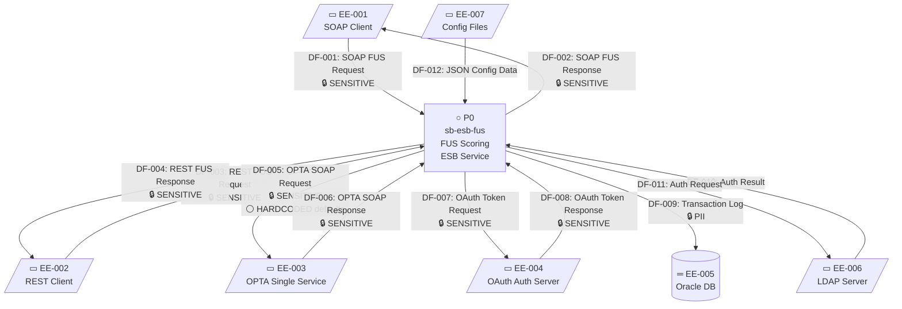
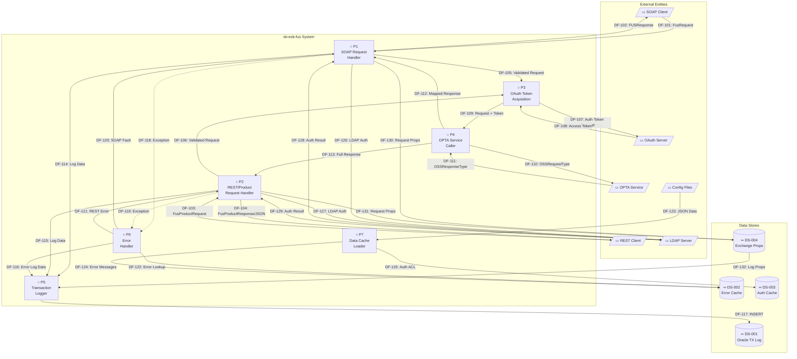
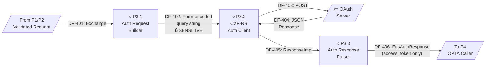
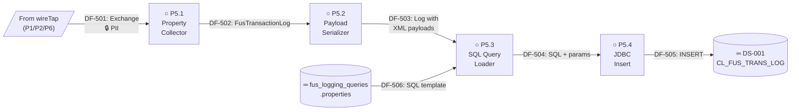
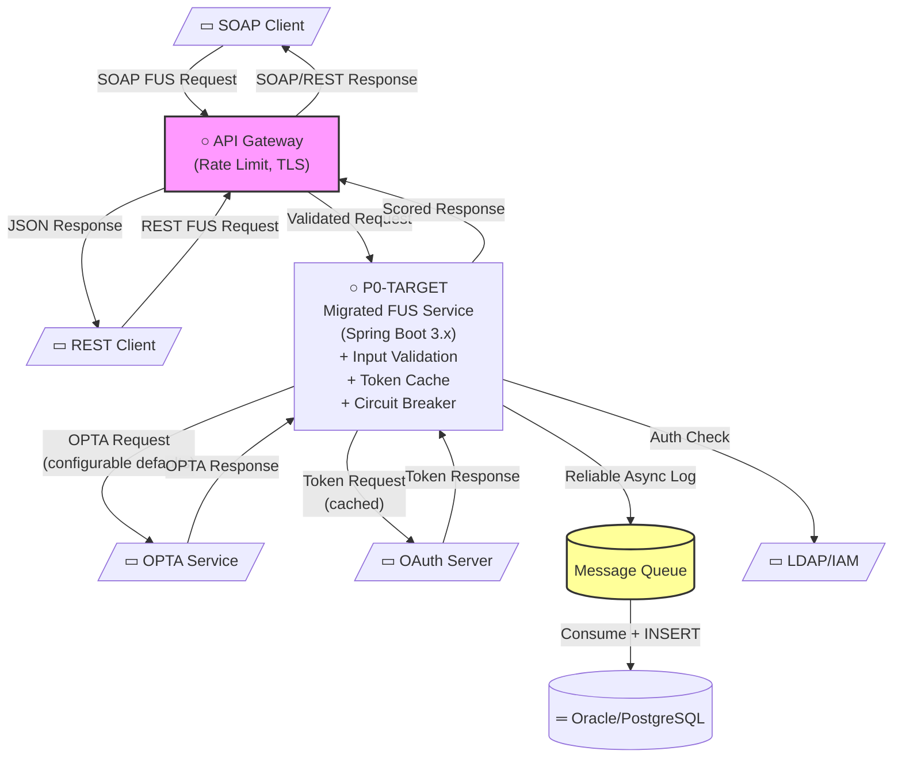

```mermaid
graph LR
    EE001[/"▭ SOAP<br/>Client"/] -->|"DF-201: SOAP<br/>FusRequest"| P11["○ P1.1<br/>CXF SOAP<br/>Endpoint"]
    P11 -->|"DF-202: Raw<br/>Request"| P12["○ P1.2<br/>JAAS/LDAP<br/>Auth"]
    P12 -->|"DF-203: Authed<br/>Request"| P13["○ P1.3<br/>Province<br/>Authorization"]
    P13 -->|"DF-204: Authorized<br/>Request"| P14["○ P1.4<br/>Request<br/>Validation"]
    P14 -->|"DF-205: Validated<br/>Request"| P15["○ P1.5<br/>Security<br/>Token"]
    P15 -->|"DF-206: Token +<br/>Request"| P16["○ P1.6<br/>OPTA Request<br/>Builder"]
    P16 -->|"DF-207: OSSRequestType<br/>⚪ HARDCODED defaults"| P17["○ P1.7<br/>OPTA Service<br/>Call"]
    P17 -->|"DF-208: OSSResponseType"| P18["○ P1.8<br/>Response<br/>Mapper"]
    P18 -->|"DF-209: FUSResponse"| EE001
    P18 -.->|"DF-210: wireTap<br/>log data"| P19["○ P1.9<br/>Logger"]
    P19 -->|"DF-211: INSERT"| DS001[("═ DS-001<br/>Oracle TX Log")]

    P13 -->|"DF-212: Props<br/>(TX ID, URL,<br/>client info)"| DS004[("═ DS-004<br/>Exchange<br/>Properties")]
```

```mermaid
graph LR
    EE002[/"▭ REST/Product<br/>Client"/] -->|"DF-301: Request"| P21["○ P2.1<br/>CXF Endpoint"]
    P21 -->|"DF-302"| P22["○ P2.2<br/>JAAS Auth"]
    P22 -->|"DF-303"| P23["○ P2.3<br/>Province<br/>Auth"]
    P23 -->|"DF-304"| P24["○ P2.4<br/>Validation"]
    P24 -->|"DF-305"| P25["○ P2.5<br/>Security<br/>Token"]
    P25 -->|"DF-306"| P26["○ P2.6<br/>OPTA Req<br/>Builder"]
    P26 -->|"DF-307<br/>⚪ HARDCODED"| P27["○ P2.7<br/>OPTA Call"]
    P27 -->|"DF-308"| P28["○ P2.8<br/>Full Response<br/>Processor"]
    P28 -->|"DF-309"| P29["○ P2.9<br/>JSON Marshal"]
    P29 -->|"DF-310: JSON<br/>Response"| EE002
    P29 -.->|"DF-311: wireTap"| P210["○ P2.10<br/>Logger"]
    P210 -->|"DF-312"| DS001[("═ DS-001<br/>Oracle TX Log")]
```

# Data Flow Diagram

---

| **Field**            | **Details**                                   |
|----------------------|-----------------------------------------------|
| **Project Name**     | Catalyst ESB — OPTA FUS Service               |
| **Application Name** | sb-esb-fus                                    |
| **Version**          | 1.0.0                                         |
| **Date**             | 26-Jun-2025                                   |
| **Prepared By**      | Copilot RE Pipeline                           |
| **Reviewed By**      | Pending                                       |
| **Status**           | Draft                                         |

---

## 1. Overview

This document presents the Data Flow Diagrams (DFDs) identified during reverse engineering of the **sb-esb-fus** application — a JBoss Fuse 6.3 OSGi bundle that exposes OPTA Single Service (Dwelling Fire Protection scoring) as SOAP and REST endpoints. The DFDs illustrate how data moves from consuming applications through the ESB service to the external OPTA scoring system and the Oracle transaction log.

### DFD Notation

| **Symbol**                | **Meaning**                                       |
|---------------------------|---------------------------------------------------|
| ▭ (Rectangle)             | External Entity — source or destination of data   |
| ○ (Circle/Rounded rect)   | Process — transforms or routes data               |
| ═══ (Open rectangle)      | Data Store — where data is persisted              |
| → (Arrow)                 | Data Flow — movement of data between elements     |

### Annotation Notation

| **Annotation**             | **Meaning**                                                       |
|----------------------------|-------------------------------------------------------------------|
| `⚠️ NO VALIDATION`         | Data enters or exits this point without any validation            |
| `⚪ HARDCODED`             | Data at this point is hardcoded/static, not derived from processing |
| `⚫ DEAD FLOW`             | Data flow path exists in code but is never triggered              |
| `🔒 PII`                   | Data flow contains Personally Identifiable Information            |
| `🔒 SENSITIVE`             | Data flow contains sensitive business data                        |
| `📝 NOTE`                  | General observation                                               |

---

## 2. DFD Index

| **Diagram ID** | **Level** | **Title**                                | **Parent Process** | **Description**                                              |
|-----------------|-----------|------------------------------------------|--------------------|--------------------------------------------------------------|
| DFD-0           | 0         | Context Diagram                          | —                  | Highest level system overview with all external entities      |
| DFD-1           | 1         | Level 1 — Main Process Decomposition     | DFD-0              | Decomposition into authorization, validation, scoring, logging |
| DFD-1.1         | 2         | SOAP FUS Scoring Pipeline                | DFD-1 / P1         | Detailed SOAP request processing flow                         |
| DFD-1.2         | 2         | REST/Product FUS Scoring Pipeline        | DFD-1 / P2         | Detailed REST/Product request processing flow                 |
| DFD-1.3         | 2         | OAuth Token Acquisition                  | DFD-1 / P3         | Token exchange flow with auth server                          |
| DFD-1.4         | 2         | Transaction Logging                      | DFD-1 / P5         | Audit log data flow to Oracle database                        |

---

## 3. Context Diagram (Level 0)

**Diagram ID:** DFD-0
**Description:** Shows the entire sb-esb-fus application as a single process with all external entities and data flows. The system acts as an ESB proxy between insurance applications and the OPTA fire protection scoring service.

### External Entities

| **Entity ID** | **Entity Name**           | **Type**          | **Description**                                                     |
|----------------|---------------------------|-------------------|---------------------------------------------------------------------|
| EE-001         | SOAP Client               | External System   | Insurance applications consuming the SOAP FUS scoring endpoint      |
| EE-002         | REST Client               | External System   | Insurance applications consuming the REST FUS scoring endpoint      |
| EE-003         | OPTA Single Service       | External API      | Third-party SOAP service providing dwelling fire protection scores   |
| EE-004         | OAuth Auth Server          | External API      | OAuth 2.0 token endpoint for OPTA service authentication            |
| EE-005         | Oracle Database            | Database          | Oracle DB (BDQWDAPI schema) for transaction audit logging           |
| EE-006         | LDAP Server               | External System   | LDAP directory for JAAS authentication of incoming requests          |
| EE-007         | Config File System         | File System       | External JSON files for error messages and authorization lookups     |

### Context Diagram

### Data Flows (Level 0)

| **Flow ID** | **From**              | **To**              | **Data Description**                                                          | **Format/Protocol**       | **Data Sensitivity**  | **Annotations**                                     |
|-------------|-----------------------|---------------------|-------------------------------------------------------------------------------|---------------------------|-----------------------|-----------------------------------------------------|
| DF-001      | EE-001 (SOAP Client)  | System (P0)         | FUS scoring request with client info, address, industry codes                | SOAP/XML over HTTPS       | 🔒 SENSITIVE          | WS-Security UsernameToken authentication             |
| DF-002      | System (P0)           | EE-001 (SOAP Client)| FUS scoring response with simplified dwelling fire protection grade          | SOAP/XML over HTTPS       | 🔒 SENSITIVE          | None                                                 |
| DF-003      | EE-002 (REST Client)  | System (P0)         | FUS product request with address as query parameters                         | REST/JSON over HTTPS      | 🔒 SENSITIVE          | JAAS Basic Auth authentication                       |
| DF-004      | System (P0)           | EE-002 (REST Client)| FUS product response (full OPTA response as JSON)                            | REST/JSON over HTTPS      | 🔒 SENSITIVE          | Jackson JSON marshal                                 |
| DF-005      | System (P0)           | EE-003 (OPTA)       | OSSRequestType SOAP request with mapped address, industry codes, credentials | SOAP/XML over TLS         | 🔒 SENSITIVE          | ⚪ HARDCODED: brokerage, carrier, addressID defaults  |
| DF-006      | EE-003 (OPTA)         | System (P0)         | OSSResponseType with FUS dwelling grades and protection classifications      | SOAP/XML over TLS         | 🔒 SENSITIVE          | None                                                 |
| DF-007      | System (P0)           | EE-004 (Auth)       | OAuth token request with grant_type, client_id, client_secret, refresh_token | HTTPS POST form-encoded   | 🔒 SENSITIVE          | Credentials from Jasypt-encrypted config             |
| DF-008      | EE-004 (Auth)         | System (P0)         | OAuth token response with access_token and metadata                          | HTTPS/JSON                | 🔒 SENSITIVE          | Only access_token extracted; rest discarded           |
| DF-009      | System (P0)           | EE-005 (Oracle)     | Transaction log record (17 columns) including payloads                       | JDBC/SQL INSERT           | 🔒 PII                | Fire-and-forget via wireTap; errors silently caught   |
| DF-010      | EE-006 (LDAP)         | System (P0)         | Authentication result (success/failure + roles)                              | LDAP/JAAS                 | Non-Sensitive          | None                                                 |
| DF-011      | System (P0)           | EE-006 (LDAP)       | Username/password credentials for authentication                             | LDAP/JAAS                 | 🔒 SENSITIVE          | None                                                 |
| DF-012      | EE-007 (Config Files) | System (P0)         | Error message lookups and authorization ACL data                             | File/JSON                 | Non-Sensitive          | One-time load at startup via Camel file consumer      |

---

## 4. Level 1 Data Flow Diagram

**Diagram ID:** DFD-1
**Description:** Decomposes the sb-esb-fus system into major processes: authentication, authorization, validation, token acquisition, scoring, response mapping, and transaction logging.

### Processes

| **Process ID** | **Process Name**           | **Description**                                                    | **Component(s)**                                    |
|----------------|----------------------------|--------------------------------------------------------------------|-----------------------------------------------------|
| P1             | SOAP Request Handler       | Receives SOAP requests, routes through auth/validation/scoring     | COMP-001 (FusSvc), Camel route `in_soap_fusRouter`  |
| P2             | REST/Product Request Handler| Receives REST/Product SOAP requests, similar pipeline              | COMP-002 (OssFusSvc), COMP-003 (FusProductSvc)     |
| P3             | OAuth Token Acquisition    | Acquires OAuth tokens from auth server for OPTA service calls      | COMP-009 (FusAuthServiceProcessor), COMP-019 (FusAuthServiceResponse) |
| P4             | OPTA Service Caller        | Builds and sends SOAP request to OPTA, processes response          | COMP-010 (FusAuthRequestProcessor), COMP-011 (FusAuthServiceResponseProcessor) |
| P5             | Transaction Logger         | Logs all transactions to Oracle database asynchronously            | COMP-012 (TransactionLogger)                        |
| P6             | Error Handler              | Converts exceptions to SOAP faults or REST error responses         | COMP-013 (ErrorProcessor)                           |
| P7             | Data Cache Loader          | Loads error messages and authorization data from JSON on startup   | COMP-014 (DataCache), COMP-015 (DataCacheLoader)    |

### Data Stores

| **Store ID** | **Store Name**           | **Type**    | **Technology** | **Data Retention**      | **Failure Behavior**                    | **Description**                             |
|--------------|--------------------------|-------------|----------------|-------------------------|-----------------------------------------|---------------------------------------------|
| DS-001       | Oracle Transaction Log   | Database    | Oracle 12c+    | Permanent               | Main flow continues silently            | `CL_FUS_TRANS_LOG` audit table              |
| DS-002       | DataCache (Errors)       | Cache       | Java HashMap   | Application lifetime    | Main flow fails (NPE on lookup)         | Error code → message lookup map             |
| DS-003       | DataCache (Auth)         | Cache       | Java HashMap   | Application lifetime    | No impact (data loaded but not used)    | User → province authorization map           |
| DS-004       | Exchange Properties      | In-memory   | Apache Camel   | Request lifetime        | Main flow fails                         | Transient request/response data in exchange |

### Level 1 Diagram

### Data Flows (Level 1)

| **Flow ID** | **From**        | **To**          | **Data Elements**                                                             | **Trigger**                   | **Volume/Frequency**  | **Data Sensitivity** | **Annotations**                            |
|-------------|-----------------|-----------------|-------------------------------------------------------------------------------|-------------------------------|-----------------------|----------------------|--------------------------------------------|
| DF-101      | EE-001          | P1              | FusRequest (baseRequest, DwellingFireProtectionRequest)                       | SOAP request arrives          | On-demand             | 🔒 SENSITIVE         | WS-Security + JAAS authenticated           |
| DF-102      | P1              | EE-001          | FUSResponse (DwellingFireProtectionResponse with grade list)                  | Processing complete           | Per request           | 🔒 SENSITIVE         | None                                       |
| DF-103      | EE-002          | P2              | FusProductRequest (streetName, postalCode, municipality, province, codes)     | REST GET request              | On-demand             | 🔒 SENSITIVE         | JAAS Basic Auth                            |
| DF-104      | P2              | EE-002          | FusProductResponse (full ResponseBodyType as JSON)                           | Processing complete           | Per request           | 🔒 SENSITIVE         | Jackson JSON marshal                       |
| DF-105      | P1              | P3              | Validated FusRequest + exchange properties                                    | Validation passes             | Per SOAP request      | 🔒 SENSITIVE         | Request stored in exchange property        |
| DF-106      | P2              | P3              | Validated FusProductRequest + exchange properties                             | Validation passes             | Per REST request      | 🔒 SENSITIVE         | Request stored in exchange property        |
| DF-107      | P3              | EE-004          | OAuth credentials (grant_type, client_id, client_secret, refresh_token)      | Every request                 | Per request (no cache)| 🔒 SENSITIVE         | ⚪ HARDCODED config values; form-encoded   |
| DF-108      | EE-004          | P3              | OAuth response (access_token, expires_in, token_type, etc.)                  | Auth server responds          | Per request           | 🔒 SENSITIVE         | Only access_token used                     |
| DF-109      | P3              | P4              | FusAuthResponse (access token) + original request from exchange              | Token acquired                | Per request           | 🔒 SENSITIVE         | None                                       |
| DF-110      | P4              | EE-003          | OSSRequestType (header with requestor, body with address/codes/products)     | Request built                 | Per request           | 🔒 SENSITIVE         | ⚪ HARDCODED: brokerage, carrier, addressID |
| DF-111      | EE-003          | P4              | OSSResponseType (FUS grades: firehall, hydrant, allOther areas)              | OPTA responds                 | Per request           | 🔒 SENSITIVE         | None                                       |
| DF-112      | P4              | P1              | Mapped FUSResponse with simplified DwellingFireProtection categories         | SOAP route processing         | Per SOAP request      | 🔒 SENSITIVE         | Grade mapping (BR-005)                     |
| DF-113      | P4              | P2              | FusProductResponse wrapping full OPTA ResponseBodyType                       | REST/Product processing       | Per REST request      | 🔒 SENSITIVE         | No mapping — pass-through                  |
| DF-114      | P1              | P5              | Exchange properties (tx ID, app, URL, client info, address, payloads, status) | wireTap (async)              | Per SOAP request      | 🔒 PII               | Fire-and-forget via wireTap                |
| DF-115      | P2              | P5              | Exchange properties (same as DF-114)                                          | wireTap (async)              | Per REST request      | 🔒 PII               | Fire-and-forget via wireTap                |
| DF-116      | P6              | P5              | Error log data (error code, message, status=error)                            | wireTap in onException       | On error              | Non-Sensitive         | Fire-and-forget via wireTap                |
| DF-117      | P5              | DS-001          | 17-column INSERT into CL_FUS_TRANS_LOG                                        | logTransaction() called      | Per request           | 🔒 PII               | JDBC INSERT; errors silently caught        |
| DF-118      | P1              | P6              | Exception (ResponseError or generic)                                          | Processing error              | On error              | Non-Sensitive         | Camel onException handler                  |
| DF-119      | P2              | P6              | Exception (ResponseError or generic)                                          | Processing error              | On error              | Non-Sensitive         | Camel onException handler                  |
| DF-120      | P6              | P1              | SOAPServiceException (DetailException with errorCode/errorMessage)            | SOAP error response           | On SOAP error         | Non-Sensitive         | Converted to SOAP fault                    |
| DF-121      | P6              | P2              | JAX-RS Response (ErrorDetails JSON with HTTP status)                          | REST error response           | On REST error         | Non-Sensitive         | HTTP 400/403/500 based on error code       |
| DF-122      | DS-002          | P6              | ErrorMessageLookup (errorCode → errorDesc mapping)                            | Error processing              | On error              | Non-Sensitive         | DataCache.getInstance().getErrorLookup()   |
| DF-123      | EE-007          | P7              | JSON files (error messages, authorization ACLs)                               | Application startup           | Once                  | Non-Sensitive         | Camel file consumer                        |
| DF-124      | P7              | DS-002          | Map<String, ErrorMessageLookup> — error code map                              | Startup loading               | Once                  | Non-Sensitive         | None                                       |
| DF-125      | P7              | DS-003          | Map<String, String[]> — user to provinces map                                 | Startup loading               | Once                  | Non-Sensitive         | ⚫ DEAD FLOW — loaded but never read       |

---

## 5. Level 2 Data Flow Diagrams

### 5.1 DFD-1.1: SOAP FUS Scoring Pipeline Decomposition

**Diagram ID:** DFD-1.1
**Parent Process:** P1 — SOAP Request Handler
**Description:** Detailed decomposition of the SOAP FUS scoring request processing pipeline, from CXF endpoint to response delivery.

#### Sub-Processes

| **Process ID** | **Process Name**                | **Description**                                                      |
|----------------|---------------------------------|----------------------------------------------------------------------|
| P1.1           | CXF SOAP Endpoint               | CXF endpoint (`/pl/api/oss/fus`) receives SOAP request               |
| P1.2           | JAAS/LDAP Authentication         | LDAP login + WS-Security token validation                            |
| P1.3           | Province Authorization           | FusAuthorizationProcessor — validate province against allowed list   |
| P1.4           | Request Validation               | FusRequestPreProcessor — validate required fields                    |
| P1.5           | Security Token (shared)          | Calls direct:securityToken for OAuth token                           |
| P1.6           | OPTA Request Builder             | FusAuthRequestProcessor — maps FUS request to OSSRequestType         |
| P1.7           | OPTA Service Call                | Sends OSSRequestType to OPTA via CXF SOAP client                    |
| P1.8           | Response Mapper                  | FusAuthServiceResponseProcessor — maps OPTA response to FUSResponse |
| P1.9           | wireTap Logger                   | Asynchronous transaction logging                                     |

#### Diagram

#### Data Flows (Level 2)

| **Flow ID** | **From** | **To**  | **Data Elements**                                                                | **Notes**                                           |
|-------------|----------|---------|----------------------------------------------------------------------------------|-----------------------------------------------------|
| DF-201      | EE-001   | P1.1    | SOAP envelope with FusRequest XML body + WS-Security header                      | HTTPS with TLS                                      |
| DF-202      | P1.1     | P1.2    | Deserialized FusRequest POJO via CXF JAXB databinding                            | CXF interceptor chain                               |
| DF-203      | P1.2     | P1.3    | Authenticated FusRequest with JAAS principal + roles                              | Role `eEsbPlApiOptaAccess` required                 |
| DF-204      | P1.3     | P1.4    | FusRequest with province verified; exchange props set (TX ID, URL, client info)  | Province uppercased; logging helpers called          |
| DF-205      | P1.4     | P1.5    | Validated FusRequest (all required fields present)                                | Sequential field validation (BR-002)                |
| DF-206      | P1.5     | P1.6    | FusAuthResponse (access_token) in exchange body; FusRequest in exchange property | Token from OAuth server via P3                      |
| DF-207      | P1.6     | P1.7    | OSSRequestType SOAP body with ⚪ HARDCODED: brokerage="ABC Brokerage", carrier="Aviva", addressID="1" | Authorization Bearer header set |
| DF-208      | P1.7     | P1.8    | OSSResponseType with FUSProductType containing DwellingGradesType                | CXF SOAP client call to OPTA                       |
| DF-209      | P1.8     | EE-001  | FUSResponse with DwellingFireProtectionResponse (baseResponse + grade list)       | JAXB XML serialization                              |
| DF-210      | P1.8     | P1.9    | Exchange properties: all logging metadata + RES_PAYLOAD                           | wireTap (fire-and-forget, async)                    |
| DF-211      | P1.9     | DS-001  | 17-column INSERT (transactionId, application, url, ..., errorMessage)            | JdbcTemplate.update()                               |
| DF-212      | P1.3     | DS-004  | TRANSACTION_ID, APPLICATION (⚪"OssFUSServiceSoap"), URL, CLIENT_ID/NAME/GUID, address fields | Stored as Camel exchange properties |

---

### 5.2 DFD-1.2: REST/Product FUS Scoring Pipeline Decomposition

**Diagram ID:** DFD-1.2
**Parent Process:** P2 — REST/Product Request Handler
**Description:** Detailed decomposition of REST and Product SOAP request processing. Shares the security token route with SOAP but uses different authorization, validation, and response processors.

#### Sub-Processes

| **Process ID** | **Process Name**                  | **Description**                                                       |
|----------------|-----------------------------------|-----------------------------------------------------------------------|
| P2.1           | CXF REST/Product Endpoint         | CXF-RS (`/pl/api/oss/rest/product`) or SOAP (`/pl/api/oss/product/fus`) |
| P2.2           | JAAS Authentication               | JAASAuthenticationFilter (REST) or JAASLoginInterceptor (SOAP)        |
| P2.3           | Province Authorization (Product)  | FusFullResAuthorizationProcessor — same logic, different request type  |
| P2.4           | Request Validation (Product)      | FusFullResRequestPreProcessor — validates FusProductRequest            |
| P2.5           | Security Token (shared)           | Reuses `direct:securityToken` route                                   |
| P2.6           | OPTA Request Builder (Product)    | FusFullResAuthRequestProcessor — maps FusProductRequest to OSSRequestType |
| P2.7           | OPTA Service Call                 | Same CXF SOAP client endpoint                                        |
| P2.8           | Full Response Processor           | FusFullResAuthServiceResponseProcessor — pass-through response        |
| P2.9           | JSON Marshal                      | Jackson marshal for REST responses                                     |
| P2.10          | wireTap Logger                    | Asynchronous transaction logging                                       |

#### Diagram

#### Data Flows (Level 2)

| **Flow ID** | **From** | **To**  | **Data Elements**                                                        | **Notes**                                            |
|-------------|----------|---------|--------------------------------------------------------------------------|------------------------------------------------------|
| DF-301      | EE-002   | P2.1    | REST: Query params (streetAddress, postalCode, etc.); SOAP: FusProductRequest XML | GET request or SOAP envelope                   |
| DF-302      | P2.1     | P2.2    | FusProductRequest POJO (CXF SimpleConsumer binding)                      | CXF interceptor chain                                |
| DF-303      | P2.2     | P2.3    | Authenticated FusProductRequest                                           | Role `eEsbPlApiOptaAccess` required                  |
| DF-304      | P2.3     | P2.4    | Authorized request; APPLICATION set based on CALL_TYPE                   | ⚪ "OssFUSServiceRest" or "OssFUSProductSoap"        |
| DF-305      | P2.4     | P2.5    | Validated FusProductRequest                                               | Same validation as BR-002 (duplicate logic)          |
| DF-306      | P2.5     | P2.6    | FusAuthResponse + FusProductRequest from exchange property               | Token from shared security token route               |
| DF-307      | P2.6     | P2.7    | OSSRequestType with ⚪ HARDCODED defaults (same as SOAP flow)            | Authorization Bearer header                          |
| DF-308      | P2.7     | P2.8    | OSSResponseType from OPTA                                                | CXF SOAP client call                                |
| DF-309      | P2.8     | P2.9    | FusProductResponse wrapping ResponseBodyType (full response pass-through) | No grade mapping — raw OPTA data                    |
| DF-310      | P2.9     | EE-002  | JSON string — marshalled FusProductResponse                              | Jackson library marshal; `convertBodyTo String`      |
| DF-311      | P2.9     | P2.10   | Exchange properties with STATUS="success" and RES_PAYLOAD                | wireTap (fire-and-forget)                            |
| DF-312      | P2.10    | DS-001  | 17-column INSERT into CL_FUS_TRANS_LOG                                   | Same as DF-211                                       |

---

### 5.3 DFD-1.3: OAuth Token Acquisition Decomposition

**Diagram ID:** DFD-1.3
**Parent Process:** P3 — OAuth Token Acquisition
**Description:** Detailed flow for acquiring OAuth access tokens from the external auth server. This route (`direct:securityToken`) is shared by all three endpoint routes.

#### Sub-Processes

| **Process ID** | **Process Name**                | **Description**                                              |
|----------------|---------------------------------|--------------------------------------------------------------|
| P3.1           | Auth Request Builder             | FusAuthServiceProcessor — builds form-encoded token request  |
| P3.2           | CXF-RS Auth Client               | Sends POST to OAuth endpoint via CXF-RS client bean          |
| P3.3           | Auth Response Parser             | FusAuthServiceResponse — parses JSON, extracts access_token  |

#### Diagram

#### Data Flows (Level 2)

| **Flow ID** | **From** | **To**  | **Data Elements**                                                         | **Notes**                                         |
|-------------|----------|---------|---------------------------------------------------------------------------|---------------------------------------------------|
| DF-401      | P1/P2    | P3.1    | Exchange with validated request in property                               | Camel `direct:securityToken` route                |
| DF-402      | P3.1     | P3.2    | URL-encoded: `grant_type=X&client_secret=X&client_id=X&refresh_token=X`  | Content-Type: `application/x-www-form-urlencoded` |
| DF-403      | P3.2     | EE-004  | HTTPS POST with form body                                                 | TLS via CXF conduit configuration                 |
| DF-404      | EE-004   | P3.2    | JSON: `{"access_token":"...","expires_in":...,"token_type":"...",...}`    | Full OAuth2 response                              |
| DF-405      | P3.2     | P3.3    | `ResponseImpl` JAX-RS response object                                     | CXF-RS client return type                         |
| DF-406      | P3.3     | P4      | `FusAuthResponse` with only `accesToken` populated                       | 📝 NOTE: Only `access_token` extracted; 6 fields discarded |

---

### 5.4 DFD-1.4: Transaction Logging Decomposition

**Diagram ID:** DFD-1.4
**Parent Process:** P5 — Transaction Logger
**Description:** Detailed flow for the asynchronous transaction logging via wireTap to Oracle database.

#### Sub-Processes

| **Process ID** | **Process Name**             | **Description**                                                  |
|----------------|------------------------------|------------------------------------------------------------------|
| P5.1           | Exchange Property Collector   | `TransactionLogger.logTransaction()` — collects exchange properties |
| P5.2           | Payload Serializer            | Serializes request/response to XML strings via JAXB.marshal()    |
| P5.3           | SQL Query Loader              | Loads INSERT SQL from `fus_logging_queries.properties`           |
| P5.4           | JDBC Insert                   | `JdbcTemplate.update()` — executes INSERT                       |

#### Diagram

#### Data Flows (Level 2)

| **Flow ID** | **From**  | **To**   | **Data Elements**                                                      | **Notes**                                    |
|-------------|-----------|----------|------------------------------------------------------------------------|----------------------------------------------|
| DF-501      | wireTap   | P5.1     | 16 exchange properties (TX ID, app, URL, client info, address, payloads, status, errors) | Camel `direct-vm:fusLogger` route |
| DF-502      | P5.1      | P5.2     | FusTransactionLog POJO (all 17 fields)                                 | `new Date()` set for transactionTime         |
| DF-503      | P5.2      | P5.3     | FusTransactionLog with reqPayload/resPayload as XML strings            | JAXB.marshal() for non-String objects        |
| DF-504      | P5.3      | P5.4     | SQL query string + 17 parameter values                                 | Properties file loaded on each call          |
| DF-505      | P5.4      | DS-001   | JDBC INSERT into CL_FUS_TRANS_LOG (17 columns)                        | Oracle connection from OracleDataSource pool |
| DF-506      | Props     | P5.3     | `INSERT_FUS_TRANS_LOG` SQL template                                    | Loaded from classpath resource               |

---

## 6. Data Flow Catalog

| **Flow ID** | **Level** | **Source**          | **Destination**       | **Data Elements**                                            | **Direction** | **Protocol/Format**     | **Frequency**   | **Data Sensitivity**  |
|-------------|-----------|---------------------|-----------------------|--------------------------------------------------------------|---------------|-------------------------|-----------------|----------------------|
| DF-001      | 0         | SOAP Client         | System                | FusRequest (clientInfo, address, industry codes)             | In            | SOAP/XML/HTTPS          | On-demand       | 🔒 SENSITIVE          |
| DF-002      | 0         | System              | SOAP Client           | FUSResponse (dwelling fire protection grades)                | Out           | SOAP/XML/HTTPS          | Per request     | 🔒 SENSITIVE          |
| DF-003      | 0         | REST Client         | System                | FusProductRequest (address query params)                     | In            | REST/HTTP GET           | On-demand       | 🔒 SENSITIVE          |
| DF-004      | 0         | System              | REST Client           | FusProductResponse (JSON full OPTA response)                 | Out           | REST/JSON/HTTPS         | Per request     | 🔒 SENSITIVE          |
| DF-005      | 0         | System              | OPTA Service          | OSSRequestType (mapped address, codes, credentials)          | Out           | SOAP/XML/TLS            | Per request     | 🔒 SENSITIVE          |
| DF-006      | 0         | OPTA Service        | System                | OSSResponseType (FUS grades, scores)                         | In            | SOAP/XML/TLS            | Per request     | 🔒 SENSITIVE          |
| DF-007      | 0         | System              | OAuth Server          | Token request (grant_type, credentials, refresh_token)       | Out           | HTTPS POST/form         | Per request     | 🔒 SENSITIVE          |
| DF-008      | 0         | OAuth Server        | System                | Token response (access_token, metadata)                      | In            | HTTPS/JSON              | Per request     | 🔒 SENSITIVE          |
| DF-009      | 0         | System              | Oracle DB             | Transaction log (17 columns)                                 | Out           | JDBC/SQL INSERT         | Per request     | 🔒 PII                |
| DF-010      | 0         | LDAP Server         | System                | Authentication result (principal + roles)                    | In            | LDAP/JAAS               | Per request     | Non-Sensitive          |
| DF-011      | 0         | System              | LDAP Server           | Authentication credentials                                   | Out           | LDAP/JAAS               | Per request     | 🔒 SENSITIVE          |
| DF-012      | 0         | Config Files        | System                | Error messages + authorization ACLs (JSON)                   | In            | File/JSON               | Once (startup)  | Non-Sensitive          |
| DF-110      | 1         | P4                  | OPTA Service          | OSSRequestType with hardcoded defaults                       | Out           | SOAP/XML/TLS            | Per request     | 🔒 SENSITIVE          |
| DF-117      | 1         | P5                  | DS-001                | 17-column INSERT                                              | Out           | JDBC/SQL                | Per request     | 🔒 PII                |
| DF-125      | 1         | P7                  | DS-003                | User-province authorization map                              | Out           | Internal/Java           | Once            | Non-Sensitive          |

---

## 7. Data Store Catalog

| **Store ID** | **Store Name**              | **Type**    | **Used By Processes** | **Key Data Elements**                                | **Entity Ref** |
|--------------|-----------------------------|-------------|-----------------------|------------------------------------------------------|----------------|
| DS-001       | CL_FUS_TRANS_LOG            | Database    | P5                    | transactionId, application, clientInfo, address, payloads, status, errors | ENT-001 |
| DS-002       | DataCache — Error Lookup    | Cache       | P6, P7                | errorCode → ErrorMessageLookup (code, desc, desc_fr)| ENT-017        |
| DS-003       | DataCache — User Auth       | Cache       | P7                    | userName → allowedProvinces[]                        | ENT-022        |
| DS-004       | Exchange Properties         | In-memory   | P1, P2, P5, P6        | TX_ID, APPLICATION, URL, CLIENT_*, address, STATUS, ERROR_*, payloads | — |

---

## 8. Data Transformation Rules

| **Process** | **Input Data**                           | **Transformation**                                                               | **Output Data**                              | **Hardcoded Override**                                                     | **Business Rule** |
|-------------|------------------------------------------|----------------------------------------------------------------------------------|----------------------------------------------|----------------------------------------------------------------------------|-------------------|
| P1.3        | FusRequest.province                       | `province.toUpperCase(Locale.ROOT)`                                              | Uppercased province string                   | None                                                                       | BR-001            |
| P1.6        | FusRequest + FusAuthResponse              | Map address fields to `RequestAddressType`; create `RequestHeaderType` with UUID; set requestor defaults | OSSRequestType SOAP object                  | ⚪ `broker="ABC Brokerage"`, `carrier="Aviva"`, `addressID="1"`, `product=FUS` | BR-004 |
| P1.8        | OSSResponseType.FUSProductType.DwellingGrades | Map grade codes (3B→firehall, 3BS→shuttletanker, 4/5→unprorected, 1/2/3A→hydrant) | DwellingFireProtectionResponse (List\<String\>) | ⚪ All grade-to-category mappings are hardcoded string comparisons        | BR-005            |
| P3.1        | Config values (grant_type, client_id, etc.) | Concatenate into URL-encoded query string                                       | `"grant_type=X&client_secret=X&client_id=X&refresh_token=X"` | ⚪ Config values from Jasypt-encrypted properties                     | BR-003            |
| P3.3        | ResponseImpl (JSON)                        | Parse JSON with `JSONParser`, extract `"access_token"` field                     | FusAuthResponse (accesToken only)            | None                                                                       | BR-003            |
| P2.8        | OSSResponseType                            | Wrap `ResponseBody` in `FusProductResponse` — no transformation                 | FusProductResponse (pass-through)            | None                                                                       | BR-015            |
| P2.9        | FusProductResponse POJO                    | Jackson JSON serialization + `convertBodyTo String`                              | JSON string representation                   | None                                                                       | BR-010            |
| P5.2        | Request/Response POJOs                     | `JAXB.marshal(entity, StringWriter)` — convert to XML string                    | String (XML)                                 | None                                                                       | BR-006            |
| P6          | ResponseError exception                    | Lookup error code in DataCache; map to SOAP fault or REST error with HTTP status | SOAPServiceException / JAX-RS Response       | ⚪ HTTP status: FS1005→403, FS3001/FS7001→500, else→400                   | BR-007            |

---

## 9. Notes & Observations

| **#** | **Observation**                                                                                         | **Related DFD** | **Impact**  |
|-------|---------------------------------------------------------------------------------------------------------|------------------|-------------|
| 1     | OAuth token acquired on every request — no caching. High latency impact for external auth calls.        | DFD-1.3          | High        |
| 2     | Transaction logging is fire-and-forget via wireTap — logging failures are silently swallowed.           | DFD-1.4          | Medium      |
| 3     | `fus_logging_queries.properties` file is loaded on every logging call (not cached).                     | DFD-1.4          | Low         |
| 4     | The shared `direct:securityToken` route is called synchronously within each main route.                 | DFD-1           | Low         |
| 5     | DF-125 (DataCache user auth data) is loaded at startup but never consumed — dead data flow.            | DFD-1           | Low         |
| 6     | No input validation on industry codes (ibcCode, naicsCode, sicCode) — sent directly to OPTA.           | DFD-1.1, DFD-1.2 | Medium     |
| 7     | Request/response payloads are stored as CLOBs in Oracle — no payload size limits enforced.              | DFD-1.4          | Medium      |
| 8     | TLS CN check disabled (`disableCNCheck="true"`) for OPTA and OAuth connections.                        | DFD-0            | High        |

---

## 10. Dead Data Flow Paths

| **Flow ID** | **DFD Level** | **From**         | **To**           | **Description**                                                      | **Evidence**                                                        | **Recommendation**                     |
|-------------|---------------|------------------|------------------|----------------------------------------------------------------------|---------------------------------------------------------------------|----------------------------------------|
| DF-125      | 1             | P7 (DataCacheLoader) | DS-003 (Auth Cache) | User-to-province authorization map loaded from JSON but never queried | Authorization processors use `SUPPORTED_PROVINCE_LIST` from config, not `DataCache.userInfo` | Remove or implement per-user authorization |
| DF-REST-STUB| 1             | EE-002 (REST)    | P2.1             | `OssFusSvc.getFusScore()` method returns `null` — CXF-RS route overrides | Method body `return null;` never executes; Camel route handles all REST processing | Confirm as intentional CXF-RS pattern  |
| DF-FULLRES  | 2             | P1.8             | —                | Commented-out `fullResReq` field logic for toggling full/simplified response | Code at `FusAuthServiceResponseProcessor:L37–L44` and `FUSResponse:L22–L40` commented out | Remove dead code in migration          |

---

## 11. Transaction Logging Data Flow Detail

### 11.1 Logging Flow Overview

| **Attribute**                | **Details**                                                                |
|------------------------------|----------------------------------------------------------------------------|
| Log Data Store               | Oracle table `BDQWDAPI.CL_FUS_TRANS_LOG`                                  |
| Logging Trigger              | wireTap at end of each route (success and error paths)                    |
| Synchronous / Asynchronous   | Asynchronous (Camel wireTap — fire-and-forget pattern). Note: `@Async` annotation on `logPayLoad()` may not function in OSGi without Spring async configuration. |
| Data Logged                  | Full request payload (JAXB XML), full response payload (JAXB XML/JSON), metadata (client info, address, status, errors) |
| Failure Impact on Main Flow  | Main flow continues silently — errors caught with `LOGGER.info("Error Logging...")` |
| Data Retention               | Permanent — no TTL or cleanup mechanism defined                           |

### 11.2 Logging Data Elements

| **#** | **Data Element**            | **Source**              | **Logged As**              | **Sensitivity**  | **Notes**                                        |
|-------|-----------------------------|-------------------------|----------------------------|------------------|--------------------------------------------------|
| 1     | Transaction ID              | System (UUID)           | `TRANSACTION_ID`           | Non-Sensitive    | Generated by authorization processor             |
| 2     | Application Name            | System (constant)       | `APPLICATION`              | Non-Sensitive    | ⚪ Hardcoded per endpoint type                    |
| 3     | Request URL                 | CXF Message             | `URL`                      | Non-Sensitive    | Extracted from `org.apache.cxf.request.url`      |
| 4     | Transaction Time            | System (`new Date()`)   | `TRANSACTION_TIME`         | Non-Sensitive    | Set at log time, not request time                |
| 5     | Client ID                   | Request                 | `CLIENT_ID`                | 🔒 PII          | From `ClientInfo.clientID`                       |
| 6     | Client Name                 | Request                 | `CLIENT_NAME`              | 🔒 PII          | From `ClientInfo.clientName`                     |
| 7     | Client GUID                 | Request                 | `CLIENT_GUID`              | 🔒 PII          | From `ClientInfo.clientGUID`                     |
| 8     | Dwelling Fire Protection    | Response                | `DWELLING_FIRE_PROTECTION` | 🔒 SENSITIVE    | Grade mapping result (e.g., `[hydrant]`)         |
| 9     | Street Name                 | Request                 | `STREET_NAME`              | 🔒 PII          | Address data from request                        |
| 10    | Postal Code                 | Request                 | `POSTAL_CODE`              | 🔒 PII          | Address data from request                        |
| 11    | Municipality                | Request                 | `MUNICIPALITY`             | Non-Sensitive    | City/municipality name                           |
| 12    | Province                    | Request                 | `PROVINCE`                 | Non-Sensitive    | Province code                                    |
| 13    | Request Payload             | Request (serialized)    | `REQ_PAYLOAD`              | 🔒 PII          | Full request XML (may contain PII)               |
| 14    | Response Payload            | Response (serialized)   | `RES_PAYLOAD`              | 🔒 SENSITIVE    | Full response XML/JSON (scoring data)            |
| 15    | Status                      | System                  | `STATUS`                   | Non-Sensitive    | ⚪ "success" or "error"                           |
| 16    | Error Code                  | System                  | `ERROR_CODE`               | Non-Sensitive    | FS-prefixed error code                           |
| 17    | Error Message               | System                  | `ERROR_MESSAGE`            | Non-Sensitive    | Error description text                           |

---

## 12. Target State Data Flow (Proposed)

### 12.1 Key Changes from Current State

| **Change #** | **Description of Change**                                                      | **Current DFD** | **Reason**                               |
|--------------|--------------------------------------------------------------------------------|-----------------|------------------------------------------|
| 1            | Add API Gateway as single entry point for all SOAP/REST flows                 | DFD-0           | Centralized security, rate limiting       |
| 2            | Implement input validation with format checks (postal code regex, province enum) | DFD-1.1, DFD-1.2 | Addresses GAP-002, GAP-012            |
| 3            | Add OAuth token caching with TTL (using expires_in from response)             | DFD-1.3         | Addresses GAP-003 — reduces latency      |
| 4            | Remove dead data flow DF-125 (unused user authorization cache)                | DFD-1           | Dead code cleanup                        |
| 5            | Replace fire-and-forget logging with reliable async (message queue)           | DFD-1.4         | Ensures no audit data loss               |
| 6            | Externalize grade mapping to configuration instead of hardcoded strings       | DFD-1.1 (P1.8)  | Addresses GAP-006                        |
| 7            | Add circuit breaker for OPTA service calls                                     | DFD-1.1, DFD-1.2 | Addresses GAP-016                      |
| 8            | Enable TLS CN check for OPTA/OAuth connections                                | DFD-0           | Addresses GAP-010 — security improvement |
| 9            | Merge duplicated authorization/validation processors into shared components   | DFD-1.1, DFD-1.2 | Addresses GAP-001 — maintainability    |
| 10           | Implement per-user province authorization using DataCache.userInfo             | DFD-1           | Utilize already-loaded authorization data |

### 12.2 Target State Context Diagram (Proposed)

---

## 13. Appendices

### Appendix A: DFD Leveling Rules

- **Level 0 (Context):** Single process representing the entire sb-esb-fus system
- **Level 1:** 7 major functional processes (SOAP handler, REST handler, OAuth, OPTA caller, logger, error handler, cache loader)
- **Level 2:** Detailed sub-processes within each Level 1 process (9–10 sub-processes per pipeline)
- Each level follows the 7±2 process guideline

### Appendix B: Glossary

| **Term**                      | **Definition**                                                          |
|-------------------------------|-------------------------------------------------------------------------|
| FUS                           | Fire Underwriting Survey — OPTA product for dwelling fire protection    |
| OPTA Single Service (OSS)     | External third-party SOAP service for property risk scoring             |
| wireTap                       | Camel EIP pattern for asynchronous fire-and-forget message copying      |
| CXF-RS                        | Apache CXF JAX-RS implementation for RESTful services                   |
| Blueprint                     | OSGi dependency injection container used in JBoss Fuse                  |
| Exchange                      | Apache Camel message exchange — carries message body + properties       |
| DataCache                     | Thread-safe singleton Java cache (HashMap-based)                        |
| OSSRequestType                | JAXB-generated SOAP request type for OPTA Single Service                |
| OSSResponseType               | JAXB-generated SOAP response type from OPTA Single Service              |
| JAAS                          | Java Authentication and Authorization Service                           |
| Jasypt                        | Java Simplified Encryption for config property values                   |

### Appendix C: Data Sensitivity Classification

| **Classification**       | **Definition**                                                          | **Handling Requirement**                              |
|--------------------------|-------------------------------------------------------------------------|-------------------------------------------------------|
| 🔒 **PII**               | Personally Identifiable Information (client ID, name, GUID, addresses)  | Must be encrypted at rest and in transit; access logged |
| 🔒 **SENSITIVE**          | Sensitive business data (scoring results, OAuth credentials, risk data) | Restricted access; audit trail required                |
| **Non-Sensitive**         | Operational/technical data (error codes, application names, URLs)       | Standard handling                                     |

---

> **Document Control:**
> | Version | Date | Author | Changes |
> |---------|------|--------|---------|
> | 0.1 | 26-Jun-2025 | Copilot RE Pipeline | Initial draft — 7 external entities, 4 data stores, 6 DFD levels documented |
> | 0.2 | 26-Jun-2025 | Copilot RE Pipeline | Added: Annotation notation (1), Data sensitivity & annotations columns (3, 4, 6), Data store retention & failure behavior (4), Hardcoded override in transforms (8), Dead data flow paths (10), Transaction logging detail (11), Target state DFD (12), Sensitivity classification (Appendix C) |
